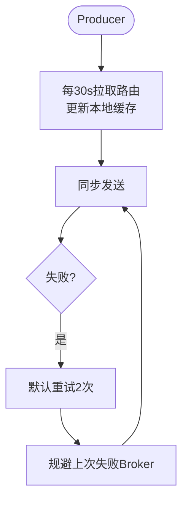

# Producer

Producer（生产者）作为消息的发送端，其核心职责是获取路由、发送消息并处理发送结果。

**工作原理与机制**：
1. **路由获取**：
   - Producer 启动时会从 NameServer 集群中随机选择一台建立长连接。
   - 之后每隔 30s 从 NameServer 拉取最新的 Topic 路由信息更新本地内存（RouteInfoManager）。
   - 本地路由表维护了 Topic 与 Queue 的对应关系以及对应的 Broker 地址。

2. **心跳与连接维护**：
   - 发现新的 Broker 后，会与其建立长连接（TCP）。
   - 默认每隔 30s 向所有 Broker 发送心跳包以维持连接状态，Broker 若检测到 Producer 长时间未心跳会关闭连接。

3. **负载均衡与容错**：
   - **发送策略**：默认对 Queue 进行轮询，将消息均匀发送到不同 Broker 上。
   - **重试机制**：
     - **同步发送**（Sync）：失败默认重试 2 次（`retryTimesWhenSendFailed`）。重试时会规避上次失败的 Broker（尝试选择其他 Broker 的队列），防止连续失败。
     - **异步发送**（Async）：失败默认重试 2 次（`retryTimesWhenSendAsyncFailed`）。注意：异步重试通常是在同一个 Broker 上重试，因为涉及回调上下文管理，切换 Broker 较为复杂（具体视版本实现而定，但原理如此）。

4. **核心组件 MQClientInstance**：
   - Producer 和 Consumer 在同一个 JVM 进程中如果 `clientId` 相同（由 IP + `instanceName` 组成，默认 instanceName 为 `DEFAULT`），会共用同一个 `MQClientInstance` 实例。
   - 这也是为什么 Producer 代码中会有“拉取服务”和“重平衡”相关逻辑的原因，因为这些是 `MQClientInstance` 公共的能力，主要为 Consumer 服务，但在 Producer 实例初始化时也会被加载。

**自动创建 Topic（TBW102）机制**：
- RocketMQ 支持自动创建 Topic。Broker 启动时，会向 NameServer 注册一个名为 `TBW102` 的系统内部 Topic（混合了所有 Broker 的默认路由信息）。
- 当 Producer 尝试向一个不存在的 Topic 发送消息时，由于本地路由表中没有该 Topic，Producer 会请求 NameServer。
- NameServer 可能返回空，或者 Producer 会根据 `TBW102` 的信息，将消息发送到其中一台 Broker。
- Broker 收到消息后发现本地没有该 Topic 的配置，如果开启了 `autoCreateTopicEnable`，则会在本地自动创建该 Topic，并将消息写入。

### 实战案例
在微服务架构中，若一个 JVM 进程内同时启动了 Producer 和 Consumer，必须显式设置不同的 `instanceName`。否则，Producer 发送线程会异常地尝试执行 Consumer 的 Rebalance 动作，导致日志报错甚至资源竞争。正确的做法是将 Producer 设置为 `producer.setInstanceName("PID_" + pid)`。

### 选择消息队列核心代码（含故障规避逻辑）

```java
// MessageQueueSelector 逻辑简化版
public MessageQueue selectOneMessageQueue(final TopicPublishInfo tpInfo, final String lastBrokerName) {
    // 如果开启了故障延迟规避
    if (this.sendLatencyFaultEnable) {
        try {
            // 1. 尝试选择一个不在规避列表中的 Queue
            int index = tpInfo.getSendWhichQueue().getAndIncrement();
            for (int i = 0; i < tpInfo.getMessageQueueList().size(); i++) {
                int pos = Math.abs(index++) % tpInfo.getMessageQueueList().size();
                MessageQueue mq = tpInfo.getMessageQueueList().get(pos);
                if (latencyFaultTolerance.isAvailable(mq.getBrokerName())) {
                    if (null == lastBrokerName || mq.getBrokerName().equals(lastBrokerName))
                        return mq;
                }
            }
            // 2. 如果都在规避列表中，选择一个相对“好”一点的（延迟低的）
            // ... 省略部分代码
        } catch (Exception e) { /* ... */ }
    }
    // 默认轮询
    return tpInfo.getMessageQueueList().get(abs(tpInfo.getSendWhichQueue().getAndIncrement()) % size);
}
```

### Producer 发送方式对比

| 发送方式 | 可靠性 | 吞吐量 | 适用场景 | 响应方式 |
| :--- | :--- | :--- | :--- | :--- |
| **同步发送 (SYNC)** | 高（有重试） | 低 | 重要通知、短信、金融交易 | 阻塞直到收到结果 |
| **异步发送 (ASYNC)** | 高（有回调重试） | 中 | 业务链路解耦、非核心链路 | 回调通知结果 |
| **单向发送 (ONEWAY)** | 低（不重试） | 极高 | 日志收集、概率性允许丢失 | 不关心结果，立即返回 |

**Producer 发送消息流程图**：

```text
[Producer Application]
       |
       | 1. send(msg)
       v
+----------------------+
| DefaultMQProducerImpl|
+----------------------+
       |
       | 2. tryToFindTopicPublishInfo()
       v
+----------------------+       (本地无路由?)      +------------------+
| TopicPublishInfo     | -----------------------> | Update from NameSrv|
| (Local Cache)        | <----------------------- +------------------+
+----------------------+
       |
       | 3. selectOneMessageQueue() (LatencyFault / RoundRobin)
       v
+----------------------+
|  MQClientAPIImpl     | 4. Netty Request (Sync/Async/Oneway)
+----------------------+
       |



## 记忆要点

- 路由维护：Producer每30s从NameServer拉取路由更新本地缓存
- 容错重试：同步发送失败默认重试2次，且重试时规避上次失败的Broker
- 实例隔离：同JVM内_PRODUCER和CONSUMER若不改instanceName会共享实例

## 结构化回答

**30 秒电梯演讲：** 生产者缓存路由、智能重试并利用默认主题实现自动创建。打个比方，像快递员先查地图（路由），查不到就发去中转站（默认Topic）自动建档。

**展开框架：**
1. **路由维护** — Producer每30s从NameServer拉取路由更新本地缓存
2. **容错重试** — 同步发送失败默认重试2次，且重试时规避上次失败的Broker
3. **实例隔离** — 同JVM内_PRODUCER和CONSUMER若不改instanceName会共享实例

**收尾：** 我在项目里踩过坑——在微服务架构中，若一个 JVM 进程内同时启动了 Producer 和 Consumer，必须显式设置不同的 `instanceName`。您想深入聊哪一段：原理、避坑还是对比选型？

## 视频脚本

> 预计时长：3 分钟 | 由浅入深

| 时间 | 画面/字幕 | 口播台词 | 讲解要点 |
|------|----------|----------|----------|
| 0:00 | 标题卡：Producer | "Producer？一句话——像快递员先查地图（路由），查不到就发去中转站（默认Topic）自动建档。" | 开场钩子 |
| 0:45 | 概念动画/示意图 | "生产者缓存路由、智能重试并利用默认主题实现自动创建——像快递员先查地图（路由），查不到就发去中转站（默认Topic）自动建档" | 核心定义 |
| 1:30 | 路由维护示意 | "Producer每30s从NameServer拉取路由更新本地缓存" | 要点1 |
| 2:15 | 容错重试示意 | "同步发送失败默认重试2次，且重试时规避上次失败的Broker" | 要点2 |
| 3:00 | 总结卡 | "记住这几条，面试不慌。下期讲进阶追问。" | 收尾 |
