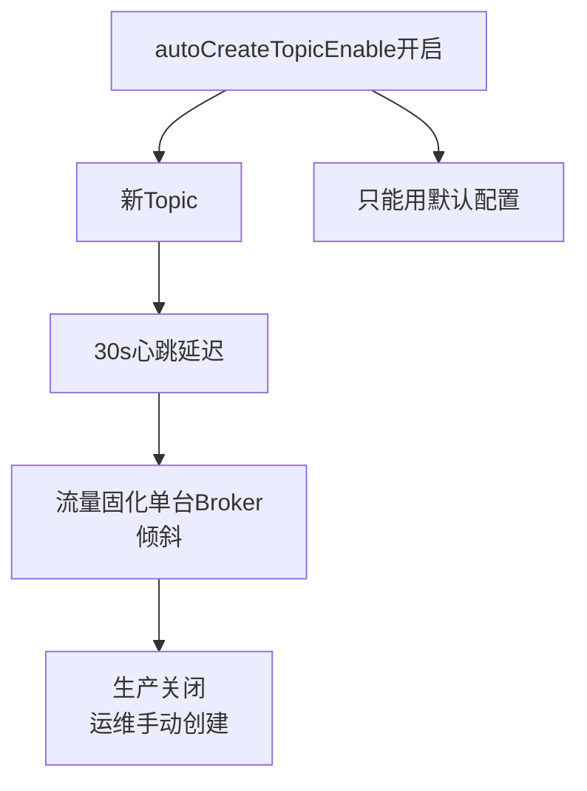

# 自动创建主题的弊端

RocketMQ 支持自动创建 Topic（Auto Create Topic），在开发测试环境非常方便，但在生产环境极其危险。

**自动创建 Topic 的流程与弊端**：

1. **路由不均匀问题（核心弊端）**：
   - **起因**：Broker 启动时注册了系统默认 Topic（如 `TBW102`），它包含了集群内所有 Broker 的地址。
   - **行为**：当 Producer 向一个不存在的 Topic 发送消息时，如果本地没有路由，会去 NameServer 拉取（通常此时还没），Producer 就会根据默认 Topic 的策略（例如轮询）选择**一台** Broker 发送消息。
   - **结果**：被选中的 Broker 收到消息后，会在本地自动创建该 Topic 的配置（包含读写队列数）。
   - **固化**：Broker 随后的心跳（30s 一次）会将这个新 Topic 的路由信息上报给 NameServer。此时 NameServer 发现该 Topic 只在 **这一台** Broker 上存在。
   - **结论**：之后所有 Producer 更新路由表后，都会将消息发送到这一台 Broker 上。无法利用集群的分片能力，导致单点负载极高，成为性能瓶颈。

2. **配置不可控**：
   - 自动创建的 Topic 通常使用 Broker 的默认配置（如默认队列数为 4），可能与业务实际需求不符（例如业务需要 16 个队列）。

**发送消息故障延迟机制（Send Latency Fault Tolerance）**：

这是 RocketMQ 提供的一种针对“慢节点”的规避机制，由参数 `sendLatencyFaultEnable` 控制（默认 `false`）。

1. **原理**：
   - Producer 在每次发送消息时会记录响应耗时。
   - 如果发现某个 Broker 的响应时间超过了预设的阈值（例如 300ms, 1000ms, 5000ms 等），就认为该 Broker 处于“故障”或“高负载”状态。
   - Producer 会将该 Broker 加入“隔离列表”，并在接下来的某一段时间内（根据超时时长反比计算，如超时越久，隔离越久）不再向其发送消息。

2. **效果**：
   - 这里的“隔离”并非是物理断开连接，而是在选择消息队列（`selectOneMessageQueue`）时，直接跳过该 Broker 下的所有 Queue。
   - 这是一种**快速失败**策略，避免客户端在慢节点上阻塞重试，从而提升了整体发送的吞吐量和可用性。

### 实战案例
某业务上线新功能时，开发误开启 `autoCreateTopicEnable` 且使用了错误的 Topic Key。导致大量流量瞬间打在一台 Broker 上，磁盘 I/O 跑满，不仅该业务受阻，还因为这台 Broker 承载了其他共用 Broker 的 Topic，导致“一租户拖累一机”的故障。这是典型的生产环境反模式。

### 故障延迟规避逻辑示例

```java
// LatencyFaultTolerance 接口的实现逻辑伪代码
public class LatencyFaultToleranceImpl {
    private ConcurrentHashMap<String, FaultItem> faultItemTable = new ConcurrentHashMap<>();

    public void updateFaultItem(final String brokerName, final long currentLatency, boolean isolation) {
        FaultItem old = this.faultItemTable.get(brokerName);
        if (old == null) {
            old = new FaultItem(brokerName);
            this.faultItemTable.putIfAbsent(brokerName, old);
        }
        // 计算不可用时长：例如延迟1000ms，则认为不可用2000ms
        long duration = computeNotAvailableDuration(currentLatency);
        old.setStartTimestamp(System.currentTimeMillis() + duration);
    }

    public boolean isAvailable(final String brokerName) {
        FaultItem faultItem = this.faultItemTable.get(brokerName);
        if (faultItem != null) {
            return faultItem.isAvailable(); // 检查当前时间是否已过隔离期
        }
        return true;
    }
}
```

### 自动创建 vs 手动创建对比

| 维度 | 自动创建 | 手动创建 |
| :--- | :--- | :--- |
| **便利性** | 高（无需运维介入） | 低（需提前规划执行命令） |
| **负载均衡** | 极差（通常集中在单 Broker） | 优（可均匀分配到集群 Broker） |
| **配置控制** | 使用 Broker 默认值 | 按需指定 Queue 数、权限等 |
| **生产环境** | **禁止** | **强制要求** |

**故障延迟时间参数示例**（NotAvailableDuration）：
```text
Latency (ms)    | NotAvailableDuration (ms)
--------------------------------------------
0 ~ 550         | 0
550 ~ 1000      | 0
1000 ~ 2000     | 2000
2000 ~ 3000     | 5000
3000 ~ 15000    | 60000
> 15000         | 600000 (10 minutes)
```

## 常见考点
1. **线上是否建议开启 `autoCreateTopicEnable`？**
   答：**坚决不推荐**。线上应提前规划好 Topic，手动配置多队列分布在不同 Broker 组上，以实现负载均衡。
2. **`sendLatencyFaultEnable` 开启后，重试机制是否还有效？**
   答：有效。该机制只是在**选择队列**时优先规避不健康的 Broker；如果选出的队列发送失败，依然会根据 `retryTimesWhenSendFailed` 进行重试，且重试时同样会考虑隔离列表。
3. **除了 `sendLatencyFaultEnable`，Producer 还有哪些高可用策略？**
   答：内部维护了可用的 Queue 列表，发送失败后会剔除该 Queue； Producer 客户端会向多个 NameServer 拉取路由，避免单 NameServer 挂掉导致路由信息丢失。




## 记忆要点

- 单点瓶颈：因心跳延迟，自动创建的新Topic极易固化在单台Broker导致倾斜
- 配置失控：自动创建只能用Broker默认配置，无法满足业务定制需求
- 熔断避让：sendLatencyFaultEnable开启后，发送慢的Broker会被暂时隔离

## 结构化回答

**30 秒电梯演讲：** 避免生产环境自动创建 Topic 造成的单点负载不均。打个比方，像大家排队只开一个窗口，其他人不知道，导致越忙的人越忙。

**展开框架：**
1. **单点瓶颈** — 因心跳延迟，自动创建的新Topic极易固化在单台Broker导致倾斜
2. **配置失控** — 自动创建只能用Broker默认配置，无法满足业务定制需求
3. **熔断避让** — sendLatencyFaultEnable开启后，发送慢的Broker会被暂时隔离

**收尾：** 我在项目里踩过坑——某业务上线新功能时，开发误开启 `autoCreateTopicEnable` 且使用了错误的 Topic Key。您想深入聊哪一段：原理、避坑还是对比选型？

## 视频脚本

> 预计时长：3 分钟 | 由浅入深

| 时间 | 画面/字幕 | 口播台词 | 讲解要点 |
|------|----------|----------|----------|
| 0:00 | 标题卡：自动创建主题的弊端 | "自动创建主题的弊端？一句话——像大家排队只开一个窗口，其他人不知道，导致越忙的人越忙。" | 开场钩子 |
| 0:45 | 概念动画/示意图 | "避免生产环境自动创建 Topic 造成的单点负载不均——像大家排队只开一个窗口，其他人不知道，导致越忙的人越忙" | 核心定义 |
| 1:30 | 单点瓶颈示意 | "因心跳延迟，自动创建的新Topic极易固化在单台Broker导致倾斜" | 要点1 |
| 2:15 | 配置失控示意 | "自动创建只能用Broker默认配置，无法满足业务定制需求" | 要点2 |
| 3:00 | 总结卡 | "记住这几条，面试不慌。下期讲进阶追问。" | 收尾 |
