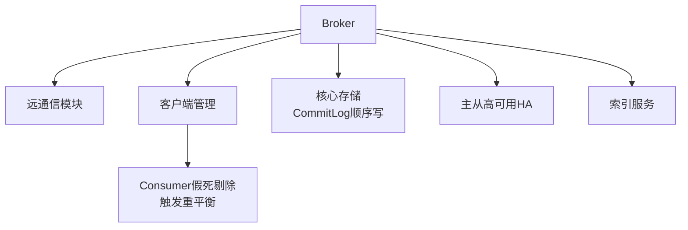

# Broker

Broker 主要负责消息的存储、转发和高可用管理。它是 RocketMQ 的核心组件，通常包含五大关键模块：

1.  **Remoting Module**：处理客户端请求，基于 Netty 实现，处理命令的编解码和分发。
2.  **Client Manager**：管理 Producer 和 Consumer 的连接，维护消费者分组信息。
3.  **Store Service**：提供消息的持久化存储、查询和读取服务（核心底层实现）。
4.  **HA Service**：主从同步服务，负责 Master 和 Slave 之间的数据同步，保证高可用。
5.  **Index Service**：通过指定 Key 建立索引文件，支持按业务键快速查询消息。

### 实战案例
在某电商系统中，Consumer 由于处理逻辑卡死导致积压，Client Manager 检测到该消费者长时间未发送心跳，主动将其踢出消费者组，触发集群内负载重平衡，避免了消费停滞。

### 代码示例 (伪代码)
```java
// Broker 处理请求的核心调度逻辑 (Netty Pipeline)
public class BrokerController {
    public void registerProcessor() {
        // SendMessageProcessor 处理消息发送
        remotingServer.registerDefaultProcessor(new SendMessageProcessor(this), this.sendMessageExecutor);
        // PullMessageProcessor 处理消息拉取
        remotingServer.registerProcessor(RequestCode.PULL_MESSAGE, new PullMessageProcessor(this), this.pullMessageExecutor);
    }
}
```

### 1. 自动创建主题的弊端
生产环境强烈建议关闭 `autoCreateTopicEnable`，原因如下：

- **负载不均**：
  当 Producer 首次向一个新 Topic 发送消息时，如果 Broker 允许自动创建，Broker 会在本地创建该 Topic 的路由信息。由于 Broker 向 NameServer 发送心跳的间隔默认为 30s，NameServer 最长需要 30s 才能感知到这个新 Topic。
  如果 Producer 发送速度极快，在 30s 内连续发送，部分请求可能因为 NameServer 路由未更新而路由到允许自动创建 Topic 的其他 Broker，从而在多个 Broker 上创建了该 Topic，实现了一定的负载均衡。
  但如果发送间歇较长，超过 30s，NameServer 最终只注册了第一个 Broker 的路由信息。后续的 Producer 从 NameServer 获取到的路由仅包含那一台 Broker，导致后续所有消息都发往这一台机器，产生严重的单点负载压力。

- **运维不可控**：自动创建的 Topic 配置（如队列数量、权限）通常是默认值，可能不符合业务需求，且难以统一管理。

### 2. 发送消息故障延迟机制
这是 Producer 端的高可用优化机制，由参数 `sendLatencyFaultEnable` 控制（默认关闭）。

- **原理**：
  Producer 会记录每次向 Broker 发送消息的耗时。如果某次请求耗时超过了预设的阈值（例如 `latencyMax` 数组中的值），该 Broker 会被判定为“不可用”，并在随后的一段时间内（`notAvailableDuration`）被“隔离”，Producer 不会向其发送消息。

- **示例**：
  比如超过 15000ms，则隔离 600000ms（10分钟）。

- **作用**：
  发送超时通常意味着 Broker 负载过高、磁盘打满或 GC 停顿。通过暂时隔离，可以让该 Broker“喘口气”，同时将流量分发到其他健康的 Broker 上，从而提升整体系统的可用性。

### 对比表格：Broker 五大模块职责

| 模块名称 | 核心职责 | 涉及组件/技术 |
| :--- | :--- | :--- |
| **Remoting Module** | 网络通信层，IO 多路复用 | Netty, FastJSON/Protostuff 编解码 |
| **Client Manager** | 连接与状态管理，消费者 offsets | ConcurrentHashMap, Channel 心跳检测 |
| **Store Service** | 持久化引擎，读写核心 | MappedFile, CommitLog, ConsumeQueue |
| **HA Service** | 主从数据复制，故障转移 | Netty 传输, 读写指针同步 |
| **Index Service** | 加速查询 | Hash 索引, IndexFile |

### 小结
- Producer 每 30s 从 NameServer 拉取路由信息。
- **禁止**在生产环境开启 `autoCreateTopicEnable`，防止负载倾斜。
- Producer 通过故障延迟机制和重试机制提升高可用。




## 记忆要点

- 五大模块：远通信、客户端管理、核心存储、主从高可用HA、Index索引服务
- 存储核心：Store Service基于CommitLog统一顺序写，构筑高性能地基
- 流量隔离：Consumer假死不发心跳，会被Client Manager剔除并触发重平衡

## 结构化回答

**30 秒电梯演讲：** Broker 负责消息存储、转发及高可用，是核心处理节点。打个比方，像仓库管理员，负责收货、存货、发货及同步库存给分仓。

**展开框架：**
1. **五大模块** — 远通信、客户端管理、核心存储、主从高可用HA、Index索引服务
2. **存储核心** — Store Service基于CommitLog统一顺序写，构筑高性能地基
3. **流量隔离** — Consumer假死不发心跳，会被Client Manager剔除并触发重平衡

**收尾：** 我在项目里踩过坑——在某电商系统中，Consumer 由于处理逻辑卡死导致积压，Client Manager 检测到该消费者长时间未发送心跳，主动将其踢出消费者组，触发集群内负载重平衡，避免了消费停滞。您想深入聊哪一段：原理、避坑还是对比选型？

## 视频脚本

> 预计时长：3 分钟 | 由浅入深

| 时间 | 画面/字幕 | 口播台词 | 讲解要点 |
|------|----------|----------|----------|
| 0:00 | 标题卡：Broker | "Broker？一句话——像仓库管理员，负责收货、存货、发货及同步库存给分仓。" | 开场钩子 |
| 0:45 | 概念动画/示意图 | "Broker 负责消息存储、转发及高可用，是核心处理节点——像仓库管理员，负责收货、存货、发货及同步库存给分仓" | 核心定义 |
| 1:30 | 五大模块示意 | "远通信、客户端管理、核心存储、主从高可用HA、Index索引服务" | 要点1 |
| 2:15 | 存储核心示意 | "Store Service基于CommitLog统一顺序写，构筑高性能地基" | 要点2 |
| 3:00 | 总结卡 | "记住这几条，面试不慌。下期讲进阶追问。" | 收尾 |
