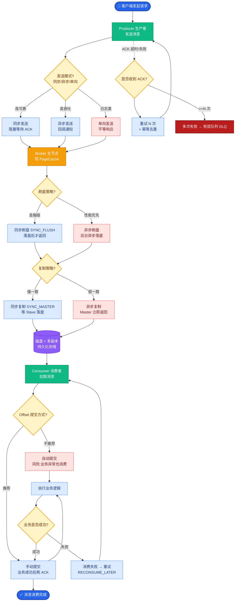

# 页缓存与内存映射

该题主要考察 RocketMQ 利用操作系统底层机制（Page Cache 和 Mmap）提升 IO 性能的原理。这与 mq-055 的后半部分内容重叠，但我们可以从更底层的内存管理角度进行补充。

### 页缓存
- **原理**：操作系统为了加速文件访问，将部分磁盘数据缓存在内存中。这部分内存被称为 Page Cache。
- **RocketMQ 的利用**：
  - **写**：消息写入 CommitLog 的 Mmap 区域，实际上是写入了 Page Cache。由 OS 后台线程负责异步刷盘。
  - **读**：消费者消费消息时，通常数据还在 Page Cache 中（热数据），直接从内存读取，无需磁盘 IO，速度极快（可达 GB/s 级别）。

### 实战案例
某视频流处理服务上线初期，Broker 频繁出现读毛刺（Latency 偶尔飙升至 500ms+）。经排查发现是 Page Cache 被其他后台进程（如日志压缩）挤占，导致消费消息时发生缺页中断读取物理磁盘。调整 `vm.swappiness=0` 并锁定内存后恢复平稳。

### 代码示例 (Java)
```java
// MmapFile 的预热逻辑
public void warmMappedFile(FlushDiskType type, int pages) {
    long beginTime = System.currentTimeMillis();
    ByteBuffer byteBuffer = this.mappedByteBuffer.slice();
    for (int i = 0; i < this.fileSize / OS_PAGE_SIZE; i += pages) {
        byteBuffer.put(i * (int)OS_PAGE_SIZE, (byte) 0);
    }
    // mlock 锁定内存，防止被 Swap
    MappedFile.mlock(this.mappedByteBuffer, this.fileSize);
}
```

### 内存映射
- **原理**：调用 `mmap()` 系统调用，将文件直接映射到进程的虚拟地址空间。
- **优势细节**：
  - **零拷贝**：避免了数据在内核空间和用户空间之间的来回拷贝。传统方式：磁盘 -> 内核缓冲区 -> 用户缓冲区 -> 内核缓冲区（发送/落盘）。Mmap 方式：磁盘 -> 页缓存 -> 用户直接访问页缓存地址。
  - **适合大文件**：RocketMQ 的 CommitLog（1G）非常适合使用 Mmap 进行映射。

- **局限性**：
  - Mmap 映射的内存大小受限于虚拟地址空间（32 位 JVM 限制约 2G-3G，64 位则无限制）。这也是为什么 CommitLog 设置为 1G（预留空间给其他 Mmap 文件）。

### 文件预热
虽然使用了 Mmap，但仅仅建立映射关系并不意味着物理页已经加载到内存中。只有真正访问时才会触发缺页中断去加载数据，这会导致瞬间的性能抖动。

RocketMQ 通过 `warmMappedFile` 方法进行预热：
1.  **写入 0 字节**：遍历 Mmap 映射的每一页，写入一个 0 字节。目的是强制触发缺页中断，将文件数据（或至少是页表项）加载到物理内存中。
2.  **mlock**：系统调用，将锁定的内存区域防止被操作系统交换到 Swap 分区。防止 Broker 在内存压力大时，关键的数据页被换出到磁盘，导致读写性能断崖式下跌。
3.  **madvise(MADV_WILLNEED)**：建议操作系统预读后续的数据块。

```text
文件预热流程:

1. Mmap(File) 
   ↓
2. [虚拟内存映射建立完毕 - 物理内存尚未分配]
   ↓
3. for each page:
      write(page, 0)  ──► 触发缺页中断，分配物理内存页
      mlock(page)     ──► 锁定物理内存，禁止 Swap
   ↓
4. 文件预热完成，读写无抖动
```

### 对比表格：传统 IO vs Mmap

| 特性 | 传统 read/write | Mmap (内存映射) |
| :--- | :--- | :--- |
| **数据拷贝次数** | 4次 (磁盘->内核->用户->内核->socket/磁盘) | 3次 (磁盘->内核->用户/内核共享->磁盘) |
| **上下文切换** | 2-4次 (用户态/内核态切换频繁) | 较少 (访问共享内存不需陷入内核) |
| **适用场景** | 小文件或需要复杂处理的场景 | 大文件顺序读写，高性能场景 |
| **限制** | 无特殊限制 | 受限于地址空间大小 |

## 常见考点
1. **RocketMQ 为什么读写快？**
   答：顺序写磁盘 + Mmap 零拷贝 + 页缓存读写。
2. **如果使用 SSD，是否还需要 Mmap 预热？**
   答：依然需要。预热的主要目的是避免运行时的缺页中断延迟和防止 Swap，这与磁盘介质类型关系不大，但 SSD 的随机读更快，缺页的影响相对小一点。
3. **RocketMQ 会不会受到 JVM GC 的影响？**
   答：会。虽然存储使用堆外内存（DirectByteBuffer/Mmap），但消息对象在发送和消费过程中需要在堆内创建。如果堆积严重，频繁的 GC 可能导致 Stop The World，影响 Netty 事件的处理。建议使用 CMS 或 G1 收集器，并调大堆内存。


## 核心流程图



## 记忆要点

- 核心加速原理：因为顺序写磁盘结合了 Mmap 零拷贝和页缓存读写，所以极大提升了 IO 性能
- 对比记忆：传统 IO 有 4 次拷贝与频繁上下文切换，而 Mmap 仅 3 次拷贝且无需频繁陷入内核

## 结构化回答

**30 秒电梯演讲：** 利用 Mmap 零拷贝技术和页缓存极大提升读写性能。打个比方，像通过传纸条（内存映射）直接读写黑板，不需要抄写一遍。

**展开框架：**
1. **核心加速原理** — 因为顺序写磁盘结合了 Mmap 零拷贝和页缓存读写，所以极大提升了 IO 性能
2. **对比记忆** — 传统 IO 有 4 次拷贝与频繁上下文切换，而 Mmap 仅 3 次拷贝且无需频繁陷入内核
3. **Mmap 将文件映射到虚拟内存** — 避免内核态到用户态的数据拷贝

**收尾：** 我在项目里踩过坑——某视频流处理服务上线初期，Broker 频繁出现读毛刺（Latency 偶尔飙升至 500ms+）。您想深入聊哪一段：原理、避坑还是对比选型？

## 视频脚本

> 预计时长：2 分钟 | 由浅入深

| 时间 | 画面/字幕 | 口播台词 | 讲解要点 |
|------|----------|----------|----------|
| 0:00 | 标题卡：页缓存与内存映射 | "页缓存与内存映射？一句话——像通过传纸条（内存映射）直接读写黑板，不需要抄写一遍。" | 开场钩子 |
| 0:40 | 概念动画/示意图 | "利用 Mmap 零拷贝技术和页缓存极大提升读写性能——像通过传纸条（内存映射）直接读写黑板，不需要抄写一遍" | 核心定义 |
| 1:20 | 核心加速原理示意 | "因为顺序写磁盘结合了 Mmap 零拷贝和页缓存读写，所以极大提升了 IO 性能" | 要点1 |
| 2:00 | 总结卡 | "记住这几条，面试不慌。下期讲进阶追问。" | 收尾 |
