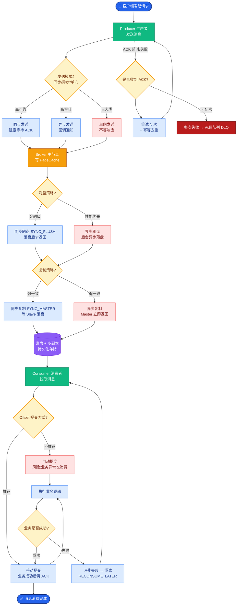

# 文件预分配和文件预热

为了进一步减少磁盘 IO 对消息写入性能的影响，RocketMQ 引入了文件预分配和文件预热机制。

### 文件预分配
- **背景**：CommitLog 写满 1G 后需要切换到下一个文件。如果在写入消息的同时申请新文件、创建 Mmap 映射，会造成瞬间的卡顿。
- **实现**：
  - 有一个后台线程 `AllocateMappedFileService`。
  - 它维护一个请求队列 `AllocateRequest`。
  - 当写满当前文件时，或者服务启动时，会向队列中放入一个预分配请求。
  - 后台线程提前创建好下一个文件，并建立好 Mmap 映射。
- **效果**：实现了文件切换的“无缝衔接”，业务线程只需从已分配好的列表中获取下一个文件即可。

**实战案例**：
在高并发压测场景下，若关闭预分配，每次文件切瞬间会出现“毛刺”（TPS 跌零），导致上游 Producer 堆积。开启预分配后，TPS 曲线变得平滑。

**代码示例**：
```java
// AllocateMappedFileService 核心逻辑
public void run() {
    while (!this.stop) {
        AllocateRequest req = this.requestQueue.take();
        // 预分配并映射文件
n        MappedFile mappedFile = new MappedFile(req.getFilePath(), req.getFileSize());
        // 预热逻辑...
        req.setMappedFile(mappedFile);
        req.getCountDownLatch().countDown(); // 通知业务线程
    }
}
```

### 文件预热
详见 mq-056 的补充，核心目的是防止运行时缺页中断和 Swap。

1.  **mlock**：防止关键数据被交换出去。
2.  **madvise**：建议内核预读。
3.  **字节数据写入**：强制加载物理页。

**代码示例**：
```java
// MappedFile 预热片段
public void warmMappedFile() {
    long startTime = System.currentTimeMillis();
    mlock(); // 锁定内存
    // 写入0，强制触发缺页中断，加载物理内存
    byte[] dummy = new byte[OS_PAGE_SIZE];
    for (int offset = 0; offset < this.fileSize; offset += OS_PAGE_SIZE) {
        this.mappedByteBuffer.put(dummy);
    }
    madvise(); // 建议系统预读
}
```

### Broker 的高可用 (HA)
Broker 的 HA 主要通过 **主从复制** 实现。

#### 同步机制
- **角色**：Master 提供读写服务，Slave 只提供读服务（如果配置允许）或仅做冷备。
- **连接**：Slave 主动连接 Master，建立 TCP 长连接。
- **传输**：
  1.  Slave 发送自己的最大 CommitLog 偏移量 `maxOffset` 给 Master。
  2.  Master 找到该偏移量之后的数据，通过 `Netty` 传输给 Slave。
  3.  Slave 接收数据后写入本地 CommitLog，然后再次上报新的 `maxOffset`。

#### 复制模式对比
| 模式 | 可靠性 | 性能 | 适用场景 | 阻塞情况 |
| :--- | :--- | :--- | :--- | :--- |
| **SYNC_MASTER** | 极高 (主从强一致) | 低 (受网络 RTT + Slave 落盘影响) | 金融、支付业务 | 写线程需等待 Slave ACK |
| **ASYNC_MASTER** | 中 (少量数据丢失) | 高 (仅本地落盘即返回) | 日志收集、普通业务 | 写线程不等待，后台传输 |

```text
         Producer
            │
            ▼
      ┌─────────┐
      │ Master  │
      │ (写)    │┐
      └────┬────┘│
   同步/异步  │
           传输 CommitLog 数据
              │
              ▼
      ┌─────────┐│
      │ Slave   │┘
      │ (读/备) │
      └─────────┘
```

## 常见考点
1. **主从复制是同步 CommitLog 还是 ConsumeQueue？**
   答：复制的是 CommitLog 原始数据。Slave 接收到 CommitLog 数据后，也会触发本地的 `ReputMessageService` 线程去构建 ConsumeQueue 和 IndexFile，与 Master 逻辑一致。
2. **主从切换怎么做？**
   答：RocketMQ 4.5 版本之前没有自动的主从切换功能，需要人工介入或配合 DLedger（Raft 协议）实现自动选主。4.5 之后引入了 DLedger 模式，支持多副本自动选举。
3. **Slave 会分担 Master 的读压力吗？**
   答：可以配置。Consumer 可以从 Slave 拉取消息进行消费，但需要注意 Slave 的消息延迟（在异步复制模式下，Slave 稍微落后于 Master）。


## 核心流程图



## 记忆要点

- 文件预分配：因为有后台线程提前创建并 Mmap 映射下一个文件，所以切换 CommitLog 时能无缝衔接无卡顿
- 同步与异步对比：同步双写可靠性极高但会阻塞写线程导致性能低，异步复制性能高但宕机可能丢少量数据

## 结构化回答

**30 秒电梯演讲：** 提前分配文件并锁定内存，消除运行时的分配抖动。打个比方，像提前铺好新跑道并踩实，比赛时就不用边跑边修路了。

**展开框架：**
1. **文件预分配** — 因为有后台线程提前创建并 Mmap 映射下一个文件，所以切换 CommitLog 时能无缝衔接无卡顿
2. **同步与异步对比** — 同步双写可靠性极高但会阻塞写线程导致性能低，异步复制性能高但宕机可能丢少量数据
3. **AllocateMappedFileService** — 后台线程预分配下一个 CommitLog
**收尾：** 我在项目里踩过坑——在高并发压测场景下，若关闭预分配，每次文件切瞬间会出现“毛刺”（TPS 跌零），导致上游 Producer 堆积。您想深入聊哪一段：原理、避坑还是对比选型？

## 视频脚本

> 预计时长：2 分钟 | 由浅入深

| 时间 | 画面/字幕 | 口播台词 | 讲解要点 |
|------|----------|----------|----------|
| 0:00 | 标题卡：文件预分配和文件预热 | "文件预分配和文件预热？一句话——像提前铺好新跑道并踩实，比赛时就不用边跑边修路了。" | 开场钩子 |
| 0:40 | 概念动画/示意图 | "提前分配文件并锁定内存，消除运行时的分配抖动——像提前铺好新跑道并踩实，比赛时就不用边跑边修路了" | 核心定义 |
| 1:20 | 文件预分配示意 | "因为有后台线程提前创建并 Mmap 映射下一个文件，所以切换 CommitLog 时能无缝衔接无卡顿" | 要点1 |
| 2:00 | 总结卡 | "记住这几条，面试不慌。下期讲进阶追问。" | 收尾 |
