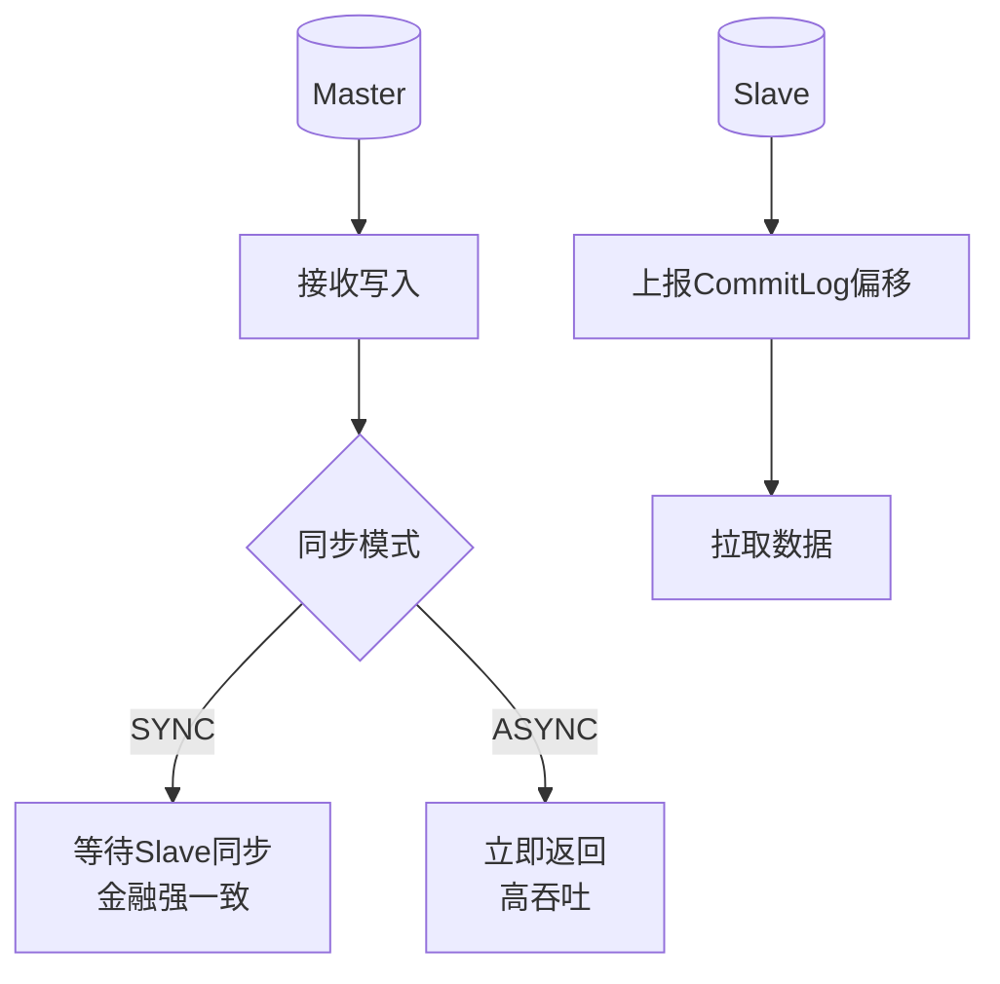

# Broker 的 HA

Broker 的 HA（High Availability）主要通过主从同步（Master-Slave Synchronization）来实现。

**同步机制**
Slave Broker 会和 Master Broker 建立长连接，并获取 Master CommitLog 的最大偏移量。Slave 向 Master 拉取消息，Master 返回一定数量的消息，循环进行该过程，从而达到主从数据一致。

**实战案例**：
在跨机房部署时，若网络带宽不足，同步双写会导致消息发送延迟剧增。解决方案是将 Slave 部署在同机房或低延迟网络，仅将异步 Slave 用于异地灾备。

**同步模式与关键细节**
RocketMQ 提供了三种同步方式，配置参数为 `brokerRole`：
1. **SYNC_MASTER**（同步双写）：Master 收到消息后，必须等待 Slave 写入成功（通过 HAConnection 传输并写入 CommitLog）才向客户端返回发送成功。优点是可靠性高（主从一致），缺点是吞吐量略低，且会阻塞写入线程（受 `haSendHousekeepingInterval` 和 `haSlaveFallbehindMax` 参数影响）。
2. **ASYNC_MASTER**（异步复制）：Master 收到消息后立即向客户端返回成功，后台异步线程传输给 Slave。性能高，但主从可能有短暂数据不一致，Master 宕机可能导致少量消息丢失。
3. **SLAVE**：从节点角色。

**代码示例**：
```java
// HAConnection 核心写入逻辑 (Master 端)
private class WriteSocketService implements Runnable {
    @Override
    public void run() {
        // 1. 读取 Slave 上报的 offset
        long slaveReadOffset = this.reportOffset;
        // 2. 查找 CommitLog 中 offset 之后的数据
        SelectMappedBufferResult result = HAService.this.defaultMessageStore.getMessage(slaveReadOffset);
        if (result != null) {
            // 3. 使用 transferTo (零拷贝) 发送数据
            this.socketChannel.transferTo(result.getByteBuffer(), ...);
        }
    }
}
```

**读写分离**
消费者消费消息默认请求 Master。如果 Master 判定当前压力过大，会建议客户端去 Slave 拉取消息。但需注意，Slave 默认只承担读请求，且只有当消费进度落后较多（超过物理内存限制）时才会真正从 Slave 读取，平时流量仍集中在 Master。

**HA 架构图**
```text
       Producer          Consumer
          |                  |
          v                  v
    +-------------+    +------------+
    |   Master    |<-->|   Slave    |
    | (CommitLog) |    | (CommitLog)|
    +-------------+    +------------+
          ^     ^
          |     | 1. 传输请求 (Slave 拉取)
          |     +-----------------------------------+
          |                                         |
          | 2. 传输数据 (返回 CommitLog 数据)        |
          +-----------------------------------------|
                                                     v
                                  3. 写入本地 CommitLog 并更新 Offset
```

## 常见考点
1. **同步双写 vs 异步复制的区别及选择场景**：金融业务选 SYNC，高并发业务选 ASYNC。
2. **Slave 如何感知 Master 的存活**：通过连接状态和心跳，Master 宕机后 Slave 无法同步但本身不自动切换（需配合 DLedger 或外部工具）。
3. **HA 传输零拷贝**：Master 向 Slave 传输数据基于 `transferTo` (NIO)，减少内核态与用户态的拷贝。




## 记忆要点

- HA 核心依赖主从同步机制，Slave 主动连接 Master 并上报本地 CommitLog 最大偏移量来拉取数据
- 同步模式选型：金融业务选 SYNC 保证主从强一致，高并发普通业务选 ASYNC 追求高吞吐

## 结构化回答


**30 秒电梯演讲：** Leader在台上演讲，Follower在台下逐字记录备份；听众多时Leader指引部分听众去问Follower。

**展开框架：**
1. **Slave主动向** — Slave主动向Master拉取CommitLog数据进行同步。
2. **支持同步复制和异** — 支持同步复制和异步复制两种模式。
3. **消费者可被重定向** — 消费者可被重定向至Slave读取以降低Master压力。

**收尾：** 这是我实战中的理解，您想深入哪一段？


## 视频脚本

> 预计时长：2 分钟 | 由浅入深

| 时间 | 画面/字幕 | 口播台词 | 讲解要点 |
|------|----------|----------|----------|
| 0:00 | 标题卡：Broker 的 HA | "Broker 的 HA？一句话——Leader在台上演讲，Follower在台下逐字记录备份；听众多时Leader指引部分听众去问Follower。" | 开场钩子 |
| 0:40 | 概念动画/示意图 | "Slave建立长连接拉取Master数据实现备份，支持读写分离——Leader在台上演讲，Follower在台下逐字记录备份；听众多时Leader指引部分听众去问Follower" | 核心定义 |
| 1:20 | 要点1图解示意 | "Slave 主动连接 Master 并上报本地 CommitLog 最大偏移量来拉取数据" | 要点1 |
| 2:00 | 总结卡 | "记住这几条，面试不慌。下期讲进阶追问。" | 收尾 |
