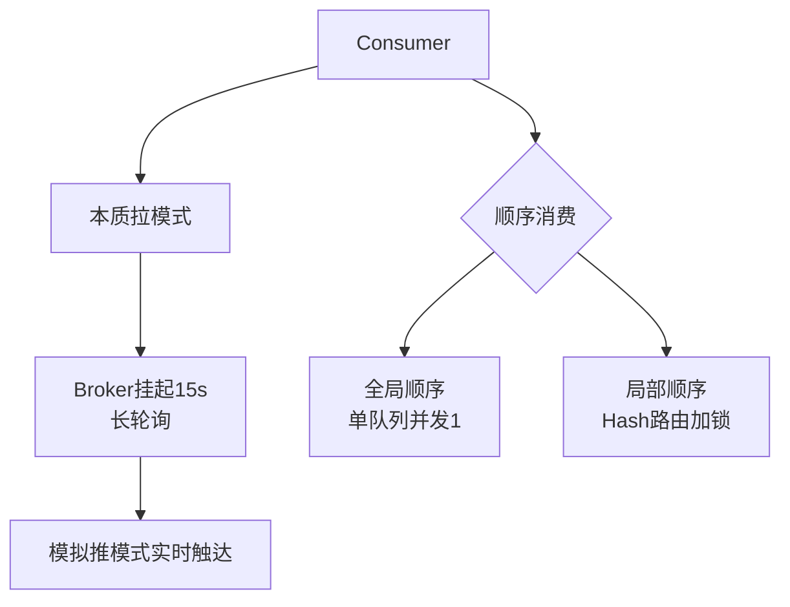

# Consumer

Consumer 是消息的消费者端，负责从 Broker 拉取并处理消息。

**消费模式对比**
| 模式 | 消费逻辑 | 进度存储 | 副作用 | 适用场景 |
| :--- | :--- | :--- | :--- | :--- |
| **广播模式** | 每个消费者消费全量数据 | 客户端本地 | 重启/上线会重复消费 | 配置更新、缓存刷新 |
| **集群模式** (默认) | 负载均衡，一条消息只被一个消费者消费 | Broker 端 | Rebalance 可能导致重复 | 高吞吐、流式处理 |

**实战案例**：
在广播模式下，若某台 Consumer 宕机重启，会重新消费历史所有消息。若业务无法处理幂等，需结合外部存储（如 Redis）记录已处理 Message ID 去重。

**推拉模式**
RocketMQ 实质上是**拉模式**（Pull），Consumer 主动向 Broker 请求消息。但在客户端封装了**推模式**（Push）的接口，通过长轮询实现消息的实时触达。

**Push 模式原理细节**：客户端内部维护一个 `PullRequest` 队列，后台线程不断轮询拉取。若服务端无消息，Broker 会挂起请求（最长 15s），直到有消息到达或超时，从而模拟“推”的效果。

**代码示例**：
```java
// DefaultMQPushConsumerImpl 拉取回调核心逻辑
public void pullCallback(PullResult pullResult) {
    switch (pullResult.getPullStatus()) {
        case FOUND:
            // 1. 提交到消费线程池处理
            submitConsumeRequest(pullResult.getMsgFoundList());
            // 2. 继续拉取下一批
            this.pullRequestQueue.put(pullRequest);
            break;
        case NO_NEW_MSG: // 没有新消息
        case NO_MATCHED_MSG:
            // 稍后挂起或继续拉取
            this.executePullRequestLater(pullRequest, PULL_TIME_DELAY_MILLS);
            break;
    }
}
```

**负载均衡**
Consumer 定期获取 Topic 下的队列数和同组消费者信息，默认按照类似“平均分页”的策略分配队列。例如 9 个队列分给 3 个消费者，每人 3 个。若负载不均，可通过增加队列数或消费者数触发重平衡。

**顺序消费**
- **全局顺序**：Topic 内只有一个队列，Producer 和 Consumer 并发度均为 1，严格有序但吞吐低。
- **局部顺序**：发送时通过 MessageQueueSelector 将相同业务 ID 的消息发往同一队列，消费时使用 MessageListenerOrderly 加锁消费，保证分区有序。

## 常见考点
1. **Push 模式是如何基于 Pull 实现的？**：重点在于长轮询和客户端内部的消息缓存队列。
2. **本地消息存储与远端存储的区别**：广播模式存储在本地，重启后会重复消费；集群模式存储在 Broker，重启不丢进度。
3. **Rebalance 的副作用**：导致消息重复消费或短暂的消费暂停。




## 记忆要点

- 推拉模式：本质是拉模式，因为 Broker 会挂起请求长达 15s 长轮询，所以能模拟出推模式的实时触达
- 顺序消费对比：全局顺序 Topic 仅 1 队列并发为 1 吞吐极低，局部顺序靠 Hash 路由同队列加锁实现高吞吐

## 结构化回答

**30 秒电梯演讲：** 消费者通过集群模式分摊负载，利用拉模式获取消息并支持顺序处理。打个比方，一群人分蛋糕（集群模式），每个人拿一块；或者所有人都拿一份完整蛋糕（广播模式）。

**展开框架：**
1. **推拉模式** — 本质是拉模式，因为 Broker 会挂起请求长达 15s 长轮询，所以能模拟出推模式的实时触达
2. **顺序消费对比** — 全局顺序 Topic 仅 1 队列并发为 1 吞吐极低，局部顺序靠 Hash 路由同队列加锁实现高吞吐
3. **支持广播和集群两种消费模式。**

**收尾：** 我在项目里踩过坑——在广播模式下，若某台 Consumer 宕机重启，会重新消费历史所有消息。您想深入聊哪一段：原理、避坑还是对比选型？

## 视频脚本

> 预计时长：3 分钟 | 由浅入深

| 时间 | 画面/字幕 | 口播台词 | 讲解要点 |
|------|----------|----------|----------|
| 0:00 | 标题卡：Consumer | "Consumer？一句话——一群人分蛋糕（集群模式），每个人拿一块；或者所有人都拿一份完整蛋糕（广播模式）。" | 开场钩子 |
| 0:45 | 概念动画/示意图 | "消费者通过集群模式分摊负载，利用拉模式获取消息并支持顺序处理——一群人分蛋糕（集群模式），每个人拿一块；或者所有人都拿一份完整蛋糕（广播模式）" | 核心定义 |
| 1:30 | 推拉模式示意 | "本质是拉模式，因为 Broker 会挂起请求长达 15s 长轮询，所以能模拟出推模式的实时触达" | 要点1 |
| 2:15 | 顺序消费对比示意 | "全局顺序 Topic 仅 1 队列并发为 1 吞吐极低，局部顺序靠 Hash 路由同队列加锁实现高吞吐" | 要点2 |
| 3:00 | 总结卡 | "记住这几条，面试不慌。下期讲进阶追问。" | 收尾 |
