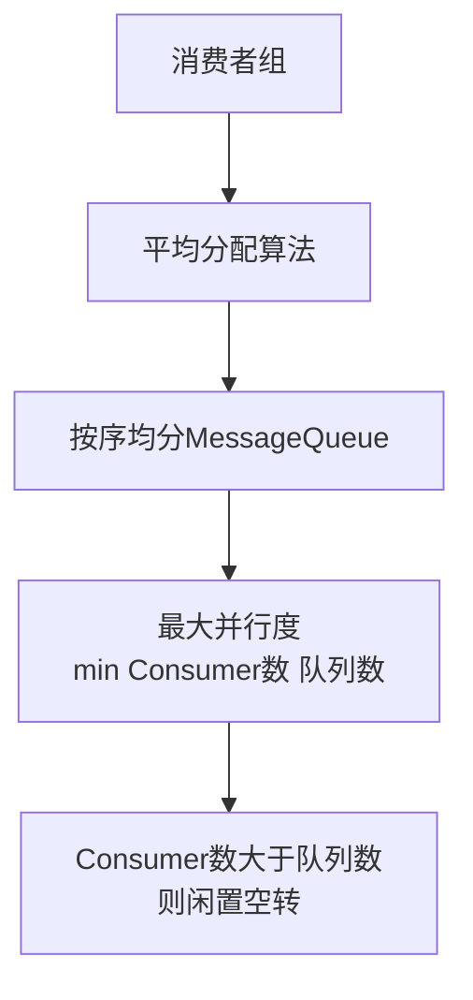

# Consumer 端的负载均衡机制

RocketMQ 的 Consumer 端负载均衡采用客户端独立协调的策略。

**分配策略**
1. **获取信息**：Consumer 定期从 NameServer 获取 Topic 路由信息（队列列表），并协调同组内的所有消费者实例。通过 All2All 通信方式（如通过 Broker 获取消费组列表或内部维护）来识别同组消费者。
2. **分配算法**：默认使用 **AllocateMessageQueueAveragely**（平均分配）。将队列和消费者分别排序，按序轮询分配。例如 9 个队列、3 个消费者，则每人分配 3 个队列。
   - **AllocateMessageQueueAveragelyByCircle**：轮询分配，不考虑已分配数量，直接取余。
   - **AllocateMessageQueueConsistentHash**：一致性哈希，减少因消费者变化导致的分配大范围变动。

**实战案例**：
当队列数 (16) 小于消费者数 (20) 时，会有 4 个消费者分配不到队列，处于“空转”浪费资源状态。因此生产环境规划时，务必保证 消费者数 <= 队列数。

**代码示例**：
```java
// AllocateMessageQueueAveragely 平均分配算法片段
public List<MessageQueue> allocate(String consumerGroup, String currentCID, List<MessageQueue> mqAll, List<String> cidAll) {
    int index = cidAll.indexOf(currentCID);
    int mod = mqAll.size() % cidAll.size();
    int averageSize = mqAll.size() <= cidAll.size() ? 1 : (mqAll.size() / cidAll.size());
    // 计算当前消费者应分配的队列范围 startIndex ~ endIndex
    int startIndex = mod > index ? (index * averageSize) : (index * averageSize + mod);
    // 截取对应范围的队列
    return new ArrayList<>(mqAll.subList(startIndex, endIndex));
}
```

**重平衡流程图**
```text
+-------------------+      +----------------------+      +----------------------+
| Consumer Instance |      |    Consumer Instance |      |    Consumer Instance |
+---------+---------+      +-----------+----------+      +-----------+----------+
          |                             |                             |
          | 1. 启动/定时任务触发 (默认20s)                              |
          +-----------------------------+-----------------------------+
                                        |
                                        v
                         +------------------------------+
                         |   获取 Topic 路由与消费者列表   |
                         +------------------------------+
                                        |
                                        v
                         +------------------------------+
                         |    执行分配算法 (本地计算)      |
+------------------------+------------------------------+------------------------+
|                        |                              |                        |
| 分配结果: Queue[0,1]   |   分配结果: Queue[2,3,4]      |   分配结果: Queue[5..8] |
+------------------------+------------------------------+------------------------+
          |                             |                             |
          | 2. 锁定分配的 Queue 并开始消费                               |
          +-----------------------------+-----------------------------+
```

**重平衡**
当消费者数量变化（上下线）或队列数量变化时，会触发重平衡。各消费者重新计算分配结果，锁定自己负责的队列并释放不再负责的队列。

**注意事项**
- 单纯增加 Consumer 实例不一定能提升吞吐，必须确保 **Consumer 数量 <= 队列数量**。



## 记忆要点

- 核心策略：客户端独立定期协调，因为默认采用平均分配算法，所以同组 Consumer 按序均分 MessageQueue
- 负载边界公式：最大并行度等于消费者数与队列数的最小值，所以消费者数绝不能大于队列数，否则闲置空转

## 结构化回答

**30 秒电梯演讲：** 消费者端通过平均算法将队列分配给不同的消费者实例。打个比方，老师把任务按顺序发给排好队的学生，保证每个人手里的任务数量差不多。

**展开框架：**
1. **核心策略** — 客户端独立定期协调，因为默认采用平均分配算法，所以同组 Consumer 按序均分 MessageQueue
2. **负载边界公式** — 最大并行度等于消费者数与队列数的最小值，所以消费者数绝不能大于队列数，否则闲置空转
3. **负载均衡在客户端计算执行。**

**收尾：** 我在项目里踩过坑——当队列数 (16) 小于消费者数 (20) 时，会有 4 个消费者分配不到队列，处于“空转”浪费资源状态。您想深入聊哪一段：原理、避坑还是对比选型？

## 视频脚本

> 预计时长：3 分钟 | 由浅入深

| 时间 | 画面/字幕 | 口播台词 | 讲解要点 |
|------|----------|----------|----------|
| 0:00 | 标题卡：Consumer 端的负载均衡机制 | "Consumer 端的负载均衡机制？一句话——老师把任务按顺序发给排好队的学生，保证每个人手里的任务数量差不多。" | 开场钩子 |
| 0:45 | 概念动画/示意图 | "消费者端通过平均算法将队列分配给不同的消费者实例——老师把任务按顺序发给排好队的学生，保证每个人手里的任务数量差不多" | 核心定义 |
| 1:30 | 核心策略示意 | "客户端独立定期协调，因为默认采用平均分配算法，所以同组 Consumer 按序均分 MessageQueue" | 要点1 |
| 2:15 | 负载边界公式示意 | "最大并行度等于消费者数与队列数的最小值，所以消费者数绝不能大于队列数，否则闲置空转" | 要点2 |
| 3:00 | 总结卡 | "记住这几条，面试不慌。下期讲进阶追问。" | 收尾 |
