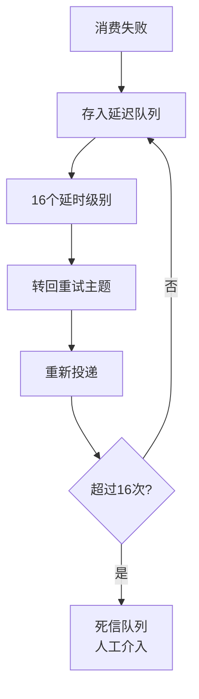

# Consumer 消息消费的重试

当消息消费失败时，RocketMQ 提供了自动重试机制，以保证消息的最终处理。

**重试流程**
1. **重试主题**：RocketMQ 会为每个消费组创建一个重试主题，命名为 `%RETRY%+ConsumerGroup`。
2. **延迟重试**：消费失败的消息并不会立即重投，而是先进入系统内部的延迟主题 `SCHEDULE_TOPIC_XXXX`。根据设定的重试级别（如 Level 1 延迟 5s，Level 2 延迟 10s），到期后将消息重新投递到重试主题。
   - **延时级别**：默认为 `1s 5s 10s 30s 1m 2m 3m 4m 5m 6m 7m 8m 9m 10m 20m 30m 1h 2h`，共 16 级。第 16 次失败后进入死信队列。
3. **重新消费**：Consumer 会像消费普通消息一样消费重试主题中的消息。

**实战案例**：
某业务因数据库连接池满导致消费失败，消息进入重试队列。若未设置指数退避，消息会按照固定间隔不断冲击数据库，导致雪崩。RocketMQ 的默认递增延时（1s...2h）有效缓解了后端压力。

**代码示例**：
```java
// ConsumeMessageConcurrentlyService 处理消费失败
public void processConsumeResult(...) {
    switch (this.defaultMQPushConsumerModel.getMessageModel()) {
        case BROADCASTING:
            // 广播模式不重试，仅记录日志
            break;
        case CLUSTERING:
            if (msg.getReconsumeTimes() < getMaxReconsumeTimes()) {
                // 发送回 Broker，延时级别根据重试次数 msg.getReconsumeTimes() + 1
                this.defaultMQPushConsumerImpl.getRetryMQFaultStrategy().sendMessageBack(msg, delayLevel);
            } else {
                // 超过最大重试次数，发送到死信队列
                this.defaultMQPushConsumerImpl.getRetryMQFaultStrategy().sendToDLQ(msg);
            }
    }
}
```

**重试机制原理图**
```text
+-----------+     消费失败     +----------------+     延迟写入      +-----------------------+
| Consumer  | -------------> | Retry Topic    | -------------> | SCHEDULE_TOPIC_XXXX   |
+-----------+ (Return FAIL)  | (Delay Level N)|  (Delay Time)  | (Internal System Topic)|
                                               |                +-----------------------+
                                               |                          |
                                               | 到期转回                   |
                                               v                          v
                                       +----------------+       +----------------+
                                       | Consumer 重试消费 | <---- | 原始消息副本    |
                                       +----------------+       +----------------+
```

**死信队列（DLQ）**
如果消息重试次数超过默认上限（16 次），消息将被移入死信队列，主题命名为 `%DLQ%+ConsumerGroup`。此时系统认为人工介入处理更合适，Consumer 不再自动重试。死信队列中的消息需要通过特定接口或工具（如 RocketMQ Console）进行人工处理。

**注意**
重试机制仅对集群模式生效，广播模式下消费失败不会重试，仅记录日志。此外，重试消息的 Message Property 会改变，例如 `RETRY_TOPIC` 和 `RETRY_TIMES`。

## 常见考点
1. **重试期间消息是否顺序消费？**：重试会暂停该队列的后续消费（顺序模式下），直到成功；并发模式下，重试消息会延迟投递，不影响后续消息。
2. **如何自定义重试次数和延迟时间？**：通过 Broker 配置 `messageDelayLevel` 修改延迟时间，代码中无法直接修改次数上限（需通过死信队列逻辑处理）。
3. **消息重试对吞吐量的影响**：大量重试会占用 Broker 资源，可能导致 `SCHEDULE_TOPIC_XXXX` 积压，影响系统性能。



## 记忆要点

- 重试本质：失败消息先存入延迟队列，经过特定延时级别后才转回重试主题进行重新投递
- 关键数字：默认共有 16 个延时级别，因为超过最大重试次数（16次）后会进入死信队列，所以需人工介入处理

## 结构化回答


**30 秒电梯演讲：** 邮件发送失败自动退回草稿箱，过一会重发；若一直失败则归入死信文件夹。

**展开框架：**
1. **RETRY** — 重试主题名为 %RETRY% + ConsumerGroup。
2. **利用延时级别** — 利用延时级别实现阶梯式延迟重试。
3. **超过重试次数** — 超过重试次数上限转入死信队列。

**收尾：** 这是我实战中的理解，您想深入哪一段？


## 视频脚本

> 预计时长：3 分钟 | 由浅入深

| 时间 | 画面/字幕 | 口播台词 | 讲解要点 |
|------|----------|----------|----------|
| 0:00 | 标题卡：Consumer 消息消费的重试 | "Consumer 消息消费的重试？一句话——邮件发送失败自动退回草稿箱，过一会重发；若一直失败则归入死信文件夹。" | 开场钩子 |
| 0:45 | 概念动画/示意图 | "失败消息进入延时重试队列，多次失败后转入死信队列待人工处理——邮件发送失败自动退回草稿箱，过一会重发；若一直失败则归入死信文件夹" | 核心定义 |
| 1:30 | 重试本质示意 | "失败消息先存入延迟队列，经过特定延时级别后才转回重试主题进行重新投递" | 要点1 |
| 2:15 | 关键数字示意 | "默认共有 16 个延时级别，因为超过最大重试次数（16次）后会进入死信队列，所以需人工介入处理" | 要点2 |
| 3:00 | 总结卡 | "记住这几条，面试不慌。下期讲进阶追问。" | 收尾 |
