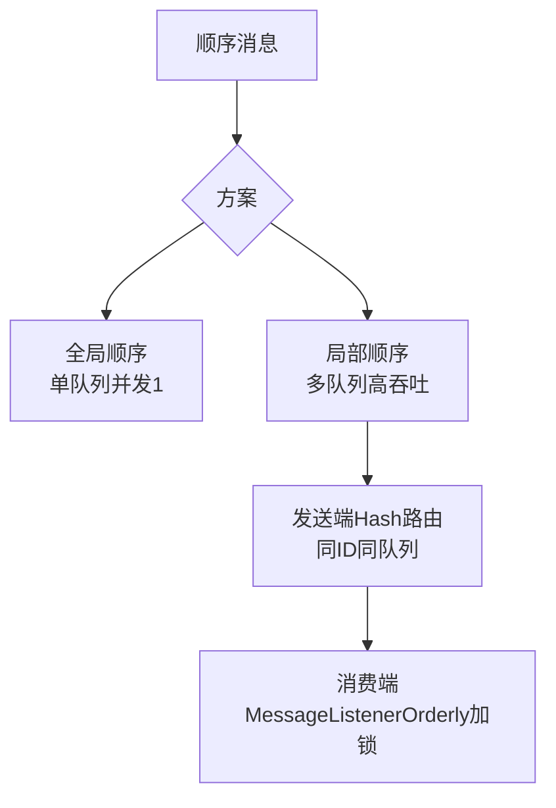

# 消息的全局顺序和局部顺序

RocketMQ 支持两种顺序消息类型，主要区别在于并发控制的粒度。

**全局顺序消息**
- **定义**：一个 Topic 下只有一个队列，所有消息严格按照发送顺序（FIFO）被消费。
- **实现**：Producer 和 Consumer 的并发度必须为 1。
- **缺点**：吞吐量极低，通常不建议使用，除非业务强依赖全局严格顺序（如极其严谨的金融对账）。

**局部（分区）顺序消息**
- **定义**：保证同一个 Queue 内的消息是有序的，不同 Queue 之间的消息可以并发消费。
- **实现**：
  - **发送端**：使用 `MessageQueueSelector` 将具有相同业务 ID（如订单 ID）的消息发送到同一个 Queue。利用 Hash 算法 `hash(key) % queueNum` 确保相同 Key 落入同一分区。
  - **消费端**：使用 `MessageListenerOrderly` 监听器。Consumer 在消费时会对 Queue 加锁（Broker 端或本地锁），确保同一时间只有一个线程消费该 Queue。

**技术细节**
Broker 端维护 `mqLockTable`，顺序消息在拉取任务创建时需申请锁，加锁成功才能进行拉取消费。

**对比表格**

| 特性 | 全局顺序 | 局部（分区）顺序 |
| :--- | :--- | :--- |
| **队列数量** | 仅 1 个 | 可配置多个（通常 >1） |
| **吞吐量** | 极低（单线程瓶颈） | 高（并行度 = 队列数） |
| **顺序粒度** | Topic 级别严格有序 | Queue 级别有序（业务 Key 一致） |
| **适用场景** | 极少，仅金融对账等 | 订单状态流转、支付流水 |

**实战案例**
在电商订单状态流转中，曾遇到因发送端未指定固定的分区算法（使用默认轮询），导致同一订单的“创建”和“支付”消息落入不同队列，被并发消费引发了状态机异常。修复后强制使用 `orderId.hashCode()` 进行分区选择，解决了乱序问题。

**代码示例 (Java)**
```java
// 发送端：根据订单ID选择队列
SendResult sendResult = producer.send(msg, new MessageQueueSelector() {
    @Override
    public MessageQueue select(List<MessageQueue> mqs, Message msg, Object arg) {
        Long orderId = (Long) arg; 
        int index = (int) (orderId % mqs.size());
        return mqs.get(index);
    }
}, orderId);
```

**顺序消费锁机制图**
```text
+-------------------+         +-------------------+         +-------------------+
|   Consumer Thread |         |   Consumer Thread |         |   Consumer Thread |
+---------+---------+         +---------+---------+         +---------+---------+
          |                             |                             |
          | 1. 申请 MessageQueue 锁      |                             |
          +-----------------------------+-----------------------------+
                                        |
                                        v
                         +------------------------------+
                         |  MessageQueue (Queue A)      |
                         |  [Locked by Thread 1]       |
                         +------------------------------+
                                        |
                  +---------------------+---------------------+
                  |                     |                     |
                  v                     v                     v
           Msg 1 (Order A)        Msg 2 (Order A)        Msg 3 (Order B)
        (Thread 1 消费)        (Thread 1 消费)        (Thread 1 消费)
```

## 常见考点
1. **MessageListenerOrderly 是如何保证顺序的？**：单线程消费吗？不是，它是通过对每个 Queue 加锁，保证同一个 Queue 的消息只能被同一个线程处理，但不同 Queue 的消息可以由不同线程并行处理。
2. **如果发送端顺序但消费端乱序了怎么办？**：通常是由于开启了并发消费（MessageListenerConcurrently）或者发生了重试导致的乱序，必须切换到 Orderly 监听器。
3. **Broker 端锁与客户端锁的区别**：在 4.5.x 版本之前主要是客户




## 核心知识点图


## 记忆要点

- 全局 vs 局部：全局顺序单队列吞吐极低，局部顺序多队列靠 Hash 路由保证分区高并发吞吐
- 局部顺序实现：发送端用 Hash 算法将同 ID 消息发往同一队列，消费端用 MessageListenerOrderly 加锁串行消费

## 结构化回答


**30 秒电梯演讲：** 把同一个订单的所有步骤都交给同一个工人处理，避免多人协作造成的混乱。

**展开框架：**
1. **全局顺序 Topic** — 只能有一个队列，吞吐低。
2. **局部顺序通过** — Hash 算法将同类消息路由至同一队列。
3. **消费端使用 Me** — 消费端使用 MessageListenerOrderly 加锁。

**收尾：** 这是我实战中的理解，您想深入哪一段？


## 视频脚本

> 预计时长：3 分钟 | 由浅入深

| 时间 | 画面/字幕 | 口播台词 | 讲解要点 |
|------|----------|----------|----------|
| 0:00 | 标题卡：消息的全局顺序和局部顺序 | "消息的全局顺序和局部顺序？一句话——把同一个订单的所有步骤都交给同一个工人处理，避免多人协作造成的混乱。" | 开场钩子 |
| 0:45 | 概念动画/示意图 | "通过将同Key消息发至同一队列并加锁消费来保证分区顺序——把同一个订单的所有步骤都交给同一个工人处理，避免多人协作造成的混乱" | 核心定义 |
| 1:30 | 全局 vs 局部示意 | "全局顺序单队列吞吐极低，局部顺序多队列靠 Hash 路由保证分区高并发吞吐" | 要点1 |
| 2:15 | 局部顺序实现示意 | "发送端用 Hash 算法将同 ID 消息发往同一队列，消费端用 MessageListenerOrderly 加锁串行消费" | 要点2 |
| 3:00 | 总结卡 | "记住这几条，面试不慌。下期讲进阶追问。" | 收尾 |
