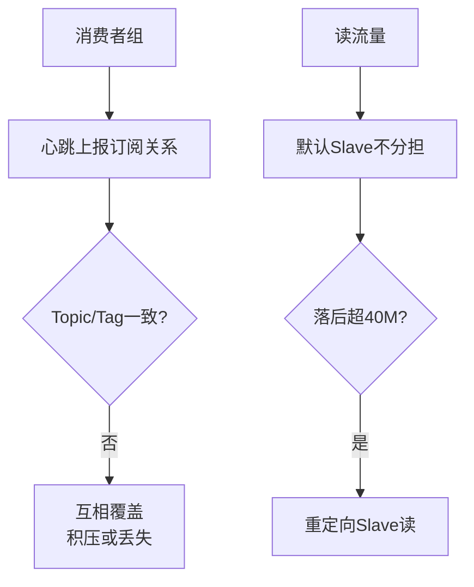

# 一些注意点

在使用 RocketMQ 时，有一些关键的架构限制和注意事项需要遵守。

**1. 订阅一致性**
- 同一个 ConsumerGroup 内的所有消费者实例，必须订阅完全相同的 Topic 和 Tag。
- **原理细节**：订阅信息随心跳上报（默认 30s 一次）。Broker 端维护消费者组的订阅关系，若不一致，Broker 会以最新的心跳为准覆盖旧配置。这会导致部分实例拉取不到消息（消息丢失）或拉取到不需要的消息（无法消费），从而破坏负载均衡机制。

**2. 主从读写分离的局限性**
- Slave 只能提供读服务，不能接收写入请求。
- **触发条件**：只有当消费者消费进度落后于 Master 较多（默认落后物理内存超过 40M，可通过 `slaveReadEnable` 等参数配置）时，Broker 才会建议客户端重定向到 Slave 读取。
- **边界条件**：Slave 消息会有轻微延迟（毫秒级），因此在正常情况下 Slave 分担的流量有限，主要用于削峰而非分担主节点日常读压力。

**3. 顺序消费的脆弱性**
- 严格的顺序消息依赖队列的单线程消费和锁机制。
- **风险点**：在 Broker 宕机发生主从切换或队列重平衡时，队列可能会切换到其他消费者，存在短暂乱序风险。若业务无法容忍，需接受此时集群降级不可用或牺牲部分性能（如仅单节点部署无 HA）。

**4. 扩容限制**
- 单纯增加 Consumer 实例无法提升消费速度，必须同步增加 Queue 数量。
- **并行度原理**：Consumer 的最大并行度 = Min(Consumer 实例总数, Topic 队列总数)。因此 Queue 数决定了理论上限。

**对比表格：重平衡影响**

| 场景 | 并发消费 | 顺序消费 |
| :--- | :--- | :--- |
| **触发时机** | 实例数变化、队列数变化、订阅关系变化 | 同左，但触发逻辑更复杂 |
| **影响范围** | 仅暂停部分队列拉取，几乎无感 | 需释放锁、转移锁、暂停消费，影响较大 |
| **恢复速度** | 快（秒级） | 慢（取决于当前消费进度是否提交） |
| **数据一致性** | 可能短暂重复（ACK 机制保证） | 可能导致短暂乱序或阻塞 |

**实战案例**
某次上线紧急修复 Bug，仅修改了 Consumer A 的订阅 Tag（由 `*` 改为 `TagA`）但未重启 Consumer B。结果导致 Consumer B 上报旧订阅覆盖了 Broker 的配置，使得 Consumer A 拉取不到 `TagA` 的消息，造成了业务数据中断。

**代码示例 (Java - 避免订阅不一致)**
```java
// 推荐做法：将订阅关系配置在配置中心或常量类中，确保所有实例启动时加载一致
public class ConsumerConfig {
    public static final String TOPIC = "ORDER_TOPIC";
    public static final String SUB_EXPRESSION = "TagA || TagB"; // 统一管理
}

consumer.subscribe(ConsumerConfig.TOPIC, ConsumerConfig.SUB_EXPRESSION);
```

## 常见考点
1. 如果 Consumer 订阅了不同的 Tag，会发生什么后果？（消息积压或丢失）
2. RocketMQ 的主从复制是同步还是异步？对读写分离有什么影响？（默认异步，Slave 有数据延迟）
3. 为什么顺序消息在扩容时可能会乱序？（重平衡导致队列所有权转移，打破了原有的处理顺序）




## 核心知识点图


## 记忆要点

- 订阅强一致性：因为同组内消费者以最新心跳上报订阅关系，若 Topic/Tag 不一致会互相覆盖，所以导致消息积压或丢失
- 读写分离局限：Slave 默认不分担读流量，只有当消费落后物理内存特定阈值（如 40M）时才重定向到 Slave 读

## 结构化回答

**30 秒电梯演讲：** 同组消费者订阅需一致，扩容需同步加队列，读写分离有门槛。打个比方，团队里大家必须接同样的任务；想干活更快得先加任务槽；备胎平时很难派上用场。

**展开框架：**
1. **订阅强一致性** — 因为同组内消费者以最新心跳上报订阅关系，若 Topic/Tag 不一致会互相覆盖，所以导致消息积压或丢失
2. **读写分离局限** — Slave 默认不分担读流量，只有当消费落后物理内存特定阈值（如 40M）时才重定向到 Slave 读
3. **ConsumerGroup 内订阅信息必须一致。**

**收尾：** 我在项目里踩过坑——某次上线紧急修复 Bug，仅修改了 Consumer A 的订阅 Tag（由 `` 改为 `TagA`）但未重启 Consumer B。您想深入聊哪一段：原理、避坑还是对比选型？

## 视频脚本

> 预计时长：3 分钟 | 由浅入深

| 时间 | 画面/字幕 | 口播台词 | 讲解要点 |
|------|----------|----------|----------|
| 0:00 | 标题卡：一些注意点 | "一些注意点？一句话——团队里大家必须接同样的任务；想干活更快得先加任务槽；备胎平时很难派上用场。" | 开场钩子 |
| 0:45 | 概念动画/示意图 | "同组消费者订阅需一致，扩容需同步加队列，读写分离有门槛——团队里大家必须接同样的任务；想干活更快得先加任务槽；备胎平时很难派上用场" | 核心定义 |
| 1:30 | 订阅强一致性示意 | "因为同组内消费者以最新心跳上报订阅关系，若 Topic/Tag 不一致会互相覆盖，所以导致消息积压或丢失" | 要点1 |
| 2:15 | 读写分离局限示意 | "Slave 默认不分担读流量，只有当消费落后物理内存特定阈值（如 40M）时才重定向到 Slave 读" | 要点2 |
| 3:00 | 总结卡 | "记住这几条，面试不慌。下期讲进阶追问。" | 收尾 |
