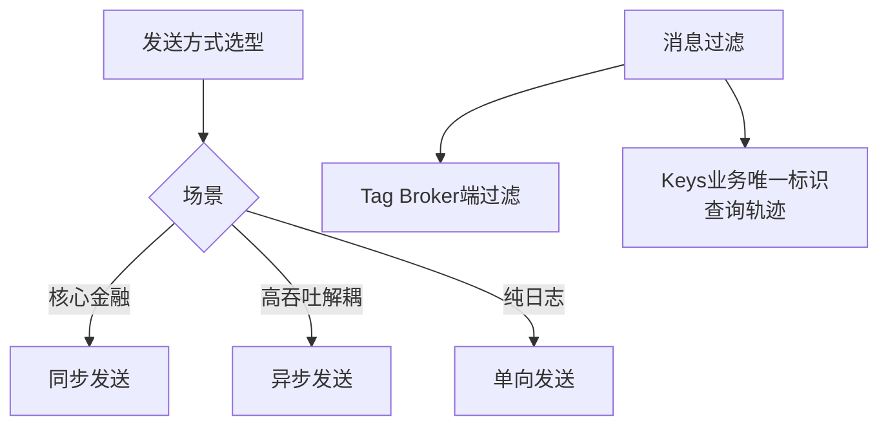

# RocketMQ 的最佳实践

遵循 RocketMQ 的最佳实践可以显著提升系统的稳定性和可维护性。

**1. Topic 与 Tag 设计**
- **一应用一 Topic**：建议一个应用对应一个 Topic，利用 Tag 来区分不同的业务线或消息类型。
- **优势**：Tag 灵活且管理清晰，便于在消费端进行基于 Tag 的过滤（Broker 端或消费端过滤），减少不必要的网络传输。

**2. Keys 的使用**
- 为每条消息设置业务上的唯一标识（如订单 ID）并存入 `keys` 字段（支持多个 Key 用空格分隔）。
- **作用**：在发生消息丢失或需要排查问题时，可以通过命令行工具（`mqadmin`）基于 Key 快速查询消息轨迹，定位具体的消息内容。

**3. JVM 参数调优**
- **堆内存**：建议设置为 4G - 8G，避免过大导致 GC 停顿过长。
- **GC 算法**：推荐使用 G1 收集器 (`-XX:+UseG1GC`)，以控制停顿时间。

**4. NameServer 寻址**
- 建议使用 HTTP 静态服务器来配置 NameServer 地址列表，实现客户端的动态发现，避免硬编码 IP 列表。

**5. 消息发送与重试**
- **发送方式**：同步发送用于重要业务（需等待返回结果），异步发送用于高吞吐场景，单向发送用于不极其重要的日志（如埋点）。
- **重试机制**：生产者发送失败会自动重试（默认 2 次），注意需保证消息发送的幂等性。

**对比表格：发送方式选型**

| 方式 | 可靠性 | 吞吐量 | 适用场景 | 返回值 |
| :--- | :--- | :--- | :--- | :--- |
| **同步发送** | 高 | 低 | 重要通知、金融交易 | SendResult (含 Offset) |
| **异步发送** | 高 | 高 | 业务解耦、非核心流程 | 回调 Callback |
| **单向发送** | 低 (不等待) | 极高 | 日志收集、埋点数据 | void |

**实战案例**
某大促期间，日志采集服务使用 Oneway 方式发送消息导致发送队列积压，最终触发 Netty 发送缓冲区溢出。虽然 Oneway 不关心结果，但过快的发送速率导致网络拥塞反而影响了其他重要 Topic 的通信。改为 Async 并结合流量整形后解决。

**代码示例 (Java - Keys 与 异步发送)**
```javan// 设置 Keys 并进行异步发送
Message msg = new Message("OrderTopic", "TagA", "OrderID_123456", body);
// 异步发送回调
producer.send(msg, new SendCallback() {
    @Override
    public void onSuccess(SendResult sendResult) {
        log.info("发送成功, MsgId: {}", sendResult.getMsgId());
    }
    @Override
    public void onException(Throwable e) {
        log.error("发送失败", e);
        // 此处可记录本地库或告警
    }
});
```

## 常见考点
1. Tags 和 Keys 的区别是什么？（Tag 用于消费端过滤，Keys 用于查询索引）
2. 为什么不建议 JVM 堆内存设置过大？（RocketMQ 大量使用堆外内存/PageCache，堆过大 GC 压力大）
3. 如何保证消息发送的幂等性？（业务层通过唯一 ID 去重）




## 记忆要点

- 发送方式选型：同步适用于核心金融交易，异步适用高吞吐解耦，单向适用纯日志无返回要求场景
- Tag 与 Keys 对比：Tag 主要用于消费端在 Broker 进行消息过滤，而 Keys 是业务唯一标识用于快速查询消息轨迹

## 结构化回答

**30 秒电梯演讲：** 规范Topic与Tag设计，善用Keys索引，合理配置JVM与寻址。打个比方，给房间贴好标签（Topic/Tag），给文件编好号，用合适的工具箱（JVM）干活。

**展开框架：**
1. **发送方式选型** — 同步适用于核心金融交易，异步适用高吞吐解耦，单向适用纯日志无返回要求场景
2. **Tag 与 Keys 对比** — Tag 主要用于消费端在 Broker 进行消息过滤，而 Keys 是业务唯一标识用于快速查询消息轨迹
3. **应用间用 Topic 隔离** — 业务内用 Tag 细分。

**收尾：** 我在项目里踩过坑——某大促期间，日志采集服务使用 Oneway 方式发送消息导致发送队列积压，最终触发 Netty 发送缓冲区溢出。您想深入聊哪一段：原理、避坑还是对比选型？

## 视频脚本

> 预计时长：3 分钟 | 由浅入深

| 时间 | 画面/字幕 | 口播台词 | 讲解要点 |
|------|----------|----------|----------|
| 0:00 | 标题卡：RocketMQ 的最佳实践 | "RocketMQ 的最佳实践？一句话——给房间贴好标签（Topic/Tag），给文件编好号，用合适的工具箱（JVM）干活。" | 开场钩子 |
| 0:45 | 概念动画/示意图 | "规范Topic与Tag设计，善用Keys索引，合理配置JVM与寻址——给房间贴好标签（Topic/Tag），给文件编好号，用合适的工具箱（JVM）干活" | 核心定义 |
| 1:30 | 发送方式选型示意 | "同步适用于核心金融交易，异步适用高吞吐解耦，单向适用纯日志无返回要求场景" | 要点1 |
| 2:15 | 要点2图解示意 | "Tag 主要用于消费端在 Broker 进行消息过滤，而 Keys 是业务唯一标识用于快速查询消息轨迹" | 要点2 |
| 3:00 | 总结卡 | "记住这几条，面试不慌。下期讲进阶追问。" | 收尾 |
