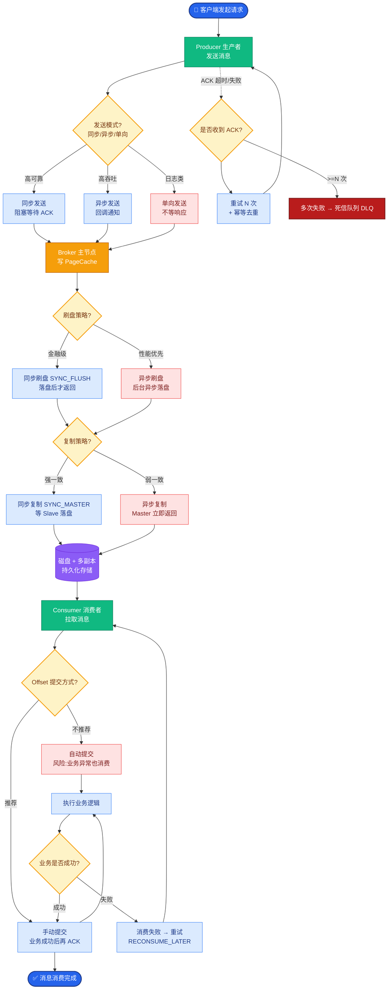
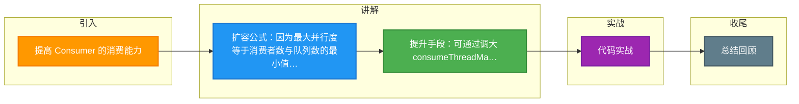

# 提高 Consumer 的消费能力

提高 Consumer 的消费能力主要从并行度、IO 批次和处理效率三个维度入手。

**1. 提高消费并行度**
- **水平扩容**：在队列数充足的前提下，增加 Consumer 实例数量。
  ```text
  并行度核心公式：
  Max Concurrency = min(Consumer Instances, Queue Numbers)
  ```
- **线程池扩容**：调高单个 Consumer 的 `consumeThreadMin` 和 `consumeThreadMax` 参数（默认 20），增加内部消费线程池大小，利用多核 CPU 加速处理。

**2. 批量消费**
- 调整 `consumeMessageBatchMaxSize` 参数（默认 1），使得 Consumer 一次拉取多条消息并批量处理（如批量插入数据库），减少网络 IO 和数据库交互次数。注意需在消费逻辑中实现 List 的批量处理。

**3. 优化消息处理逻辑**
- **跳过非核心消息**：在系统负载过高时，对于日志类等非核心消息，可在监听器中直接返回 `ConsumeConcurrentlyStatus.CONSUME_SUCCESS`（丢弃），以保护核心业务链路。
- **异步处理**：如果业务允许，将耗时操作（如调用第三方 HTTP 接口）转为异步（如扔到本地独立线程池），避免阻塞 MQ 消费线程导致心跳超时。

**对比表格：优化手段**

| 维度 | 手段 | 优点 | 缺点/风险 |
| :--- | :--- | :--- | :--- |
| **并行度** | 增加机器/线程 | 提升 CPU 利用率 | 受限于队列数；增加线程会增加上下文切换 |
| **批量** | consumeMessageBatchMaxSize | 减少 DB IO | 单条失败可能导致整批重试（视配置而定）；内存占用增加 |
| **逻辑** | 异步化/本地线程池 | 避免阻塞 Rebalance | 增加代码复杂度；需处理异步结果的异常和重试 |

**实战案例**
在处理积压数千万的消息时，单纯增加 Consumer 无效（队列数瓶颈）。解决方案是临时新建一个拥有 10 倍队列数的临时 Topic，写程序将存量消息转发进去，再部署 10 倍的 Consumer 进行消费，处理完后恢复原状。

**代码示例 (Java - 批量消费)**
```java
// 配置批量消费大小
consumer.setConsumeMessageBatchMaxSize(10); 

@Override
public ConsumeConcurrentlyStatus consumeMessage(List<MessageExt> msgs, ConsumeConcurrentlyContext context) {
    // 批量处理逻辑，如批量插入 DB
    List<Order> orders = msgs.stream()
        .map(msg -> JSON.parseObject(msg.getBody(), Order.class))
        .collect(Collectors.toList());
    
    orderService.batchInsert(orders); 
    return ConsumeConcurrentlyStatus.CONSUME_SUCCESS;
}
```

**消费流程简图：**
```text
Pull Message Thread (单线程)
       │
       ├─> 从 Broker 拉取一批消息 (默认 32 条)
       │
       ▼
Process Queue (内存队列)
       │
       ├─> Submit to Consume Executor (多线程池)
       │       │
       │       ├─> Thread 1 -> 处理单条或批量消息 -> 返回状态
       │       ├─> Thread 2 -> 处理单条或批量消息 -> 返回状态
       │       └─> ...
       │
       ▼
Offset Management (更新消费进度)
```

## 常见考点
1. 如果 Consumer 数量大于 Queue 数量会发生什么？（多余的消费者闲置，浪费资源）
2. 批量消费时，如果中间某条消息处理失败，怎么处理？（默认重试该批，或者单条重试，取决于具体实现）
3. 为什么不建议在消费逻辑中进行耗时同步阻塞操作？（阻塞消费线程会导致 Rebalance，甚至被踢出消费组）


## 核心流程图



## 记忆要点

- 扩容公式：因为最大并行度等于消费者数与队列数的最小值，所以单纯增加消费者无效，必须同步增加队列数
- 提升手段：可通过调大 consumeThreadMax 线程池或调大 batchMaxSize 批量拉取参数，来减少网络 IO 提升处理效率

## 结构化回答

**30 秒电梯演讲：** 通过加线程、加机器、批量处理及降级非核心消息提升吞吐。打个比方，多雇几个人，一次搬一箱砖而不是一块砖，紧急时扔掉不重要的砖。

**展开框架：**
1. **扩容公式** — 因为最大并行度等于消费者数与队列数的最小值，所以单纯增加消费者无效，必须同步增加队列数
2. **提升手段** — 可通过调大 consumeThreadMax 线程池或调大 batchMaxSize 批量拉取参数，来减少网络 IO 提升处理效率
3. **增加 Consumer 数量和单机线程数。**

**收尾：** 我在项目里踩过坑——在处理积压数千万的消息时，单纯增加 Consumer 无效（队列数瓶颈）。您想深入聊哪一段：原理、避坑还是对比选型？

## 视频脚本

> 预计时长：3 分钟 | 由浅入深

| 时间 | 画面/字幕 | 口播台词 | 讲解要点 |
|------|----------|----------|----------|
| 0:00 | 标题卡：提高 Consumer 的消费能力 | "提高 Consumer 的消费能力？一句话——多雇几个人，一次搬一箱砖而不是一块砖，紧急时扔掉不重要的砖。" | 开场钩子 |
| 0:45 | 概念动画/示意图 | "通过加线程、加机器、批量处理及降级非核心消息提升吞吐——多雇几个人，一次搬一箱砖而不是一块砖，紧急时扔掉不重要的砖" | 核心定义 |
| 1:30 | 扩容公式示意 | "因为最大并行度等于消费者数与队列数的最小值，所以单纯增加消费者无效，必须同步增加队列数" | 要点1 |
| 2:15 | 提升手段示意 | "可通过调大 consumeThreadMax 线程池或调大 batchMaxSize 批量拉取参数，来减少网络 IO 提升处理效率" | 要点2 |
| 3:00 | 总结卡 | "记住这几条，面试不慌。下期讲进阶追问。" | 收尾 |

### 视频流程图



