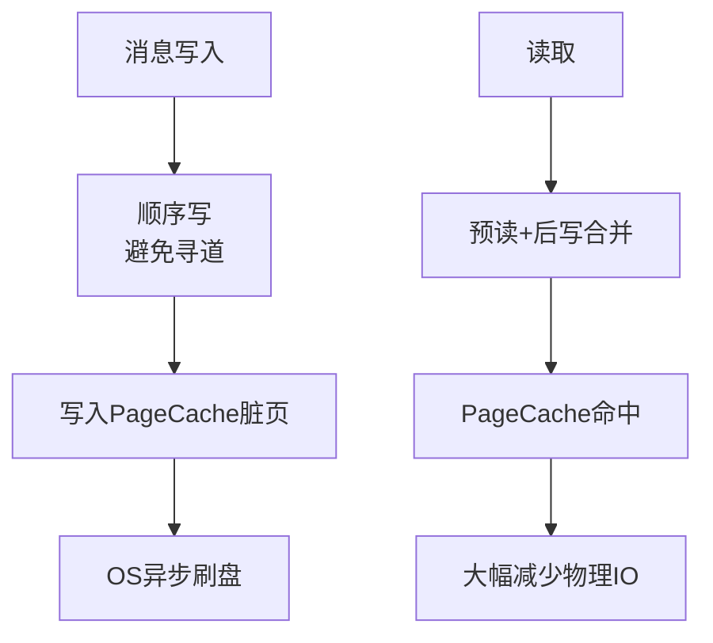
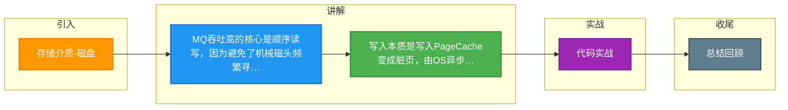

# 存储介质-磁盘

Kafka和RocketMQ底层存储揭秘，为什么能
这么快？
 
我们都知道 RocketMQ 和 Kafka 消息都是存在磁盘中的，那为什么消息存磁盘读写还可以这么快？有
没有做了什么优化？都是存磁盘它们两者的实现之间有什么区别么？各自有什么优缺点?
今天我们就来一探究竟。
存储介质-磁盘
 
一般而言消息中间件的消息都存储在本地文件中，因为从效率来看直接放本地文件是最快的，并且稳定
性最高。毕竟要是放类似数据库等第三方存储中的话，就多一个依赖少一份安全，并且还有网络的开
销。
那对于将消息存入磁盘文件来说一个流程的瓶颈就是磁盘的写入和读取。我们知道磁盘相对而言读写速
度较慢，那通过磁盘作为存储介质如何实现高吞吐呢？
顺序读写
 
答案就是顺序读写。
首先了解一下页缓存，页缓存是操作系统用来作为磁盘的一种缓存，减少磁盘的I/O操作。
在写入磁盘的时候其实是写入页缓存中，使得对磁盘的写入变成对内存的写入。写入的页变成脏页，然
后操作系统会在合适的时候将脏页写入磁盘中。
在读取的时候如果页缓存命中则直接返回，如果页缓存 miss 则产生缺页中断，从磁盘加载数据至页缓
存中，然后返回数据。
并且在读的时候会预读，根据局部性原理当读取的时候会把相邻的磁盘块读入页缓存中。在写入的时候
会后写，写入的也是页缓存，这样存着可以将一些小的写入操作合并成大的写入，然后再刷盘。
而且根据磁盘的构造，顺序 I/O 的时候，磁头几乎不用换道，或者换道的时间很短。
根据网上的一些测试结果，顺序写盘的速度比随机写内存还要快。
当然这样的写入存在数据丢失的风险，例如机器突然断电，那些还未刷盘的脏页就丢失了。不过可以调
用 fsync  强制刷盘，但是这样对于性能的损耗较大。
因此一般建议通过多副本机制来保证消息的可靠，而不是同步刷盘。
可以看到顺序 I/O 适应磁盘的构造，并且还有预读和后写。 RocketMQ 和 Kafka 都是顺序写入和近似
顺序读取。它们都采用文件追加的方式来写入消息，只能在日志文件尾部写入新的消息，老的消息无法
更改。
mmap-文件内存映射
 
从上面可知访问磁盘文件会将数据加载到页缓存中，但是页缓存属于内核空间，用户空间访问不了，因
此数据还需要拷贝到用户空间缓冲区。

**深化实战**

- **实战案例**：在云环境（如 AWS EBS）上使用 Kafka 时，发现 `InitiatingHeapOccupancyPercent` 设置不当会导致频繁 Full GC，利用 Page Cache 进行批量顺序读可显著提升 EBS 的吞吐性能。
- **对比表格**（I/O 模式对比）：

| I/O 模式 | 速度 | 磁盘寻道 | 适用场景 | 评价 |
| :--- | :--- | :--- | :--- | :--- |
| **顺序写** | 极快 (可达 600MB/s) | 极少 | 消息队列追加日志 | 最佳实践，利用预读和后写 |
| **随机写** | 慢 (约 100KB/s-2MB/s) | 频繁 | 传统数据库 B+ 树更新 | 机械硬盘瓶颈明显 |
| **顺序读** | 快 | 极少 | 消费历史数据 | 利用 OS 预读 |
| **随机读** | 较慢 | 频繁 | 根据偏移量跳跃读取 | 依赖 PageCache 命中率 |

- **代码示例**（Java NIO FileChannel 顺序写）：
```java
// 使用 FileChannel 保证顺序写，利用 write 位置自动后移
FileChannel channel = new FileOutputStream(file, true).getChannel();
ByteBuffer buffer = ByteBuffer.wrap(messageBytes);
while (buffer.hasRemaining()) {
    channel.write(buffer); // 指针自动后移，无需 seek
}
```




## 记忆要点

- MQ吞吐高的核心是顺序读写，因为避免了机械磁头频繁寻道，且完美利用PageCache
- 写入本质是写入PageCache变成脏页，由OS异步刷盘，断电有丢数据风险
- 局部性原理优势：读操作伴随预读，写操作伴随后写合并，大幅减少物理I/O次数
- 随机读写极慢，依赖PageCache命中率，传统DB随机写是机械硬盘主要瓶颈

## 结构化回答

**30 秒电梯演讲：** 利用磁盘顺序读写特性突破IO性能瓶颈。打个比方，像磁带录音机一直向后录，不用倒带，比在内存里乱翻书还快。

**展开框架：**
1. **MQ吞吐高的核心是顺序读写** — 因为避免了机械磁头频繁寻道，且完美利用PageCache
2. **写入本质是写入PageCache变成脏页** — 由OS异步刷盘，断电有丢数据风险
3. **局部性原理优势** — 读操作伴随预读，写操作伴随后写合并，大幅减少物理I/O次数

**收尾：** 我在项目里踩过坑——对比表格（I/O 模式对比）：。您想深入聊哪一段：原理、避坑还是对比选型？

## 视频脚本

> 预计时长：3 分钟 | 由浅入深

| 时间 | 画面/字幕 | 口播台词 | 讲解要点 |
|------|----------|----------|----------|
| 0:00 | 标题卡：存储介质-磁盘 | "存储介质-磁盘？一句话——像磁带录音机一直向后录，不用倒带，比在内存里乱翻书还快。" | 开场钩子 |
| 0:45 | 概念动画/示意图 | "利用磁盘顺序读写特性突破IO性能瓶颈——像磁带录音机一直向后录，不用倒带，比在内存里乱翻书还快" | 核心定义 |
| 1:30 | 要点1图解示意 | "因为避免了机械磁头频繁寻道，且完美利用PageCache" | 要点1 |
| 2:15 | 要点2图解示意 | "由OS异步刷盘，断电有丢数据风险" | 要点2 |
| 3:00 | 总结卡 | "记住这几条，面试不慌。下期讲进阶追问。" | 收尾 |

---

### 视频流程图




## 延伸：Kafka和RocketMQ底层存储揭秘，为什么能这么快

> 合并自 `mq-069`（相似度 66%）

这么快？
 
我们都知道 RocketMQ 和 Kafka 消息都是存在磁盘中的，那为什么消息存磁盘读写还可以这么快？有
没有做了什么优化？都是存磁盘它们两者的实现之间有什么区别么？各自有什么优缺点?
今天我们就来一探究竟。
存储介质-磁盘
 
一般而言消息中间件的消息都存储在本地文件中，因为从效率来看直接放本地文件是最快的，并且稳定
性最高。毕竟要是放类似数据库等第三方存储中的话，就多一个依赖少一份安全，并且还有网络的开
销。
那对于将消息存入磁盘文件来说一个流程的瓶颈就是磁盘的写入和读取。我们知道磁盘相对而言读写速
度较慢，那通过磁盘作为存储介质如何实现高吞吐呢？
顺序读写
 
答案就是顺序读写。
首先了解一下页缓存，页缓存是操作系统用来作为磁盘的一种缓存，减少磁盘的I/O操作。
在写入磁盘的时候其实是写入页缓存中，使得对磁盘的写入变成对内存的写入。写入的页变成脏页，然
后操作系统会在合适的时候将脏页写入磁盘中。
在读取的时候如果页缓存命中则直接返回，如果页缓存 miss 则产生缺页中断，从磁盘加载数据至页缓
存中，然后返回数据。
并且在读的时候会预读，根据局部性原理当读取的时候会把相邻的磁盘块读入页缓存中。在写入的时候
会后写，写入的也是页缓存，这样存着可以将一些小的写入操作合并成大的写入，然后再刷盘。
而且根据磁盘的构造，顺序 I/O 的时候，磁头几乎不用换道，或者换道的时间很短。
根据网上的一些测试结果，顺序写盘的速度比随机写内存还要快。
当然这样的写入存在数据丢失的风险，例如机器突然断电，那些还未刷盘的脏页就丢失了。不过可以调
用 fsync  强制刷盘，但是这样对于性能的损耗较大。
因此一般建议通过多副本机制来保证消息的可靠，而不是同步刷盘。
可以看到顺序 I/O 适应磁盘的构造，并且还有预读和后写。 RocketMQ 和 Kafka 都是顺序写入和近似
顺序读取。它们都采用文件追加的方式来写入消息，只能在日志文件尾部写入新的消息，老的消息无法
更改。
mmap-文件内存映射
 
从上面可知访问磁盘文件会将数据加载到页缓存中，但是页缓存属于内核空间，用户空间访问不了，因
此数据还需要拷贝到用户空间缓冲区。

**深化实战**

- **对比表格**：

| 特性 | RocketMQ | Kafka |
| :--- | :--- | :--- |
| **存储模型** | CommitLog + ConsumeQueue (逻辑物理分离) | Partition Log (日志合并) |
| **文件结构** | 固定长度 CommitLog (1G) + ConsumeQueue | 固定长度 Segment Log (1G) + 索引文件 |
| **顺序读** | ConsumeQueue 近乎顺序，CommitLog 顺序 | 天然顺序追加，顺序读 |
| **实时性** | 更高 (支持指定消息消费) | 稍低 (依赖 Fetch 请求) |
| **零拷贝** | mmap (读写) | mmap (读) / sendfile (传输) |

- **实战案例**：Kafka 在日志清理时会因磁盘碎片化导致顺序写退化为随机写，影响吞吐，需合理配置 `log.segment.bytes` 和 `log.retention.hours`。
- **代码示例**（RocketMQ MappedFile 初始化）：
```java
// RocketMQ 利用 mmap 映射 CommitLog 文件
this.mappedByteBuffer = mappedFileChannel.map(MapMode.READ_WRITE, 0, fileSize);
```

## 记忆要点

- 快的核心基石是顺序写，因为磁头几乎不用换道，且能利用OS预读和后写合并I/O
- 两者均用追加写，老消息不可改，所以顺序写盘速度甚至比随机写内存快
- 可靠性靠多副本而非同步刷盘，因为fsync强制刷盘对性能损耗过大
- 网络传输用零拷贝，RocketMQ用mmap（降低CPU拷贝），Kafka用sendfile

## 结构化回答

**30 秒电梯演讲：** 利用磁盘顺序读写特性突破IO性能瓶颈。打个比方，像磁带录音机一直向后录，不用倒带，比在内存里乱翻书还快。

**展开框架：**
1. **快的核心基石是顺序写** — 因为磁头几乎不用换道，且能利用OS预读和后写合并I/O
2. **两者均用追加写** — 老消息不可改，所以顺序写盘速度甚至比随机写内存快
3. **可靠性靠多副本而非同步刷盘** — 因为fsync强制刷盘对性能损耗过大

**收尾：** 我在项目里踩过坑——代码示例（RocketMQ MappedFile 初始化）：。您想深入聊哪一段：原理、避坑还是对比选型？

## 视频脚本

> 预计时长：3 分钟 | 由浅入深

| 时间 | 画面/字幕 | 口播台词 | 讲解要点 |
|------|----------|----------|----------|
| 0:00 | 标题卡：Kafka和RocketMQ底层存储… | "Kafka和RocketMQ底层存储揭秘，为什么能这么快？一句话——像磁带录音机一直向后录，不用倒带，比在内存里乱翻书还快。" | 开场钩子 |
| 0:45 | 概念动画/示意图 | "利用磁盘顺序读写特性突破IO性能瓶颈——像磁带录音机一直向后录，不用倒带，比在内存里乱翻书还快" | 核心定义 |
| 1:30 | 快的核心基石是顺序写示意 | "因为磁头几乎不用换道，且能利用OS预读和后写合并I/O" | 要点1 |
| 2:15 | 两者均用追加写示意 | "老消息不可改，所以顺序写盘速度甚至比随机写内存快" | 要点2 |
| 3:00 | 总结卡 | "记住这几条，面试不慌。下期讲进阶追问。" | 收尾 |

### 视频流程图


