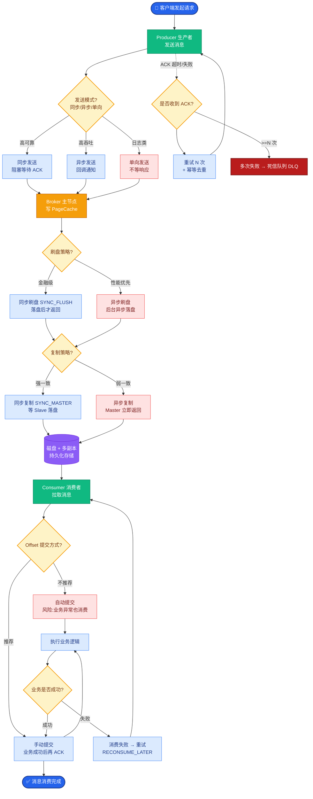

# mmap-文件内存映射

RocketMQ 和 Kafka 之所以能在磁盘上实现高吞吐，核心在于**顺序读写**和**零拷贝**（mmap/sendfile）。除了顺序写带来的磁盘物理优势外，`mmap`（内存映射）是减少 CPU 拷贝开销的关键技术。

### 一、mmap 原理与优势

传统的文件读写需要经历 **4 次数据拷贝**和 **4 次上下文切换**（Read + Write）。具体如下：
1.  **磁盘 -> 内核缓冲区**（DMA 拷贝）
2.  **内核缓冲区 -> 用户缓冲区**（CPU 拷贝，上下文切换）
3.  **用户缓冲区 -> Socket 缓冲区**（CPU 拷贝）
4.  **Socket 缓冲区 -> 网卡**（DMA 拷贝，上下文切换）

**mmap (Memory Map)** 通过映射机制，将用户空间的虚拟内存地址直接映射到内核空间的 Page Cache 上。

*   **读写操作**：应用程序不再调用 `read`/`write`，而是直接像操作内存一样通过指针修改映射地址的数据。
*   **拷贝次数**：减少了 1 次 CPU 拷贝（内核态 -> 用户态）。数据在页缓存中修改后，虽仍需拷贝到 Socket 缓冲区，但应用程序读取时无需从内核拷贝到用户态。
*   **上下文切换**：从 4 次减少为 2-4 次（视具体调用流程）。

### 二、mmap 读写消息流程图

下图展示了使用 mmap 后，Broker 如何将磁盘文件数据直接映射到内存供消费者快速读取：

```text
  JVM 用户空间                     内核空间                     硬件
┌──────────────────┐            ┌───────────────────┐
│                  │            │                   │
│  User Buffer     │            │                   │
│   (逻辑读写)     │            │                   │
│        ▲         │            │                   │
│        │ mmap()  │            │                   │
└────────┼─────────┘            │                   │
         │ 映射关系              │                   │
         └──────────────────────>│  Page Cache       │
                               │ (磁盘文件缓存)     │
                               │        ▲          │
                               │        │ DMA Read  │
                               └────────┼───────────┘
                                        │
                                        ▼
                                   ┌────────┐
                                   │  Disk  │ (CommitLog)
                                   └────────┘

注：
1. Producer 发送消息时，写入 mmap 映射的内存，直接进入 Page Cache。
2. Consumer 消费消息时，直接读取 mmap 映射的内存，避免了数据从内核态复制到用户态的开销。
```

### 三、mmap 的限制与边界条件

1.  **文件大小限制**：
    *   **RocketMQ**：利用 mmap 传输 CommitLog 时，由于映射数量和地址空间限制（特别是 32 位系统），单个文件大小不能无限大。RocketMQ 默认 CommitLog 为 1G，ConsumeQueue 为 5.72M（约 600W 条记录），这是权衡后的结果，以便在 32 位/64 位系统上都能高效映射。
2.  **内存回收风险**：
    *   当

**深化实战**

- **实战案例**：在处理超大批量消息（如 1GB 单文件）时，若 mmap 映射区域过大且并发访问高，可能导致操作系统的内存压力过大甚至 OOM Killer 杀进程，需合理控制 CommitLog 文件大小（推荐 1G）。
- **对比表格**（零拷贝技术对比）：

| 特性 | 传统 I/O (read/write) | mmap (Memory Map) | sendfile | RocketMQ 选用 | Kafka 选用 |
| :--- | :--- | :--- | :--- | :--- | :--- |
| **拷贝次数** | 4次 (2 CPU + 2 DMA) | 3次 (1 CPU + 2 DMA) | 2次 (0 CPU + 2 DMA) | mmap | mmap / sendfile |
| **上下文切换** | 4次 | 2-4次 | 2次 | 2-4次 | 2次 (持久化) |
| **用户态访问** | 支持 | 支持 | 不支持 | 支持 (读写) | 不支持 (仅传输) |
| **适用场景** | 小文件、简单逻辑 | 频繁读写、随机访问 | 文件传输 | 读写 CommitLog | 数据传输 |

- **代码示例**（Java MappedByteBuffer 操作）：
```java
// 模拟 RocketMQ 写入消息到 MappedByteBuffer
MappedByteBuffer mappedBuffer = fileChannel.map(FileChannel.MapMode.READ_WRITE, 0, fileSize);
int position = 0; // 当前写入偏移量
byte[] msgData = "Hello RocketMQ".getBytes();

// 直接写入内存，OS 负责异步刷盘
mappedBuffer.position(position);
mappedBuffer.put(msgData); 
```


## 核心流程图



## 记忆要点

- 作用：将磁盘文件直接映射到用户态虚拟内存，省去内核态到用户态的CPU拷贝
- 对比传统I/O：传统需4次拷贝4次上下文切换，mmap减少1次CPU拷贝，降至3次拷贝
- 限制与边界：受虚拟地址空间限制，RocketMQ将CommitLog切分为固定1G大小的文件
- 适用场景：需在用户态读取修改数据；RocketMQ广泛用于CommitLog和ConsumeQueue的读写

## 结构化回答

**30 秒电梯演讲：** 将磁盘文件直接映射到内存，省去内核态到用户态的数据拷贝。打个比方，给磁盘文件开了一扇直通内存的窗，直接读写不用搬运行李。

**展开框架：**
1. **作用** — 将磁盘文件直接映射到用户态虚拟内存，省去内核态到用户态的CPU拷贝
2. **对比传统I/O** — 传统需4次拷贝4次上下文切换，mmap减少1次CPU拷贝，降至3次拷贝
3. **限制与边界** — 受虚拟地址空间限制，RocketMQ将CommitLog切分为固定1G大小的文件

**收尾：** 我在项目里踩过坑——对比表格（零拷贝技术对比）：。您想深入聊哪一段：原理、避坑还是对比选型？

## 视频脚本

> 预计时长：3 分钟 | 由浅入深

| 时间 | 画面/字幕 | 口播台词 | 讲解要点 |
|------|----------|----------|----------|
| 0:00 | 标题卡：mmap-文件内存映射 | "mmap-文件内存映射？一句话——给磁盘文件开了一扇直通内存的窗，直接读写不用搬运行李。" | 开场钩子 |
| 0:45 | 概念动画/示意图 | "将磁盘文件直接映射到内存，省去内核态到用户态的数据拷贝——给磁盘文件开了一扇直通内存的窗，直接读写不用搬运行李" | 核心定义 |
| 1:30 | 作用示意 | "将磁盘文件直接映射到用户态虚拟内存，省去内核态到用户态的CPU拷贝" | 要点1 |
| 2:15 | 对比传统I/示意 | "传统需4次拷贝4次上下文切换，mmap减少1次CPU拷贝，降至3次拷贝" | 要点2 |
| 3:00 | 总结卡 | "记住这几条，面试不慌。下期讲进阶追问。" | 收尾 |
