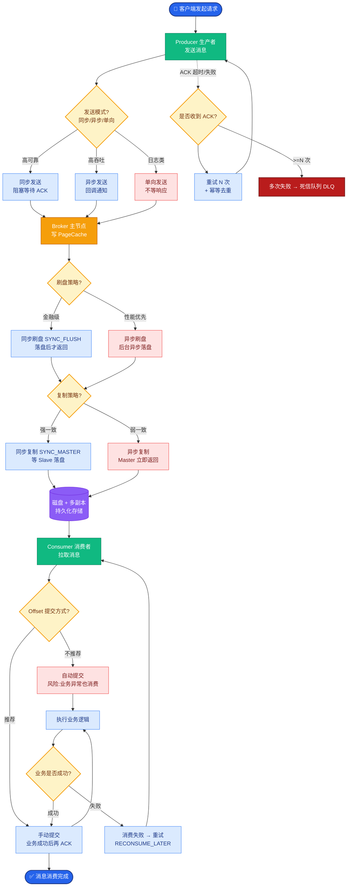
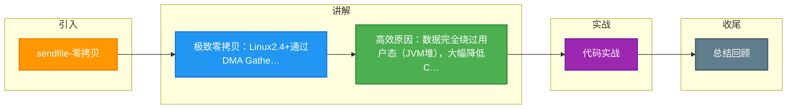

# sendfile-零拷贝

在消息队列的高性能传输中，`sendfile` 系统调用是实现“零拷贝”的关键技术，它主要解决了数据在**内核空间内部**的冗余拷贝问题。

### 一、传统文件传输的痛点

在没有零拷贝技术时，从磁盘读取文件并发送到网络（例如 Consumer 拉取消息），流程如下：
1.  **Read**：`read(file, buf)`，数据从 磁盘 -> 内核缓冲区 -> 用户缓冲区 (JVM Heap)。
2.  **Write**：`write(socket, buf)`，数据从 用户缓冲区 -> Socket 缓冲区 -> 网卡。

**问题**：数据在内核缓冲区和用户缓冲区之间来回拷贝（CPU 负责拷贝），浪费了大量 CPU 周期和总线带宽。

### 二、Sendfile 的演进与原理

#### 1. Linux 2.1 版本
引入 `sendfile(socket, file, offset, len)` 系统调用。
*   **流程**：数据从 磁盘 -> Page Cache -> Socket Buffer -> 网卡。
*   **优化**：相比传统方式，数据**不再拷贝到用户态**，减少了一次 CPU 拷贝和两次上下文切换（从 Read/Write 两次调用变为一次 Sendfile 调用）。
*   **不足**：Page Cache 到 Socket Buffer 仍然需要一次 CPU 拷贝，数据在内存中依然有两份副本。

#### 2. Linux 2.4 版本（真正零拷贝）
配合支持 **Scatter-Gather（分散-收集）** 的 DMA 控制器，`sendfile` 实现了极致优化。
*   **原理**：不再将数据从 Page Cache 拷贝到 Socket Buffer，而是仅将**包含数据位置和长度信息的描述符**（缓冲区描述符）拷贝到 Socket Buffer。
*   **DMA 动作**：DMA 控制器根据 Socket Buffer 中的描述符信息，直接从 Page Cache 将数据组装并发送到网卡。
*   **结果**：CPU 不再参与数据搬运，实现了真正的“零拷贝”。

### 三、零拷贝数据流转对比图

下图清晰展示了传统方式、Mmap 方式与 Sendfile 方式在数据拷贝上的差异：

```text
【方式 1: 传统 Read + Write】
磁盘 ──(DMA)──> 内核缓冲区 ──(CPU)──> 用户缓冲区 ──(CPU)──> Socket缓冲区 ──(DMA)──> 网卡
                ^                |                ^
                | (上下文切换)    | (上下文切换)   |

【方式 2: Mmap + Write】
磁盘 ──(DMA)──> 内核缓冲区 ────────────────────> Socket缓冲区 ──(DMA)──> 网卡
                | (映射)           ^ (CPU拷贝)
                |                  | (上下文切换)
                └──────> 用户缓冲区 (仅读操作)

【方式 3: Sendfile (Linux 2.4+)】
磁盘 ──(DMA)──> 内核缓冲区
                     |
                     | (仅拷贝 描述符/指针)
                     ▼
                Socket缓冲区 ──(DMA Gather)──> 网卡
                (仅包含数据元信息)      (直接从内核缓冲区取数据)
```

### 四、为什么 Sendfile 这么快？
1.  **减少上下文切换**：从 4 次（Read+Write）降低到 2 次（仅 Sendfile 调用）。
2.  **减少数据拷贝**：消除最耗时的 CPU 拷贝（内核态与用户态之间、内核态内部），完全由 DMA 负责传输，解放 CPU 去处理业务逻辑。
3.  **缓存友好**：数据一直保留在 Page Cache 中，后续如果有其他消费者拉取相同消息，直接命中缓存，无需再次读盘。

### 五、实战案例与代码

#### 实战案例
在 Kafka 的高并发下载场景中，若未开启零拷贝，JVM 的 GC（垃圾回收）压力会随着吞吐量线性增加，因为大量的 byte buffer 在堆内创建和销毁。开启 `sendfile` 后，数据完全不经过 JVM 堆内存，CPU 上下文切换降低 60% 以上，吞吐量显著提升且 GC 频率大幅下降。

#### 代码示例 (Java NIO)
```java
FileChannel fileChannel = new FileInputStream("log.segment").getChannel();
SocketChannel socketChannel = SocketChannel.open(new InetSocketAddress("consumer", 9092));

// transferTo 底层调用 sendfile 系统调用
// position: 文件起始偏移, count: 传输字节数
long transferred = fileChannel.transferTo(0, fileChannel.size(), socketChannel);
```

### 六、应用场景
*   **Kafka**：大量使用 `sendfile`。因为 Kafka 消费通常是顺序的，直接将日志文件片段传输给消费者，非常适合这种不需要在用户态处理数据的场景。
*   **RocketMQ**：在传输 CommitLog 时也利用了类似机制（基于 FileChannel）。
*   **Nginx**：作为静态资源服务器，`sendfile on` 是高性能配置的核心。
*   **对比表格**：

| 特性 | 传统 Read+Write | Mmap | Sendfile (Zero Copy) |
| :--- | :--- | :--- | :--- |
| **拷贝次数** | 4次 (2 CPU + 2 DMA) | 3次 (1 CPU + 2 DMA) | 2次 (0 CPU + 2 DMA) |
| **上下文切换** | 4次 | 4次 | 2次 |
| **CPU 参与度** | 高 (两次内存拷贝) | 中 (一次内存拷贝) | 低 (仅搬运描述符) |
| **数据修改** | 可在用户态随意修改 | 可在用户态修改 | 不可修改 (直通网卡) |
| **适用场景** | 需要对数据加工 | 随机读+少量写 | 纯传输 (如文件下载、MQ) |


## 核心流程图



## 记忆要点

- 极致零拷贝：Linux2.4+通过DMA Gather直接从PageCache送网卡，全程0次CPU拷贝
- 高效原因：数据完全绕过用户态（JVM堆），大幅降低CPU消耗和上下文切换次数
- 对比mmap：sendfile仅做纯数据传输不支持用户态读写，但拷贝次数更少效率更高
- 适用场景：大文件顺序网络传输；Kafka日志拉取大量使用sendfile，RocketMQ则不用

## 结构化回答

**30 秒电梯演讲：** 数据直接从磁盘文件传输到网卡，不经过应用程序内存。打个比方，用传送带把货物直接从仓库装车，不用先搬进中转站。

**展开框架：**
1. **极致零拷贝** — Linux2.4+通过DMA Gather直接从PageCache送网卡，全程0次CPU拷贝
2. **高效原因** — 数据完全绕过用户态（JVM堆），大幅降低CPU消耗和上下文切换次数
3. **对比mmap** — sendfile仅做纯数据传输不支持用户态读写，但拷贝次数更少效率更高

**收尾：** 这三点都能配合实战聊。您想深入聊原理、对比还是避坑？

## 视频脚本

> 预计时长：2 分钟 | 由浅入深

| 时间 | 画面/字幕 | 口播台词 | 讲解要点 |
|------|----------|----------|----------|
| 0:00 | 标题卡：sendfile-零拷贝 | "sendfile-零拷贝？一句话——用传送带把货物直接从仓库装车，不用先搬进中转站。" | 开场钩子 |
| 0:40 | 概念动画/示意图 | "数据直接从磁盘文件传输到网卡，不经过应用程序内存——用传送带把货物直接从仓库装车，不用先搬进中转站" | 核心定义 |
| 1:20 | 极致零拷贝示意 | "Linux2.4+通过DMA Gather直接从PageCache送网卡，全程0次CPU拷贝" | 要点1 |
| 2:00 | 总结卡 | "记住这几条，面试不慌。下期讲进阶追问。" | 收尾 |

### 视频流程图



