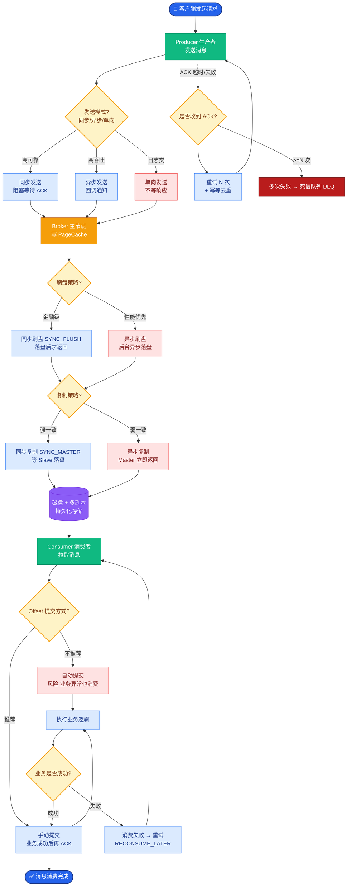
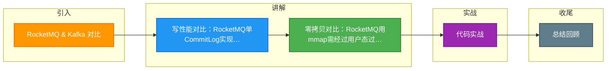

# RocketMQ & Kafka 对比

RocketMQ 和 Kafka 在高性能消息队列的设计上有着不同的权衡，主要体现在存储模型、I/O 模型和拷贝策略上。

### 1. 存储模型对比

| 特性 | RocketMQ | Kafka |
| :--- | :--- | :--- |
| **文件结构** | 所有 Topic 混存于 `CommitLog`，`ConsumeQueue` 作为索引 | 每个Partition一个独立的日志文件 |
| **写入模式** | 全局严格顺序写 | 单 Partition 顺序写，Partition 过多则全局随机写 |
| **扩容/迁移** | 相对复杂，需处理整体 CommitLog | 非常灵活，Partition 级别移动 |

### 2. I/O 拷贝技术对比

**RocketMQ：mmap + write**
- 利用 `mmap` 减少文件读取到用户态的拷贝。
- 发送时，通常需要将 Page Cache 数据拷贝到堆内内存，再写入 Socket（或通过 `MappedByteBuffer` 写入 Socket Buffer）。
- 流程：磁盘 -> Page Cache -> **用户态内存** -> Socket Buffer -> 网卡。
- **结论**：未实现完全零拷贝，但通过预热优化了 mmap 的缺页问题。

**Kafka：sendfile (零拷贝)**
- 利用 `FileChannel.transferTo` 调用底层 `sendfile`。
- 数据直接从 Page Cache 传输到网卡，绕过用户态内存。
- 流程：磁盘 -> Page Cache -> **网卡**。
- **结论**：实现了真正的零拷贝，数据不经过应用程序地址空间，CPU 消耗极低。

```text
┌──────────────────┐    RocketMQ Path      ┌─────────────┐
│  Disk / File     │ ──▶ Page Cache ──▶ User Heap ──▶ │   Socket    │
└──────────────────┘                        └─────────────┘

┌──────────────────┐    Kafka Path         ┌─────────────┐
│  Disk / File     │ ──▶ Page Cache ────────────────▶ │   Socket    │
└──────────────────┘   (sendfile)            └─────────────┘
```

### 3. 内存管理与 Swap

- **RocketMQ**：通过 `mlock` 锁定内存，防止关键消息数据被交换到磁盘，避免读取时的延迟抖动。这是为了满足金融级场景对低延迟的严苛要求。
- **Kafka**：倾向于相信操作系统的 Page Cache 管理能力。建议设置 `vm.swappiness=1` 而非 0。
  - **swappiness=0**: Linux 内核在许多版本中意味着“禁止 Swap”，内存耗尽时会触发 OOM Killer，直接杀进程，风险较高。
  - **swappiness=1**: 尽量不使用 Swap，但在内存极度紧张时允许少量 Swap，给系统管理员留出排查和报警的时间窗口。

### 实战案例与代码

#### 实战案例
在大促场景下，Kafka 集群通常在内存有限的情况下承载 PB 级流量。如果错误地将 `swappiness` 设为 0，一旦 Page Cache 占满，Linux 会直接杀掉 Kafka 进程，导致整个集群不可用。而 RocketMQ 则通过 `TransientStorePool`（堆外内存池）实现读写分离，写入时不依赖 Page Cache，从而规避了锁 Page Cache 带来的竞争，但在极端内存压力下仍需防止 Swap。

#### 代码示例 (Netty TransferTo 模拟 Kafka 传输)
```java
// 模拟 Kafka 消费者拉取数据的零拷贝传输
File file = new File("kafka-log-0.log");
FileChannel fileChannel = new FileInputStream(file).getChannel();
long position = 0;
long count = fileChannel.size();

// 关键 API：底层依赖 sendfile，数据不经过 JVM 堆内存
// 如果 OS 不支持 sendfile，Netty 会自动降级为 mmap + write
fileChannel.transferTo(position, count, socketChannel);
```

### 总结
- **RocketMQ** 胜在严格的顺序写和对低延迟（毛刺敏感）的极致优化，适合事务、订单等业务。
- **Kafka** 胜在吞吐量和利用零拷贝带来的高效率，适合日志收集、流计算等大数据场景。

## 常见考点
1.  **为什么 RocketMQ 不用 sendfile？** （因为 RocketMQ 需要在 CommitLog 中查找并构建消息内容，可能涉及多条消息拼接或过滤，需要数据在用户态进行处理，难以直接从磁盘送网卡）。
2.  **Partition 数量对 Kafka 性能的影响？** （Partition 过多导致文件句柄打开过多，且磁盘写头在多个文件间频繁跳转，破坏顺序写性能，增加随机 I/O）。
3.  **零拷贝的原理？** （DMA 传输，绕过 CPU，减少内核态与用户态的上下文切换和数据拷贝）。
4.  **如何权衡 mmap 和 sendfile？** （读多写少且需要随机访问用 mmap；纯顺序大批量传输用 sendfile）。


## 核心流程图



## 记忆要点

- 写性能对比：RocketMQ单CommitLog实现全局顺序写；Kafka多Partition并行写但过多会退化为随机写
- 零拷贝对比：RocketMQ用mmap需经过用户态过滤，是3次拷贝；Kafka用sendfile绕过用户态，是2次拷贝
- 设计定位：RocketMQ主打业务低延迟（防Swap锁内存）；Kafka主打大数据高吞吐（依赖OS PageCache）

## 结构化回答

**30 秒电梯演讲：** RocketMQ偏重写入通用性，Kafka偏重传输效率。打个比方，RocketMQ用大本子全速记流水账，Kafka按分类发传单。

**展开框架：**
1. **写性能对比** — RocketMQ单CommitLog实现全局顺序写；Kafka多Partition并行写但过多会退化为随机写
2. **零拷贝对比** — RocketMQ用mmap需经过用户态过滤，是3次拷贝；Kafka用sendfile绕过用户态，是2次拷贝
3. **设计定位** — RocketMQ主打业务低延迟（防Swap锁内存）；Kafka主打大数据高吞吐（依赖OS PageCache）

**收尾：** 这三点都能配合实战聊。您想深入聊原理、对比还是避坑？

## 视频脚本

> 预计时长：2 分钟 | 由浅入深

| 时间 | 画面/字幕 | 口播台词 | 讲解要点 |
|------|----------|----------|----------|
| 0:00 | 标题卡：RocketMQ & Kafka 对… | "RocketMQ & Kafka 对比？一句话——RocketMQ用大本子全速记流水账，Kafka按分类发传单。" | 开场钩子 |
| 0:40 | 概念动画/示意图 | "RocketMQ偏重写入通用性，Kafka偏重传输效率——RocketMQ用大本子全速记流水账，Kafka按分类发传单" | 核心定义 |
| 1:20 | 写性能对比示意 | "RocketMQ单CommitLog实现全局顺序写；Kafka多Partition并行写但过多会退化为随机写" | 要点1 |
| 2:00 | 总结卡 | "记住这几条，面试不慌。下期讲进阶追问。" | 收尾 |

### 视频流程图



