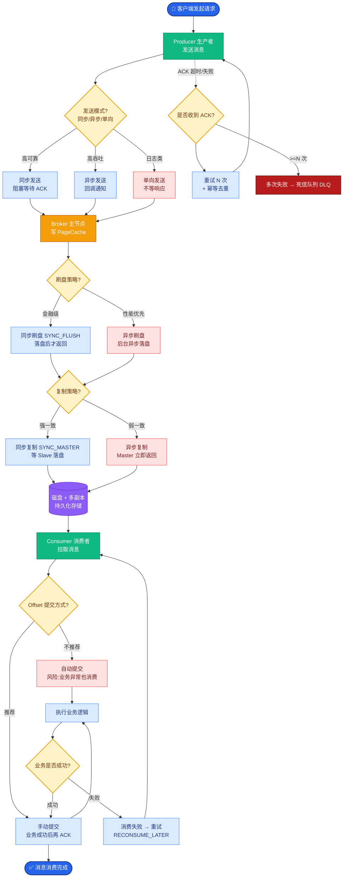

# Timer

Timer 是 JDK 早期提供的定时任务工具，虽然简单，但在生产环境中存在严重缺陷，理解其源码原理有助于明白为什么现代高性能框架（Netty、Kafka）都弃用了它。

### Timer 核心原理

**1. 数据结构**
Timer 内部维护了一个 `TaskQueue`，这是一个基于**二叉最小堆**的优先队列。
- 堆顶元素是下一个即将执行的任务（executionTime 最小）。

**2. 执行线程**
- `TimerThread` 是单线程，负责从队列中取出任务并执行。

### 执行流程与源码分析

**流程图：**
```text
┌─────────────┐    1. 加锁    ┌──────────────┐
│ Main Thread │ ────────────▶ │ TaskQueue    │
│  (添加任务)  │               │ (Min Heap)    │
└─────────────┘               └──────┬───────┘
                                     │
                           ┌─────────▼─────────┐
                           │   TimerThread     │
                           │ (单线程死循环)     │
                           └─────────┬─────────┘
                                     │
              ┌──────────────────────┼──────────────────────┐
              │                      │                      │
       ┌──────▼──────┐        ┌──────▼──────┐       ┌──────▼──────┐
       │ 堆顶任务时间 │   ==   │  当前时间   │   <   │  未来时间   │
   ┌───┴──────┬─────┴───┐    └──────┬──────┘       └──────┬──────┘
   │ 执行任务   │  wait等待 │    │ 执行            │ wait(剩余时间)
   │ (更新时间)│          │    │                 │
   └───────────┘          │    │                 │
           │              │    │                 │
           ▼              ▼    ▼                 ▼
   若是周期任务？          ┌─────────────────────────┐
   是 -> 重新入堆         │        执行 run()       │
   否 -> 移除             └─────────────────────────┘
```

**关键细节：**
1. **排序**：插入任务时，`TaskQueue` 会根据 `nextExecutionTime` 进行堆排序，保证最小值在堆顶。
2. **等待**：如果堆顶任务还没到时间，`TimerThread` 会调用 `wait(queue.top.delay)` 释放锁并休眠，等待被唤醒或超时。
3. **执行**：时间到了之后，取出任务执行。如果是 `fixed-rate` 周期任务，会计算下次时间并重新放回队列。

### 致命缺陷分析

1. **单线程阻塞**
   - 假设任务 A 执行了 10 秒，任务 B 本应在任务 A 后 1 秒执行。由于只有一个线程，任务 B 会被硬生生推迟 10 秒。这会导致严重的“任务积压”。

2. **异常崩塌**
   - Timer 的 `mainLoop` 方法中，`task.run()` 被 `try-catch` 包裹，但捕获异常后仅仅是 `return`，意味着线程直接退出，后续所有任务（包括周期任务）全部报废。

3. **O(logN) 开销**
   - 虽然单机下不明显，但在海量定时任务场景（如连接保活心跳），频繁的堆调整会造成 CPU 压力。

## 常见考点
1. **Timer 是如何保证任务按时间顺序执行的？** （基于最小堆，堆顶永远是最近需要执行的任务）。
2. **Timer 中 wait() 是什么时候被唤醒的？** （1. wait 超时自动醒来；2. 新加入的任务执行时间比当前堆顶更早，会调用 notify() 唤醒线程重新排序）。
3. **Timer 和 ScheduledThreadPoolExecutor 最本质的区别？** （Timer 是单线程执行，STPE 是线程池执行；Timer 异常会退，STPE 有异常捕获机制；但数据结构上两者底层都用了堆）。


## 核心流程图



## 记忆要点

- 底层基于二叉最小堆，堆顶永远是下一次将执行的任务，入队和出队均为O(logN)
- 执行流程：单线程死循环取堆顶，未到期则wait()，到期执行后重算时间入队
- 因为单线程且未捕获异常，所以一个任务阻塞或抛出异常会导致整个Timer线程崩溃退
- 因为底层任务队列排序，所以唤醒条件是wait超时或有更早任务入队触发了notify

## 结构化回答

**30 秒电梯演讲：** 基于优先队列的单线程延时任务调度器。打个比方，只有一个服务员的窗口，按任务紧急程度排队处理。

**展开框架：**
1. **底层基于二叉最小堆** — 堆顶永远是下一次将执行的任务，入队和出队均为O(logN)
2. **执行流程** — 单线程死循环取堆顶，未到期则wait()，到期执行后重算时间入队
3. **一个任务阻塞或抛出异常会导致整个Timer线程崩** — 因为单线程且未捕获异常，所以一个任务阻塞或抛出异常会导致整个Timer线程崩溃退。

**收尾：** 这三点都能配合实战聊。您想深入聊原理、对比还是避坑？

## 视频脚本

> 预计时长：2 分钟 | 由浅入深

| 时间 | 画面/字幕 | 口播台词 | 讲解要点 |
|------|----------|----------|----------|
| 0:00 | 标题卡：Timer | "Timer？一句话——只有一个服务员的窗口，按任务紧急程度排队处理。" | 开场钩子 |
| 0:40 | 概念动画/示意图 | "基于优先队列的单线程延时任务调度器——只有一个服务员的窗口，按任务紧急程度排队处理" | 核心定义 |
| 1:20 | 底层基于二叉最小堆示意 | "堆顶永远是下一次将执行的任务，入队和出队均为O(logN)" | 要点1 |
| 2:00 | 总结卡 | "记住这几条，面试不慌。下期讲进阶追问。" | 收尾 |
