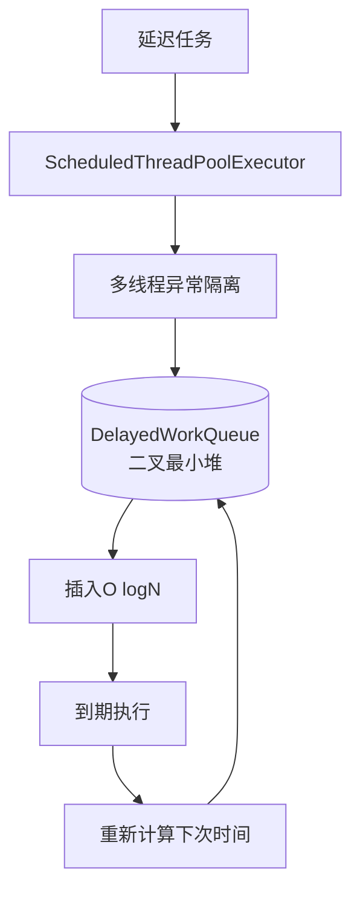
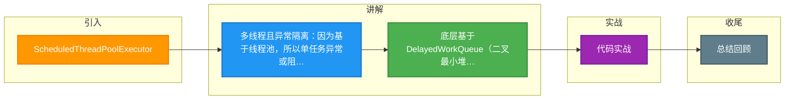

# ScheduledThreadPoolExecutor

ScheduledThreadPoolExecutor (STPE) 是 Java 5 引入的并发工具，旨在解决 `Timer` 的单线程和异常处理缺陷。虽然它是更通用的替代品，但在特定的高性能场景下（如 Netty/Kafka），仍有不足。

### ScheduledThreadPoolExecutor vs Timer

**改进点：**
1. **多线程执行**：由线程池（`ThreadPoolExecutor`）执行任务，不再受限于单线程阻塞。一个任务耗时不会影响其他任务。
2. **异常隔离**：任务抛出异常只会终止当前任务的线程（并可能创建新线程补充），不会导致整个调度器停止，其他任务照常执行。
3. **配置灵活**：核心线程数可配置，设置为 1 时行为类似 Timer，但更健壮。

### 核心实现原理

STPE 继承自 `ThreadPoolExecutor`，其核心在于使用了 **`DelayedWorkQueue`**（无界延迟阻塞队列）。

**1. DelayedWorkQueue**
- 数据结构同样是**二叉最小堆**（基于数组实现）。
- 队列元素是 `ScheduledFutureTask`，实现了 `Delayed` 接口，通过 `getDelay()` 获取剩余时间。

**2. 调度流程**
- 线程池中的 Worker 线程不断从 `DelayedWorkQueue` 中 take() 队首任务。
- 如果队首任务未到期，`take()` 操作会阻塞（利用 `Condition.awaitNanos`），直到时间到达。
- 执行任务后，如果是周期任务，会重新计算时间并再次 `offer` 回队列。

### 为什么 Netty/Kafka 依然不用 STPE？

虽然 STPE 解决了 Timer 的稳定性问题，但在**海量低延迟任务**场景下，它的**数据结构**成了瓶颈。

**1. 时间复杂度瓶颈**
- STPE 的入队（`offer`）和出队（`take`）依然依赖堆的调整，时间复杂度为 **O(logN)**。
- 在 Kafka 中，可能存在数以万计的连接超时检测任务，每次插入和删除都需要 logN 的开销，CPU 消耗巨大。

**2. 内存局部性**
- 堆结构在内存中是非连续的，节点跳跃访问，对 CPU 缓存不友好。

**3. 时间轮的优势对比**
- **时间轮**的插入和删除是 **O(1)**，只需链表操作，无需排序。
- 对于大规模、短周期的定时任务，时间轮的性能是碾压级的。

### 总结

| 维度 | Timer | ScheduledThreadPoolExecutor | 时间轮 (Netty/Kafka) |
| :--- | :--- | :--- | :--- |
| **线程模型** | 单线程 | 线程池 | 通常单线程或少量线程 |
| **数据结构** | 最小堆 | 最小堆 | 环形数组 + 链表 |
| **时间复杂度** | O(logN) | O(logN) | **O(1)** |
| **异常影响** | 导致线程死掉 | 仅影响单个任务 | 仅影响单个任务 |
| **适用场景** | 简单定时，任务少 | 通用业务定时，任务中等 | **海量超时/延迟任务** |

## 常见考点
1. **STPE 的队列为什么是无界的？** （为了防止任务提交时被拒绝，但如果任务提交速度远大于执行速度，会导致 OOM）。
2. **STPE 如何实现周期性调度？** （任务执行完修改 `time`，重新扔进队列，本质上并非精确周期，而是“执行完成后间隔 N 时间再执行”）。
3. **为什么堆结构在大量任务下性能不如数组？** （O(logN) vs O(1)，且时间轮不需要比较大小，只需要哈希计算，CPU 分支预测更友好）。

## 记忆要点

- 多线程且异常隔离：因为基于线程池，所以单任务异常或阻塞不会像Timer一样导致全局崩溃
- 底层基于DelayedWorkQueue（二叉最小堆），所以并发和海量任务下的插入/删除依然是O(logN)
- 周期任务原理：任务执行完后重新计算下次时间，再次offer入队
- 与Timer对比：Timer是单线程且异常退，STPE是多线程且有异常捕获；但数据结构复杂度均为O(logN)

## 结构化回答

**30 秒电梯演讲：** 有多个服务员的窗口，可以同时处理多个紧急任务

**展开框架：**
1. **支持多线程并发执行任务** — 支持多线程并发执行任务，互不影响
2. **任务异常不** — 任务异常不会导致线程池退出，仅记录错误
3. **基于Dela** — 基于DelayedWorkQueue（优先队列）实现调度

**收尾：** 这是我实战中的理解，您想深入哪一段？

## 视频脚本

> 预计时长：2 分钟 | 由浅入深

| 时间 | 画面/字幕 | 口播台词 | 讲解要点 |
|------|----------|----------|----------|
| 0:00 | 标题卡：ScheduledThreadPoo… | "ScheduledThreadPoolExecutor？一句话——有多个服务员的窗口，可以同时处理多个紧急任务。" | 开场钩子 |
| 0:40 | 概念动画/示意图 | "基于线程池的并发延时任务调度器——有多个服务员的窗口，可以同时处理多个紧急任务" | 核心定义 |
| 1:20 | 多线程且异常隔离示意 | "因为基于线程池，所以单任务异常或阻塞不会像Timer一样导致全局崩溃" | 要点1 |
| 2:00 | 总结卡 | "记住这几条，面试不慌。下期讲进阶追问。" | 收尾 |

### 视频流程图

