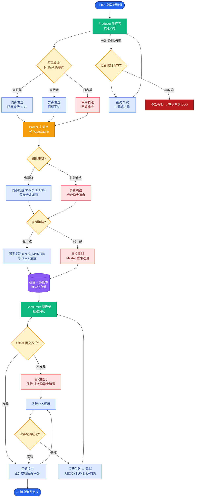

# 时间轮算法

**核心原理**
时间轮是一种高效的定时任务调度算法，旨在将插入和删除操作的时间复杂度降低到 **O(1)**。它模拟了时钟的运作机制，通过环形数组和指针转动来处理任务。

**1. 单层时间轮**
*   **环形数组**：底层是一个环形数组，数组中的每个位置称为一个槽。
*   **时间精度**：指针每隔一个固定的 时间间隔（如 1秒）移动一格（即指向下一个槽）。这个间隔决定了时间轮的最高精度。
*   **任务存储**：每个槽内部维护一个双向链表，存储该时间点需要执行的任务。插入任务只需在链表头部或尾部操作，复杂度 O(1)。

**ASCII 架构图：单层时间轮结构**
```text
       时间流逝方向 (指针顺时针转动)
            ┌───┐
      ┌────►│ 7 │────┐
      │     └───┘    │
      ▼              ▼
    ┌───┐          ┌───┐
    │ 6 │          │ 0 │ ◄─── 指针
    └───┘          └───┘
    ▲              ▲
    │     ┌───┐    │
    └─────│ 1 │◄───┘
          └───┘
          ...
```

**2. 任务轮次与多级时间轮**
如果延迟时间超过了一圈的时间，如何处理？主要有两种方案：

*   **方案一：增加轮次**
    *   在任务对象中增加一个 `round`（轮数）字段。
    *   计算公式：`槽位索引 = (当前指针位置 + 延迟时间/tickDuration) % 槽总数`；`轮数 = (延迟时间/tickDuration) / 槽总数`。
    *   指针扫到该槽时，如果 `round > 0`，则将 `round` 减 1，任务不移除；只有当 `round == 0` 时才真正执行。
    *   *代表实现*：Netty `HashedWheelTimer`。

*   **方案二：多级时间轮**
    *   类似于时钟的秒针、分针、时针。
    *   当低一级的时间轮转一圈时，高一级的时间轮走一格。
    *   **降级机制**：随着时间流逝，原本在高级时间轮的任务，其剩余延迟时间变小，会被重新降级（插入）到低一级的时间轮中，最终在第一级时间轮执行。
    *   *代表实现*：Kafka。

**ASCII 架构图：多级时间轮（类似时钟）**
```text
    ┌──────────────────┐
    │   秒针轮 (Level1) │  Tick: 1s, Size: 10 (范围: 0-10s)
    │    指针每秒走1格   │
    └────────┬─────────┘
             │ 走完一圈(10s)触发
             ▼
    ┌──────────────────┐
    │   分针轮 (Level2) │  Tick: 10s, Size: 10 (范围: 0-100s)
    │    指针每10s走1格 │
    └────────┬─────────┘
             │
             ▼
    ┌──────────────────┐
    │   时针轮 (Level3) │  ...
    └──────────────────┘
```

**3. Netty 中的 HashedWheelTimer**
*   **Worker 线程**：时间轮由一个独立的 Worker 线程驱动，它负责处理指针推进和任务执行。
*   **MPSC 队列**：外部线程添加任务时，并不直接操作时间轮的数据结构，而是先将任务放入一个 `MPSC` (Multi-Producer-Single-Consumer) 队列。Worker 线程会在每次 tick 时批量处理队列中的任务，将其迁移到对应的槽中。这保证了加锁范围最小化，提高并发性能。
*   **位运算优化**：槽位大小通常设为 2 的幂次方，利用 `mask` 进行位运算替代取模运算，提高计算效率。

**4. 时间轮优缺点分析**
*   **优点**：插入、删除时间复杂度均为 O(1)，适合海量定时任务。
*   **缺点**：
    1.  **时间精度受限**：精度取决于 `tickDuration`，无法做到任意精度的延迟。
    2.  **空推进问题**：即使没有任何任务，Worker 线程也会按固定间隔不断推进指针，造成 CPU 资源浪费（Netty 存在此问题，Kafka 通过 DelayQueue 解决了此问题）。
    3.  **任务执行阻塞**：如果任务在时间轮线程中同步执行，耗时的任务会阻塞后续任务的执行，甚至导致指针卡顿（建议异步执行）。

## 常见考点
1.  **时间轮算法相比 PriorityQueue 的优势是什么？**
    PriorityQueue 插入删除是 O(log n)，时间轮是 O(1)。在任务量极大且调度频繁的场景下，时间轮性能显著优于优先队列。
2.  **Netty 时间轮中的“任务取消”是如何实现的？**
    任务对象中通常维护一个状态位或引用。取消操作本质上是将任务从对应槽的双向链表中移除（链表删除操作是 O(1)），或者标记为取消状态，Worker 线程扫描时跳过。
3.  **如果延迟时间非常长（比如几小时），单层时间轮怎么做？**
    会导致链表非常长，遍历效率低。因此通常会采用多级时间轮或者增加 `round` 轮次字段来避免单个槽位链表过长。
4.  **什么是时间轮的“空推进”问题？**
    指时间轮指针必须严格按照固定的间隔向前转动，即使当前槽及后续一段时间的槽内都没有任务，指针依然会空转，消耗 CPU 资源。


## 核心流程图



## 记忆要点

- 核心优势是O(1)：因为底层是环形数组+链表，插入删除只需哈希定位和链表操作，无需堆排序
- 单层超时处理方案：Netty用round(轮数)字段记录，指针扫到且round为0才执行；Kafka用多级时间轮降级
- 空推进缺点：即使无任务，Worker线程也按固定间隔tick，浪费CPU（Netty痛点）
- 并发优化：Netty利用MPSC队列接收外部任务，Worker单线程批量处理，减小了锁粒度

## 结构化回答


**30 秒电梯演讲：** 像时钟表盘，指针走到哪个刻度就执行那个槽的任务

**展开框架：**
1. **底层** — 底层是环形数组，槽位存储双向链表
2. **插入删除时间** — 插入删除时间复杂度为O(1)
3. **支持轮数计数** — 支持轮数计数或层级轮解决长延时

**收尾：** 这是我实战中的理解，您想深入哪一段？


## 视频脚本

> 预计时长：4 分钟 | 由浅入深

| 时间 | 画面/字幕 | 口播台词 | 讲解要点 |
|------|----------|----------|----------|
| 0:00 | 标题卡：时间轮算法 | "时间轮算法？一句话——像时钟表盘，指针走到哪个刻度就执行那个槽的任务。" | 开场钩子 |
| 0:48 | 概念动画/示意图 | "利用环形数组实现O(1)时间复杂度的高效延时任务调度算法——像时钟表盘，指针走到哪个刻度就执行那个槽的任务" | 核心定义 |
| 1:36 | 核心优势是O(1)示意 | "因为底层是环形数组+链表，插入删除只需哈希定位和链表操作，无需堆排序" | 要点1 |
| 2:24 | 单层超时处理方案示意 | "Netty用round(轮数)字段记录，指针扫到且round为0才执行；Kafka用多级时间轮降级" | 要点2 |
| 3:12 | 空推进缺点示意 | "即使无任务，Worker线程也按固定间隔tick，浪费CPU（Netty痛点）" | 要点3 |
| 4:00 | 总结卡 | "记住这几条，面试不慌。下期讲进阶追问。" | 收尾 |
