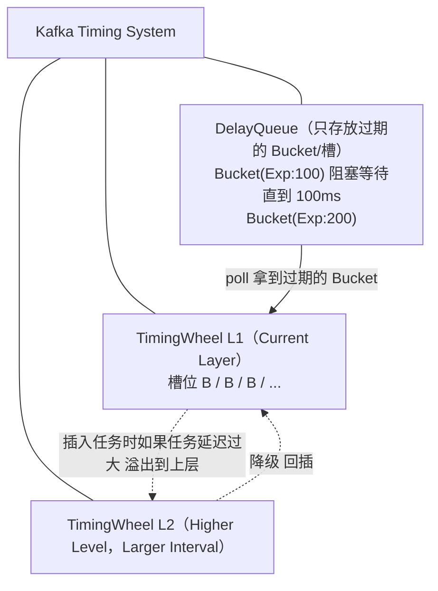

# Kafka 中的时间轮

**核心原理**
Kafka 为了解决海量延时消息（如延时操作、事务超时等）的调度问题，采用了基于**层次化时间轮**的方案，并针对 Netty 时间轮的“空推进”问题进行了优化。

**1. 核心组件：TimingWheel**
Kafka 的时间轮也是环形数组结构，主要参数包括：
*   `tickMs`：每个槽代表的时间跨度（精度，如 20ms）。
*   `wheelSize`：槽数量（默认 20）。
*   `startMs`：时间轮的起始时间。
*   `interval`：时间轮的总时长（`tickMs * wheelSize`，即走一圈的时间）。

**2. 核心优化：利用 DelayQueue 解决空推进**
Netty 的时间轮有一个 Worker 线程在不断 sleep/tick，即使没有任务也要空转，浪费 CPU。Kafka 的设计如下：

*   **槽的延迟化**：它不仅存储任务，还将**槽** 视为一个延迟对象。
*   **DelayQueue 管理**：Kafka 引入了一个 `DelayQueue<TimerTaskList>`。注意，队列里放的不是一个个任务，而是**槽**。
*   **过期时间**：每个槽都有一个过期时间（即该槽被指针指到的时间）。

**工作流程**：
1.  工作线程从 `DelayQueue` 中获取一个已过期的槽（`poll`）。如果没过期，`DelayQueue` 会自动阻塞，这就解决了空推进问题。
2.  拿到槽后，推进当前时间轮的 `currentTime`。
3.  遍历槽中的双向链表：
    *   如果任务已被取消，跳过。
    *   如果任务属于当前层级（且到了执行时间），执行它。
    *   如果任务属于更高层级的时间轮，将其重新降级插入到合适的层级中。

**ASCII 架构图：Kafka 时间轮 + DelayQueue**

**3. 任务添加与降级机制**
*   **添加任务**：计算任务延迟时间。如果超过当前时间轮范围，递归创建或复用上一层时间轮（`overflowWheel`），直到找到能容纳该延迟的层级，将其插入对应槽中。同时，将该槽加入到 `DelayQueue` 中（如果是新添加的槽）。
*   **降级**：当时间轮转动，取出一个槽中的任务时，如果发现该任务原本属于上层时间轮，但由于时间流逝，它已经可以在当前层或更低层执行了，就会将其**重新插入**到当前时间轮的合适槽位中。

**4. 关键细节**
*   **空间换时间**：Kafka 用 `DelayQueue` 的空间开销（元素是槽，数量远小于任务数）换取了 CPU 时间的节省（消除空转）。
*   **时间推进**：`advanceClock` 方法会更新时间轮的 `currentTime`。为了保证时间对齐，`currentTime` 会被调整为 `tickMs` 的整数倍。

## 常见考点
1.  **Kafka 为什么要在时间轮外再加一个 DelayQueue？这难道不是又回到了 O(log n) 吗？**
    虽然放入 DelayQueue 的操作是 O(log n)，但 DelayQueue 中存放的元素是**槽**，而不是**任务**。
    时间轮的槽数量是固定的（如 20 个），而任务数量可能有成千上万个。将槽数量级的对象放入 DelayQueue 的开销几乎可以忽略不计，但同时完美解决了空推进问题。
2.  **Kafka 时间轮如何处理任务执行时间过长的情况？**
    Kafka 的时间轮线程（`Reaper`）主要负责“推进时间”和“分发任务”，任务的执行逻辑通常由回调函数完成。如果回调执行耗时过长，依然会阻塞时间轮线程，导致后续任务调度延迟。因此设计上应避免在回调中做重操作。
3.  **什么是时间轮的“层级升级”和“降级”？**
    *   **升级**：添加一个延迟很长的任务时，当前层放不下，放到更高层的时间轮（时间跨度更大）。
    *   **降级**：随着时间流逝，高层时间轮的指针转动，原本在高层任务的剩余时间变短，可以被重新放入低层时间轮（精度更高）等待执行。
4.  **Kafka 时间轮的应用场景有哪些？**
    主要用于延时操作，例如：
    *   生产者请求的超时重试。
    *   事务消息的超时检查。
    *   延迟删除（如日志段的清理）。

## 核心知识点图

## 记忆要点

- 层次化结构：采用多级时间轮，类似于时钟的秒分时针，长延时任务会从高层级降级到低层级执行
- 解决空推进：因为把「时间槽(TimerTaskList)」放入DelayQueue，所以无任务时线程会彻底阻塞，直到槽到期唤醒
- 空间换时间：DelayQueue管理的对象是少量的槽而非海量任务，有效平衡了O(logN)排序开销与空推进问题
- 核心参数：tickMs(槽时间跨度)、wheelSize(槽的数量)，currentTime会对齐为tickMs的整数倍

## 结构化回答

**30 秒电梯演讲：** 利用DelayQueue推进时间轮指针，避免无效空转。打个比方，像只给快响的闹钟上发条，没到时间的钟不管。

**展开框架：**
1. **层次化结构** — 采用多级时间轮，类似于时钟的秒分时针，长延时任务会从高层级降级到低层级执行
2. **解决空推进** — 因为把「时间槽(TimerTaskList)」放入DelayQueue，所以无任务时线程会彻底阻塞，直到槽到期唤醒
3. **空间换时间** — DelayQueue管理的对象是少量的槽而非海量任务，有效平衡了O(logN)排序开销与空推进问题

**收尾：** 这三点都能配合实战聊。您想深入聊原理、对比还是避坑？

## 视频脚本

> 预计时长：2 分钟 | 由浅入深

| 时间 | 画面/字幕 | 口播台词 | 讲解要点 |
|------|----------|----------|----------|
| 0:00 | 标题卡：Kafka 中的时间轮 | "Kafka 中的时间轮？一句话——像只给快响的闹钟上发条，没到时间的钟不管。" | 开场钩子 |
| 0:40 | 概念动画/示意图 | "利用DelayQueue推进时间轮指针，避免无效空转——像只给快响的闹钟上发条，没到时间的钟不管" | 核心定义 |
| 1:20 | 层次化结构示意 | "采用多级时间轮，类似于时钟的秒分时针，长延时任务会从高层级降级到低层级执行" | 要点1 |
| 2:00 | 总结卡 | "记住这几条，面试不慌。下期讲进阶追问。" | 收尾 |
