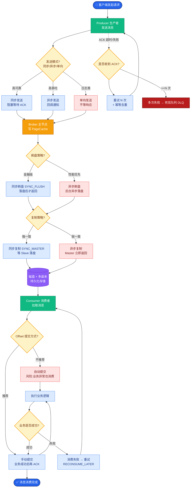

# ELK日志系统的架构和各组件的作用是什么？

**ELK 日志系统架构**
ELK 是 Elasticsearch、Logstash、Kibana 三大开源软件的首字母缩写，现已扩展包含 Beats 等组件，是一套完整的实时日志分析解决方案。

**1. 核心组件作用**

*   **Elasticsearch (ES)**：分布式搜索和分析引擎。
    *   **作用**：负责数据的存储、索引和检索。它基于 Lucene 开发，提供 RESTful API。
    *   **特点**：高扩展性、近实时搜索、处理 PB 级数据。
*   **Logstash**：数据收集和处理引擎。
    *   **作用**：负责从各种数据源（如日志文件、数据库、消息队列）采集数据，进行过滤、解析、转换，然后发送给 Elasticsearch。
    *   **特点**：拥有丰富的插件库（input, filter, output），强大的正则和 Grok 解析能力。由于 Logstash 基于 JVM 运行，资源消耗较大，通常作为中间处理层。
*   **Kibana**：数据可视化平台。
    *   **作用**：允许用户通过浏览器查看 Elasticsearch 中的数据。可以创建仪表盘、图表、地图等进行数据展示。
    *   **特点**：交互式查询、图形化分析，是“看数据”的窗口。
*   **Beats** (补充组件)：轻量级数据采集器。
    *   **作用**：安装在服务器上，作为代理专门负责抓取数据（如 Filebeat 抓日志、Metricbeat 抓指标），然后输出给 Logstash 或直接给 Elasticsearch。
    *   **特点**：基于 Go 语言编写，资源占用极低，解决了 Logstash 在每台服务器都部署的开销问题。

**2. 架构流程**

最典型的架构流程如下：
1.  **采集**：应用服务器产生日志，由 **Filebeat** 采集并读取。
2.  **缓冲与处理**：Filebeat 将日志推送到 **Kafka**（可选，用于削峰填谷）或直接发送给 **Logstash**。Logstash 对日志进行清洗（如去重、解析 JSON、切分字段）。
3.  **存储与索引**：Logstash 将处理后的结构化数据发送给 **Elasticsearch** 集群进行存储。
4.  **展示**：用户通过 **Kibana** 连接 Elasticsearch，进行可视化的日志分析和排查。

**ASCII 架构图：典型 ELK 数据流**
```text
┌──────────────┐     ┌──────────────┐     ┌──────────────┐     ┌──────────────┐     ┌──────────────┐
│   App Server │ ──► │   Filebeat   │ ──► │   Logstash   │ ──► │Elasticsearch │ ──► │    Kibana    │
│  (产生日志)   │     │   (采集)      │     │  (过滤/转换)  │     │   (存储/索引)  │     │   (可视化)    │
└──────────────┘     └──────────────┘     └──────────────┘     └──────────────┘     └──────────────┘
                                              ▲
                                              │
                                     (可选: 削峰填谷)
                                              │
                                    ┌─────────┴─────────┐
                                    │      Kafka        │
                                    │  (消息队列缓冲)    │
                                    └───────────────────┘
```

**3. 补充：Logback 配合 ELK**
虽然 ELK 提供了采集能力，但在 Java 应用中，通常直接利用 Logback 的 `LogstashEncoder` 将日志直接格式化为 JSON 字符串输出到文件，这样 Filebeat 采集后无需复杂的 Grok 解析即可直接入库，极大降低 CPU 消耗。

**4. 实战深化**

*   **实战案例**：在某电商大促期间，由于未限制索引分片数，导致 ES 集群出现百万级小 Shards，引发 Master 节点 OOM。后通过强制合并 API (`_forcemerge`) 清理历史数据，并实施 Rollover 滚动策略（按时间或大小滚动索引），解决了元数据过重的问题。

*   **代码示例**：
```xml
<!-- logback-spring.xml 配置示例：直接输出 JSON 格式 -->
<configuration>
    <appender name="LOGSTASH" class="ch.qos.logback.core.rolling.RollingFileAppender">
        <encoder class="net.logstash.logback.encoder.LogstashEncoder">
            <!-- 自定义字段，区分环境 -->
            <customFields>{"app":"order-service","env":"prod"}</customFields>
        </encoder>
        <file>/var/log/app.log</file>
    </appender>
</configuration>
```

*   **组件选型对比**：

| 特性 | Logstash | Filebeat | Fluentd | Vector | 
| :--- | :--- | :--- | :--- | :--- | 
| **语言** | JRuby | Go | Ruby/C | Rust | 
| **资源消耗** | 高 (JVM 重) | 极低 | 中等 | 极低 (高性能) | 
| **主要定位** | 强数据转换、过滤 | 轻量级日志采集 | 统一日志层 (K8s常用) | 现代化高性能管线 | 
| **插件生态** | 最丰富 | 较少 | 丰富 | 增长中 |


## 核心流程图



## 记忆要点

- 架构主链路：App -> Filebeat -> Logstash -> Elasticsearch -> Kibana
- ES负责存储检索，Kibana负责可视化，Logstash负责过滤解析，Beats负责轻量采集
- Logstash资源消耗大且基于JVM，所以在各服务器部署轻量级Go语言编写的Beats分担采集压力
- Java实战优化：Logback直接格式化输出JSON，让Filebeat免Grok正则解析，极大降低CPU消耗

## 结构化回答

**30 秒电梯演讲：** Elasticsearch、Logstash、Kibana组成的日志实时分析平台。打个比方，像管道工收集水（日志）存进水库（ES）并在仪表盘（Kibana）显示。

**展开框架：**
1. **架构主链路** — App -> Filebeat -> Logstash -> Elasticsearch -> Kibana
2. **ES负责存储检索** — Kibana负责可视化，Logstash负责过滤解析，Beats负责轻量采集
3. **Logstash资源消耗大且基于JVM** — 所以在各服务器部署轻量级Go语言编写的Beats分担采集压力

**收尾：** 我在项目里踩过坑——<!-- logback-spring.xml 配置示例：直接输出 JSON 格式 -->。您想深入聊哪一段：原理、避坑还是对比选型？

## 视频脚本

> 预计时长：2 分钟 | 由浅入深

| 时间 | 画面/字幕 | 口播台词 | 讲解要点 |
|------|----------|----------|----------|
| 0:00 | 标题卡：ELK日志系统的架构和各组件的作用是… | "ELK日志系统的架构和各组件的作用是什么？一句话——像管道工收集水（日志）存进水库（ES）并在仪表盘（Kibana）显示。" | 开场钩子 |
| 0:40 | 概念动画/示意图 | "Elasticsearch、Logstash、Kibana组成的日志实时分析平台——像管道工收集水（日志）存进水库（ES）并在仪表盘（Kibana）显示" | 核心定义 |
| 1:20 | 架构主链路示意 | "App -> Filebeat -> Logstash -> Elasticsearch -> Kibana" | 要点1 |
| 2:00 | 总结卡 | "记住这几条，面试不慌。下期讲进阶追问。" | 收尾 |
