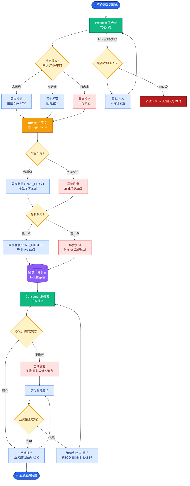

# HBase中MemStore刷盘的机制是什么？

HBase 的写入流程遵循 **WAL (Write-Ahead Log)** 原则，确保数据不丢失。核心步骤如下：

1.  **定位 RegionServer**：Client 访问 ZK 或缓存 meta 表，获取 RowKey 所在的 Region 及其对应的 RegionServer。
2.  **写 WAL (HLog)**：请求首先写入顺序文件 HLog。这是持久化的第一步，位于 HDFS 上。只有 HLog 写入成功（fsync 成功），才算数据落盘。
3.  **写 MemStore**：数据写入内存中的 MemStore（实际是 SkipList 结构）。此时，对于 Client 来说，写入操作已完成（异步刷盘）。
4.  **异步刷盘**：MemStore 中的数据会在满足特定条件下异步 flush 成 HFile 生成在 HDFS 上。

**MemStore 刷盘 触发机制**
为了提升性能，数据不会立即落盘，而是在以下场景触发 Flush：

1.  **Region 级别触发**
    *   **MemStore 达到上限**：当某个 Region 的任意一个 MemStore 大小达到 `hbase.hregion.memstore.flush.size`（默认 128MB）时，触发该 Region 的所有 MemStore 刷盘。
2.  **RegionServer 级别触发**
    *   **全局内存占用过高**：当一个 RS 上所有 Region 的 MemStore 占用总和达到配置的堆内存阈值（`hbase.regionserver.global.memstore.size.lower.limit`，默认是堆的 0.4 * 0.95）时，RS 会强制执行 Flush，从内存占用最大的 Region 开始，防止 OOM。
    *   **WAL 数量过大**：如果 WAL 文件的数量达到阈值，为了缩短故障恢复时间，RS 会触发最早的 WAL 对应的 Region 进行刷盘（`hbase.regionserver.maxlogs`）。
3.  **HMaster 定期检查**
    *   **日志老化**：Master 定期检查最早的 WAL，如果超过一定时间未删除（对应 Region 未刷盘），会通知 RS 刷盘。
    *   **手动触发**：用户通过 flush 命令或 API 调用。
4.  **正常关闭 RegionServer**
    *   RS 停止前会刷盘所有数据。

```text
写入流程架构图：

Client
   │
   │ 1. 定位 RegionServer
   ▼
┌─────────────────────────────────────────────┐
│              RegionServer                    │
│                                              │
│  2. Write WAL (Append + Sync)               │
│  ┌──────────────────────────────────────┐   │
│  │           HLog (WAL)                 │   │
│  └──────────────┬───────────────────────┘   │
│                 │                           │
│                 ▼                           │
│  3. Write MemStore (Write to Memory)       │
│  ┌──────────────────────────────────────┐   │
│  │   MemStore (MemStoreLSN + SkipList)  │   │
│  └──────────────┬───────────────────────┘   │
│                 │                           │
│   (Async)      ▼                           │
│  ┌──────────────────────────────────────┐   │
│  │   StoreFile (HFile on HDFS)          │   │
│  └──────────────────────────────────────┘   │
└─────────────────────────────────────────────┘
```

**5. 实战深化**

*   **实战案例**：在高并发写入场景下，因 MemStore Flush 过于频繁导致 RegionServer 出现“写阻塞”现象（基于 `hbase.hstore.blockingStoreFiles` 参数）。解决方案是调大 `hbase.hregion.memstore.flush.size` 并启用异步刷盘相关参数，同时增加 Compaction 线程数以加速小文件合并。

*   **代码示例**：
```java
// Java API：手动触发 Region Flush (通常运维操作，开发慎用)
Admin admin = connection.getAdmin();
try {
    // flush 指定表
    admin.flush(TableName.valueOf("my_table"));
    // 或 flush 指定 Region (通过 RegionName)
    // admin.flushRegion(regionName);
} finally {
    admin.close();
}
```

*   **参数对比配置**：

| 参数 | 默认值 | 作用 | 调优建议 |
| :--- | :--- | :--- | :--- |
| `hbase.hregion.memstore.flush.size` | 128MB | 单个 MemStore 触发刷盘阈值 | 写入量大时可适当调大 (如 256MB) 以减少 IO 抖动 |
| `hbase.regionserver.global.memstore.size` | 0.4 (堆内存 40%) | RS 上所有 MemStore 总上限 | 需预留内存给 BlockCache 和读写请求 |
| `hbase.hstore.blockingStoreFiles` | 10 | 触发写阻塞的 HFile 数量阈值 | 超过此值且未完成 Compaction 时会阻塞写入 |
| `hbase.hregion.memstore.mslab.enabled` | true | 是否启用 MSLAB 防止内存碎片 | **强烈建议开启**，能有效避免 Full GC |


## 核心流程图



## 记忆要点

- 写入核心链路：先写HLog(WAL)持久化，再写内存MemStore，最后异步Flush成HFile落盘
- Flush触发机制：Region单MemStore达128MB；或RegionServer全局内存达阈值(防OOM)
- WAL触发Flush：当WAL数量过大，为缩短故障恢复时间，会强制触发最早WAL对应的数据刷盘

## 结构化回答

**30 秒电梯演讲：** MemStore数据从内存写入HDFS磁盘的触发机制。打个比方，写满草稿纸或时间到了就誊写到正式档案。

**展开框架：**
1. **写入核心链路** — 先写HLog(WAL)持久化，再写内存MemStore，最后异步Flush成HFile落盘
2. **Flush触发机制** — Region单MemStore达128MB；或RegionServer全局内存达阈值(防OOM)
3. **WAL触发Flush** — 当WAL数量过大，为缩短故障恢复时间，会强制触发最早WAL对应的数据刷盘

**收尾：** 我在项目里踩过坑——// Java API：手动触发 Region Flush (通常运维操作，开发慎用)。您想深入聊哪一段：原理、避坑还是对比选型？

## 视频脚本

> 预计时长：2 分钟 | 由浅入深

| 时间 | 画面/字幕 | 口播台词 | 讲解要点 |
|------|----------|----------|----------|
| 0:00 | 标题卡：HBase中MemStore刷盘的机… | "HBase中MemStore刷盘的机制是什么？一句话——写满草稿纸或时间到了就誊写到正式档案。" | 开场钩子 |
| 0:40 | 概念动画/示意图 | "MemStore数据从内存写入HDFS磁盘的触发机制——写满草稿纸或时间到了就誊写到正式档案" | 核心定义 |
| 1:20 | 写入核心链路示意 | "先写HLog(WAL)持久化，再写内存MemStore，最后异步Flush成HFile落盘" | 要点1 |
| 2:00 | 总结卡 | "记住这几条，面试不慌。下期讲进阶追问。" | 收尾 |
