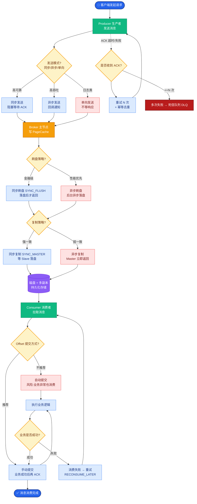
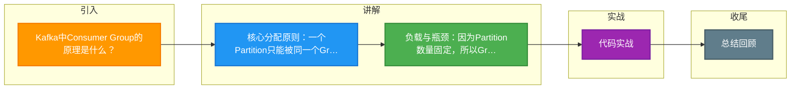

# Kafka中Consumer Group的原理是什么？

**Consumer Group（消费者组）原理**

Kafka 通过 Consumer Group 实现了**单播（队列）**与**多播（发布订阅）**两种模型的灵活切换。

1.  **Group ID 与 分区分配**
    *   所有拥有相同 `group.id` 的 Consumer 实例组成一个 Consumer Group。
    *   **原则**：Kafka 规定，**一个 Partition 只能被同一个 Group 内的一个 Consumer 消费**。
    *   **效果**：若 Group 内 Consumer 数量 < Partition 数量，部分 Consumer 会消费多个 Partition；若 Consumer 数量 > Partition 数量，多余的 Consumer 将空闲（作为容灾备用）。

2.  **消费模型**
    *   **Queue 模式（集群消费）**：所有消费者在同一个 Group 内，消息只被其中一人消费，负载均衡。
    *   **Pub-Sub 模式（广播消费）**：每个消费者属于独立的 Group，所有 Group 都能收到同一条消息的副本。

3.  **Rebalance（重平衡）机制**
    *   当 Group 内成员变化（加入/退出/崩溃）或 Topic 分区数变化时，Kafka 会触发 Rebalance，重新分配 Partition 与 Consumer 的对应关系。Rebalance 期间 Group 会暂停服务。

4.  **消息有序性与位移管理**
    *   **Partition 内有序**：利用磁盘顺序读写，单个 Partition 内消息有序。
    *   **Offset（位移）管理**：Consumer 需要提交消费位移。旧版本 Kafka 将位移存储在 Zookeeper，新版本默认存储在 Kafka 内部的特殊 Topic (`__consumer_offsets`) 中。

```text
Consumer Group 分配逻辑图：

Topic A (3 Partitions)
┌───────────────────────────────────────────────┐
│  ┌─────┐  ┌─────┐  ┌─────┐                   │
│  │ P0  │  │ P1  │  │ P2  │                   │
│  └──┬──┘  └──┬──┘  └──┬──┘                   │
└─────┼────────┼────────┼───────────────────────┘
      │        │        │
      └────────┼────────┴─┐ (Assign)
               ▼          ▼
     Consumer Group (ID: "G1")
  ┌───────────────┐  ┌───────────────┐
  │  Consumer C1  │  │  Consumer C2  │
  └───────────────┘  └───────────────┘
  (消费 P0, P1)      (消费 P2)

注：如果 G1 中加入 C3，会触发 Rebalance，例如变为 C1->P0, C2->P1, C3->P2。
```

**5. 常见考点**
1.  **Consumer Group 数量与性能的关系？**
    Consumer 组内的最大并发数受限于 Topic 的 Partition 总数。增加 Consumer 实例超过 Partition 数量不会提升吞吐，只会浪费资源。
2.  **如何做到消息不丢失？**
    需要在 Consumer 端关闭自动提交 offset (`enable.auto.commit=false`)，改为业务逻辑处理完成后手动提交，防止处理中途宕机导致重复消费或数据丢失。
3.  **Rebalance 的危害及优化？**
    Rebalance 期间会导致“Stop the World”，暂停消费。优化手段包括：增加 `session.timeout.ms` 和 `max.poll.interval.ms`，保证心跳正常；避免频繁的 GC 或长时间处理导致超时。

**6. 实战深化**

*   **实战案例**：在微服务环境，因业务逻辑执行时间超过 `max.poll.interval.ms` 导致 Consumer 被踢出 Group，频繁触发 Rebalance 甚至“Rebalance 暴死”。通过将单次拉取数据量减少（`max.poll.records`）并异步化业务处理线程（配合手动提交位移），成功稳定了消费组。

*   **代码示例**：
```java
// Kafka Consumer 手动提交位移示例
Properties props = new Properties();
props.put("enable.auto.commit", "false"); // 关键：关闭自动提交
KafkaConsumer<String, String> consumer = new KafkaConsumer<>(props);
consumer.subscribe(Arrays.asList("my-topic"));

while (true) {
    ConsumerRecords<String, String> records = consumer.poll(Duration.ofMillis(100));
    for (ConsumerRecord<String, String> record : records) {
        // 业务逻辑处理...
    }
    // 业务处理成功后，手动提交，防止丢失
    consumer.commitSync(); 
}
```

*   **Rebalance 协议对比**：

| 特性 | Heartbeat 机制 (Old) | Cooperative Sticky (New / Incremental) |
| :--- | :--- | :--- |
| **重平衡策略** | Stop-the-world，全部收回重新分配 | 渐进式重平衡，先撤销少量分区，再分配 |
| **影响范围** | 整个 Consumer Group 暂停消费 | 仅涉及变动的 Consumer，其他继续消费 |
| **配置参数** | `session.timeout.ms` | `partition.assignment.strategy`=
`org.apache.kafka.clients.consumer.CooperativeStickyAssignor` |
| **适用场景** | 简单场景 | 对稳定性要求高、不允许长时间停服的场景 |


## 核心流程图



## 记忆要点

- 核心分配原则：一个Partition只能被同一个Group内的一个Consumer消费，确保分区消费的有序性
- 负载与瓶颈：因为Partition数量固定，所以Group内Consumer数量若超过Partition数，多余实例将空闲
- Rebalance危害：成员变更或消费超时会触发Rebalance，导致Stop The World暂停消费
- 防丢失策略：关闭自动提交(auto.commit=false)，改为业务处理完成后手动提交offset防重复消费

## 结构化回答

**30 秒电梯演讲：** 多个消费者组成组协同消费，单分区仅被组内一个实例消费。打个比方，多人合伙搬砖，每块砖只能由一个人搬，不能抢。

**展开框架：**
1. **核心分配原则** — 一个Partition只能被同一个Group内的一个Consumer消费，确保分区消费的有序性
2. **负载与瓶颈** — 因为Partition数量固定，所以Group内Consumer数量若超过Partition数，多余实例将空闲
3. **Rebalance危害** — 成员变更或消费超时会触发Rebalance，导致Stop The World暂停消费

**收尾：** 我在项目里踩过坑——// Kafka Consumer 手动提交位移示例。您想深入聊哪一段：原理、避坑还是对比选型？

## 视频脚本

> 预计时长：2 分钟 | 由浅入深

| 时间 | 画面/字幕 | 口播台词 | 讲解要点 |
|------|----------|----------|----------|
| 0:00 | 标题卡：Kafka中Consumer Gro… | "Kafka中Consumer Group的原理是什么？一句话——多人合伙搬砖，每块砖只能由一个人搬，不能抢。" | 开场钩子 |
| 0:40 | 概念动画/示意图 | "多个消费者组成组协同消费，单分区仅被组内一个实例消费——多人合伙搬砖，每块砖只能由一个人搬，不能抢" | 核心定义 |
| 1:20 | 核心分配原则示意 | "一个Partition只能被同一个Group内的一个Consumer消费，确保分区消费的有序性" | 要点1 |
| 2:00 | 总结卡 | "记住这几条，面试不慌。下期讲进阶追问。" | 收尾 |

### 视频流程图



