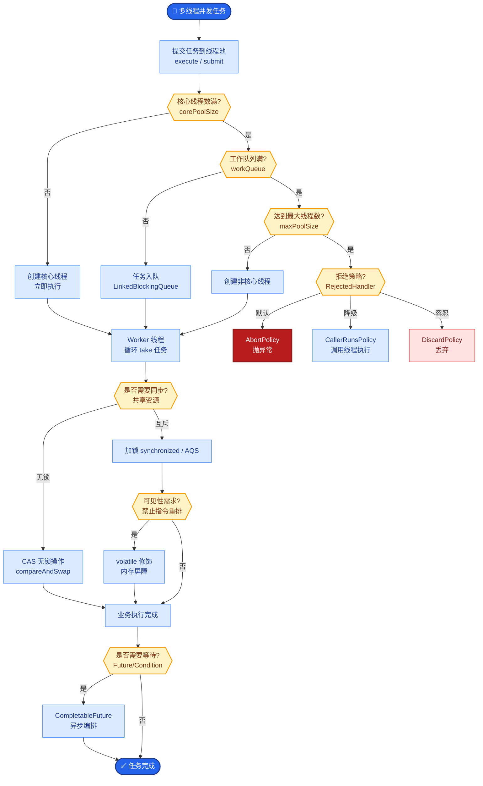
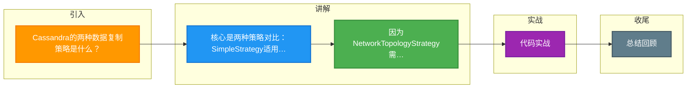

# Cassandra的两种数据复制策略是什么？

Cassandra 的数据复制策略决定了数据如何在集群中的节点分布和存储。Cassandra 在创建 Keyspace 时指定策略，主要有两种：

### 1. SimpleStrategy（简单策略）
*   **适用场景**：仅适用于**单数据中心（Single Data Center）**的部署环境。
*   **工作原理**：
    *   使用 Partitioner（如 Murmur3Partitioner）计算 Primary Key 的 Token，确定数据在环上的位置。
    *   **第一个副本**：放置在 Token 所在的主节点。
    *   **后续副本**：顺时针方向在环上寻找接下来的 N-1 个节点存放剩余副本。
*   **缺点**：在多数据中心环境下，可能导致副本分布不均，无法跨机房容灾。

### 2. NetworkTopologyStrategy（网络拓扑策略）
*   **适用场景**：适用于**复杂的多数据中心（Multiple Data Centers）**部署。
*   **工作原理**：
    *   允许针对每个数据中心分别设置副本数。
    *   Cassandra 会将副本均匀散布到指定数据中心的机架上，以避免单点故障（如机架断电）。
    *   即使某个数据中心整体宕机，其他 DC 仍可提供服务。

**Gossip 协议补充**
为了配合上述复制策略，Cassandra 使用 Gossip 协议（每秒一次，随机选择 3 个节点）进行节点间的状态同步（Push/Pull 模式收敛性最好），确保集群感知元数据变化和节点存活状态。

```text
SimpleStrategy vs NetworkTopologyStrategy 示意图：

数据环 (Token Ring)
┌────────────────────────────────────────────────────────────┐
│                                                            │
│  Node A (Tok:10)    Node B (Tok:20)    Node C (Tok:30)    │
│      ╱                   ╲                    │            │
│     ╱                     ╲                   │            │
│    ╱   SimpleStrategy      ╲                  │            │
│   ╱   (RF=3, 顺时针)       ╲                 │            │
│  ╱                         ╲                │            │
│ Data1 (A, B, C)             Data2 (B, C, D)  │            │
│                                                     (只看 Token 顺序)        │
│                                                            │
│  NetworkTopologyStrategy (DC1:RF=2, DC2:RF=1)               │
│  Data1 -> DC1: [A, B]   DC2: [X]   (跨机房感知拓扑)        │
│                                                            │
└────────────────────────────────────────────────────────────┘
```

### 3. 常见考点
1.  **Snitch 的作用是什么？它与复制策略的关系？**
    Snitch 定义了集群的拓扑结构（告知节点属于哪个 DC、哪个 Rack）。NetworkTopologyStrategy 必须配合支持拓扑感知的 Snitch（如 GossipingPropertyFileSnitch）才能工作，否则它不知道节点在哪个机房。
2.  **副本一致性级别（Consistency Level）的选择？**
    写入时需指定 CL（如 LOCAL_QUORUM）。如果 CL 设置为 QUORUM，则需要跨机房响应，延迟较高；设置为 LOCAL_QUORUM 则只在本地机房满足多数派即可，牺牲了一致性但换取了低延迟。

**4. 实战深化**

*   **实战案例**：某跨国业务初期使用 SimpleStrategy，后扩展至双机房。由于 Token 环分布不均，导致 80% 的读写请求集中在主数据中心的一个节点，引发热点。迁移至 NetworkTopologyStrategy 并配合 GossipingPropertyFileSnitch 后，成功实现读写流量按机房权重自动分流。

*   **代码示例**：
```cql
-- CQL: 创建 Keyspace 时指定策略
-- 单机房 (开发/测试环境)
CREATE KEYSPACE my_app_ks 
WITH REPLICATION = { 
  'class' : 'SimpleStrategy', 
  'replication_factor' : 3 
};

-- 多机房 (生产环境)
CREATE KEYSPACE my_app_prod 
WITH REPLICATION = { 
  'class' : 'NetworkTopologyStrategy', 
  'DC1' : 3,  -- 数据中心1存3副本
  'DC2' : 2   -- 数据中心2存2副本
};
```

*   **策略与 Snitch 配合表**：

| 复制策略 | 推荐使用的 Snitch | 机架感知能力 | 适用场景 |
| :--- | :--- | :--- | :--- |
| **SimpleStrategy** | SimpleSnitch | 无 | 单数据中心，开发测试 |
| **NetworkTopologyStrategy** | **GossipingPropertyFileSnitch** | **有 (基于配置文件)** | 生产环境，混合云，多机房 |
| **NetworkTopologyStrategy** | Ec2Snitch / Ec2MultiRegionSnitch | 有 (AWS 拓扑) | AWS 部署环境 |
| **NetworkTopologyStrategy** | CloudstackSnitch | 有 | Cloudstack 部署环境 |


## 核心流程图



## 记忆要点

- 核心是两种策略对比：SimpleStrategy适用单机房且仅看Token顺序，NetworkTopologyStrategy适用多机房且感知拓扑
- 因为NetworkTopologyStrategy需要感知机房和机架，所以必须配合Snitch组件才能发挥作用
- Gossip协议每秒随机选3个节点通信，采用Push-Pull模式收敛性最好
- 多机房写一致性：因为QUORUM需跨机房响应，所以LOCAL_QUORUM通过仅本地机房多数派换取低延迟

## 结构化回答

**30 秒电梯演讲：** SimpleStrategy用于单中心，NetworkTopologyStrategy用于多数据中心。打个比方，一个是同房间多备份，一个是跨城市多备份。

**展开框架：**
1. **核心是两种策略对比** — SimpleStrategy适用单机房且仅看Token顺序，NetworkTopologyStrategy适用多机房且感知拓扑
2. **必须配合Snitch组件才能发挥作用** — 因为NetworkTopologyStrategy需要感知机房和机架，所以必须配合Snitch组件才能发挥作用。
3. **Gossip协议每秒随机选3个节点通信** — 采用Push-Pull模式收敛性最好

**收尾：** 我在项目里踩过坑——CQL: 创建 Keyspace 时指定策略。您想深入聊哪一段：原理、避坑还是对比选型？

## 视频脚本

> 预计时长：2 分钟 | 由浅入深

| 时间 | 画面/字幕 | 口播台词 | 讲解要点 |
|------|----------|----------|----------|
| 0:00 | 标题卡：Cassandra的两种数据复制策略… | "Cassandra的两种数据复制策略是什么？一句话——一个是同房间多备份，一个是跨城市多备份。" | 开场钩子 |
| 0:40 | 概念动画/示意图 | "SimpleStrategy用于单中心，NetworkTopologyStrategy用于多数据中心——一个是同房间多备份，一个是跨城市多备份" | 核心定义 |
| 1:20 | 核心是两种策略对比示意 | "SimpleStrategy适用单机房且仅看Token顺序，NetworkTopologyStrategy适用多机房且感知拓扑" | 要点1 |
| 2:00 | 总结卡 | "记住这几条，面试不慌。下期讲进阶追问。" | 收尾 |

### 视频流程图



