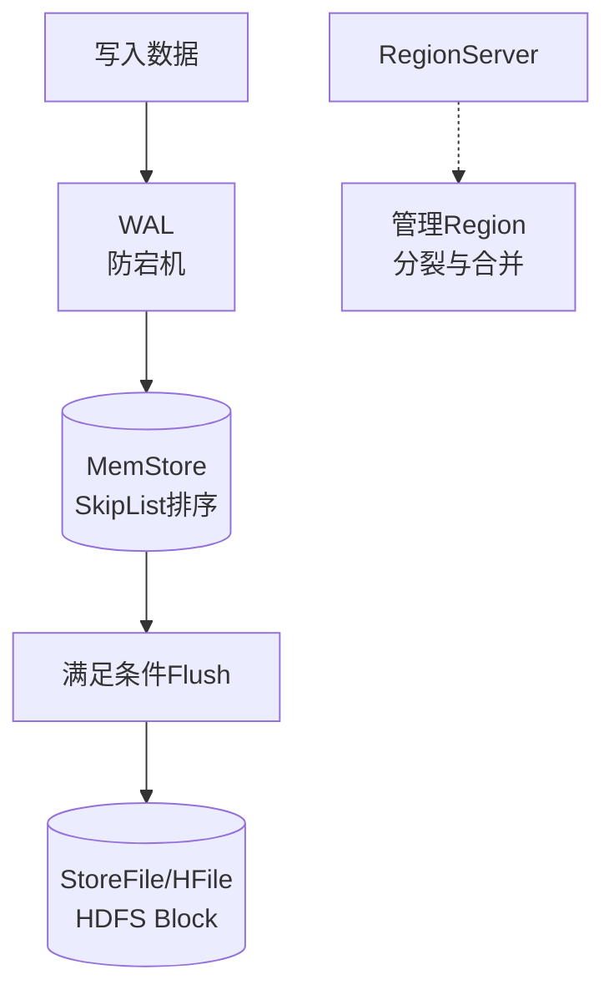

# HBase中RegionServer的作用和架构是什么？

HBase 采用 Master-Slave 架构，RegionServer 是集群的“工作节点”，负责处理用户的实际读写请求。以下是其详细的作用和架构组件。

### RegionServer 的核心作用
1.  **管理 Region**：负责分配给它的多个 Region 的 I/O 操作。
2.  **处理读写请求**：响应 Client 的 Get/Put/Scan/Delete 请求。
3.  **数据合并**：负责 MemStore 的 Flush 以及 HFile 的 Compaction（合并小文件）。
4.  **Region 分裂**：当 Region 过大时，负责执行 Split 操作将其一分为二。

### RegionServer 内部架构组件
RegionServer 包含以下核心组件：

1.  **WAL (Write Ahead Log / HLog)**
    - 位于 HDFS 上，用于存储数据修改的日志。
    - 作用：故障恢复。当 RS 宕机时，可通过重放 WAL 恢复 MemStore 中未持久化的数据。

2.  **Region**
    - HBase 表的分片。一个 RS 管理多个 Region。
    - 每个 Region 包含多个 Store（对应表中的列族 Column Family）。

3.  **Store (Column Family Store)**
    - 一个列族对应一个 Store。
    - Store 包含两部分：**MemStore**（内存）和 **StoreFiles**（磁盘）。

4.  **MemStore**
    - 内存缓冲区，数据先写入这里。
    - 基于 SkipList 实现，数据有序。
    - 满足条件后 Flush 成 HFile。

5.  **StoreFile (HFile)**
    - 数据在 HDFS 上的物理存储格式，基于 Block（默认 64KB）存储。
    - 适合顺序读，底层支持 BlockCache 缓存。

### 实战案例
在峰值写入场景下，若 MemStore 设置过大，一旦 RegionServer 宕机，**WAL 回放恢复时间过长**，导致集群不可用；若设置过小，会导致频繁 Flush 产生大量小文件，引发频繁 Compaction 导致“写放大”阻塞写入。

### 代码示例
HBase 客户端写入数据的关键配置（Java）：

```java
// 设置 WAL 关闭以追求极致性能（高风险，仅用于非关键数据）
Put put = new Put(rowKey);
put.setWriteToWAL(false); 

// 手动 Flush 防止内存溢出（通常由 HBase 自动管理，但紧急情况下可调用）
admin.flush(TableName.valueOf("my_table"));
```

```text
RegionServer 架构图：

┌─────────────────────────────────────────────────────────────┐
│                     RegionServer                             │
│                                                              │
│  ┌──────────────────────┐  ┌──────────────────────────────┐ │
│  │       WAL (HLog)     │  │        BlockCache            │ │
│  │  (Append-Only Log)   │  │   (Read Cache: LRU/Lru...)   │ │
│  └──────────────────────┘  └──────────────────────────────┘ │
│            ▲                                 ▲               │
│            │ 写 Log                          │ 读 Block     │
┌───────────┴──────────────────────────────────┴─────────────┐ │
│                         Region 1                          │ │
│  ┌─────────────┐  ┌─────────────┐  ┌─────────────┐        │ │
│  │ Store (CF1) │  │ Store (CF2) │  │  ...        │        │ │
│  │ ┌─────────┐ │  │ ┌─────────┐ │  │             │        │ │
│  │ │MemStore│ │  │ │MemStore│ │  │             │        │ │
│  │ └────┬────┘ │  │ └────┬────┘ │  │             │        │ │
│  │      │Flush │  │      │




## 记忆要点

- 因为RegionServer是HBase的工作节点，所以负责管理Region、处理读写、执行分裂与合并
- 写入必经之路：数据先写WAL（防宕机）再写MemStore，满足条件后Flush为HFile
- MemStore基于SkipList实现内存排序，StoreFile以Block形式存于HDFS
- 实战避坑：MemStore若设置过大，会导致宕机时WAL回放时间过长引发阻塞

## 结构化回答

**30 秒电梯演讲：** HBase集群中负责处理实际读写请求的工作节点。打个比方，像餐馆里的服务员，直接接待顾客（Client）上菜。

**展开框架：**
1. **负责管理Region、处理读写、执行分裂与合并** — 因为RegionServer是HBase的工作节点，所以负责管理Region、处理读写、执行分裂与合并。
2. **写入必经之路** — 数据先写WAL（防宕机）再写MemStore，满足条件后Flush为HFile
3. **MemStore基于SkipList实现内存排序** — StoreFile以Block形式存于HDFS

**收尾：** 我在项目里踩过坑——在峰值写入场景下，若 MemStore 设置过大，一旦 RegionServer 宕机，WAL 回放恢复时间过长，导致集群不可用；若设置过小，会导致频繁 Flush 产生大量小文件，引发频繁 Compaction 导致“写放大”阻塞写入。您想深入聊哪一段：原理、避坑还是对比选型？

## 视频脚本

> 预计时长：2 分钟 | 由浅入深

| 时间 | 画面/字幕 | 口播台词 | 讲解要点 |
|------|----------|----------|----------|
| 0:00 | 标题卡：HBase中RegionServer… | "HBase中RegionServer的作用和架构是什么？一句话——像餐馆里的服务员，直接接待顾客（Client）上菜。" | 开场钩子 |
| 0:40 | 概念动画/示意图 | "HBase集群中负责处理实际读写请求的工作节点——像餐馆里的服务员，直接接待顾客（Client）上菜" | 核心定义 |
| 1:20 | 要点1图解示意 | "因为RegionServer是HBase的工作节点，所以负责管理Region、处理读写、执行分裂与合并。" | 要点1 |
| 2:00 | 总结卡 | "记住这几条，面试不慌。下期讲进阶追问。" | 收尾 |
