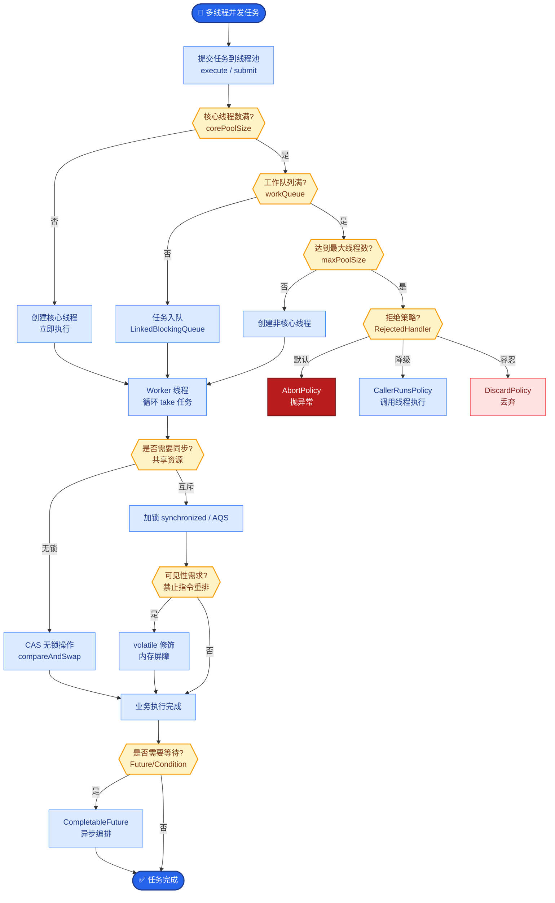
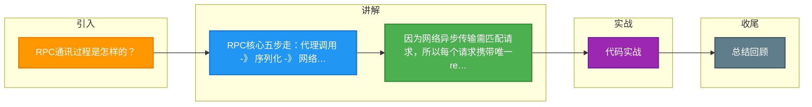

# RPC通讯过程是怎样的？

RPC（远程过程调用）旨在让调用远程服务像调用本地方法一样。其核心通讯过程包含以下几个步骤：

**1. 服务调用（客户端）**
- 客户端线程调用本地接口代理（Proxy）。
- **序列化**：将方法名、参数类型、参数值等对象序列化为二进制字节流，便于网络传输（常用 Protobuf、Hessian、JSON 等）。

**2. 网络传输**
- 客户端通过 TCP 连接（通常基于 Netty）将二进制数据封装成协议包发送给服务端。
- 此时客户端线程根据配置（Sync/Async）决定是阻塞等待还是异步回调。

**3. 请求接收与处理（服务端）**
- 服务端收到二进制流，进行**反序列化**，还原为请求对象。
- 服务端根据请求信息找到对应的实现类，执行真正的业务逻辑。

**4. 结果返回（服务端）**
- 业务逻辑执行完毕，捕获异常或结果，将结果对象**序列化**为二进制流。
- 通过网络连接将响应发送回客户端。

**5. 结果接收与回调（客户端）**
- 客户端收到响应数据，**反序列化**得到结果对象。
- **核心问题解决**：
  - **寻址（Response 匹配 Request）**：每个请求携带唯一的 `requestID`（如 AtomicLong 生成）。服务端返回时带回该 ID。客户端维护一个 `ConcurrentHashMap<requestID, Callback>`，根据 ID 找到对应的 Callback。
  - **线程挂起与唤醒（同步模式下）**：
    1. 客户端调用 `channel.writeAndFlush` 前，构建一个 Future 对象放入 Map。
    2. 调用线程通过 `Future.get()` 阻塞等待（底层通常基于 `LockSupport.park()` 或 `CountDownLatch`）。
    3. Netty 的 IO 线程收到响应后，在 Map 中找到 Future，设置结果并唤醒挂起的业务线程继续执行。

### 实战案例
在 Dubbo 等框架中，若服务端处理请求极慢，客户端的默认超时时间（如 1s）耗尽后会抛出 TimeoutException。但实际上服务端可能仍在处理，这就导致了“重试风暴”或“数据重复执行”，生产环境中需结合**幂等性**和**合理的超时策略**来规避。

### 代码示例
Netty 实现 Simple RPC 客户端请求映射逻辑：

```java
// 发送请求前
long requestId = IdGenerator.next();
DefaultPromise promise = new DefaultPromise(channel.eventLoop());
PendingRequests.put(requestId, promise); // 存入Map

channel.writeAndFlush(new Request(requestId, "methodName", args));

// 同步等待结果
promise.get(1, TimeUnit.SECONDS); // 阻塞业务线程

// Netty IO线程收到响应后
Response resp = (Response) msg;
DefaultPromise p = PendingRequests.get(resp.getRequestId());
if(p != null) {
    p.setSuccess(resp.getResult()); // 唤醒业务线程
}
```

### 对比表格：RPC vs HTTP

| 特性 | RPC | HTTP (RESTful) |
| :--- | :--- | :--- |
| **传输协议** | 通常基于 TCP (自定义协议) | TCP (HTTP/1.1, HTTP/2) |
| **序列化** | 二进制，占用小，速度快 | 文本/JSON，占用大，解析慢 |
| **语义** | 动词 + 对象 (如 userService.getUser) | 名词 + 动词 (如 GET /user) |
| **性能** | 高 (长连接、多路复用、压缩) | 相对低 (header 较重) |
| **通用性** | 强耦合，适合内部微服务 | 无耦合，适合对外接口 |

```text
┌───────────┐                    ┌───────────┐
│  Client   │                    │  Server   │
└─────┬─────┘                    └─────┬─────┘
      │                                │
 1.   │  Proxy.invoke(param)           │
      │  ---------------------->       │
      │                                │
 2.   │  Serialize (Binary)            │
      │  ----------------------------------------------> 
      │         (Network: TCP/IP)                 │
      │                                │
 3.   │                                │  Deserialize
      │                                │  Invoke Service
      │                                │  Execute Logic
      │                                │
 4.   │                                │  Serialize (Result)
      │  <----------------------------------------------
      │         (Response with requestID)             │
      │                                │
 5.   │  Find Callback/Future by ID  │
      │  Resume Thread / Callback     │
```


## 核心流程图



## 记忆要点

- RPC核心五步走：代理调用 -> 序列化 -> 网络传输 -> 反序列化执行 -> 结果回调
- 因为网络异步传输需匹配请求，所以每个请求携带唯一requestID并维护Map<ID, Future>
- 同步转异步：业务线程调用Future.get()阻塞挂起，IO线程收到响应后唤醒
- RPC对比HTTP：RPC多基于TCP自定义二进制协议，性能高且强耦合适用内部微服务

## 结构化回答

**30 秒电梯演讲：** 将本地调用转化为网络二进制传输，并通过ID匹配实现异步回调同步化。打个比方，像寄信并等回信，信封上贴唯一编号，收发室（Map）根据编号把回信准确交给寄信人。

**展开框架：**
1. **RPC核心五步走** — 代理调用 -> 序列化 -> 网络传输 -> 反序列化执行 -> 结果回调
2. **每个请求携带唯一requestID并维护Map<** — 因为网络异步传输需匹配请求，所以每个请求携带唯一requestID并维护Map<ID, Future>。
3. **同步转异步** — 业务线程调用Future.get()阻塞挂起，IO线程收到响应后唤醒

**收尾：** 我在项目里踩过坑——在 Dubbo 等框架中，若服务端处理请求极慢，客户端的默认超时时间（如 1s）耗尽后会抛出 TimeoutException。您想深入聊哪一段：原理、避坑还是对比选型？

## 视频脚本

> 预计时长：2 分钟 | 由浅入深

| 时间 | 画面/字幕 | 口播台词 | 讲解要点 |
|------|----------|----------|----------|
| 0:00 | 标题卡：RPC通讯过程是怎样的 | "RPC通讯过程是怎样的？一句话——像寄信并等回信，信封上贴唯一编号，收发室（Map）根据编号把回信准确交给寄信人。" | 开场钩子 |
| 0:40 | 概念动画/示意图 | "将本地调用转化为网络二进制传输，并通过ID匹配实现异步回调同步化——像寄信并等回信，信封上贴唯一编号，收发室（Map）根据编号把回信准确交给寄信人" | 核心定义 |
| 1:20 | RPC核心五步走示意 | "代理调用 -> 序列化 -> 网络传输 -> 反序列化执行 -> 结果回调" | 要点1 |
| 2:00 | 总结卡 | "记住这几条，面试不慌。下期讲进阶追问。" | 收尾 |

### 视频流程图



