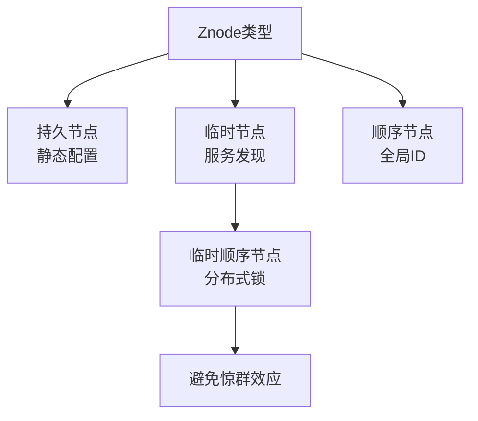

# ZooKeeper中Znode有哪几种类型？

ZooKeeper 中 Znode（数据节点）根据生命周期和命名方式，主要分为 4 种标准类型，以及 2 种扩展类型：

### 1. 持久节点
- **特性**：创建后一直存在，直到被显式删除。
- **生命周期**：与客户端会话无关，客户端断开后节点依然保留。
- **用途**：常用于存储配置信息、数据库连接参数、环境变量等静态数据。
- **命令**：`create /path data`

### 2. 持久顺序节点
- **特性**：在持久节点的基础上，ZK 会自动在节点名后面追加一个单调递增的数字序号（如 `/node0000000001`）。
- **序号唯一性**：序号由父节点维护，是全局递增且唯一的。
- **用途**：分布式全局 ID 生成、分布式队列。
- **命令**：`create -s /path data`

### 3. 临时节点
- **特性**：节点的生命周期依赖于创建该节点的客户端**会话**。
- **生命周期**：一旦客户端会话结束（断连或 Session 超时），该节点会被 ZK 自动删除。
- **限制**：临时节点**不允许拥有子节点**。
- **用途**：服务注册与发现（服务下线自动摘除）、简单的分布式锁（Lock 节点）、Leader 选举。
- **命令**：`create -e /path data`

### 4. 临时顺序节点
- **特性**：结合了临时节点和顺序节点的特性。
- **生命周期**：会话结束自动删除，且名字带有序号。
- **用途**：**分布式锁的推荐实现**（公平锁）。所有客户端在锁节点下创建临时顺序节点，序号最小的获得锁，其余监听比自己小的前一个节点。
- **命令**：`create -e -s /path data`

### 扩展类型（3.5.x 版本后）
- **容器节点**：如果节点没有任何子节点（变为空节点），ZooKeeper 的后台任务会在一段时间后扫描并自动删除它，用于清理空目录。
- **TTL 节点**：节点可以设置过期时间，如果在该时间内没有被修改且没有子节点，会被自动删除。

```text
       ZNode Hierarchy (ZK Name Space)

            / (Root)
           / \
          /   \
    [PERSISTENT]  [PERSISTENT_SEQUENTIAL]
    /app_config   /queue_task
    |             |
    |             +--- task0000000001 (Ephemeral)
    |             +--- task0000000002 (Ephemeral)
    |
    +--- db_url (Persistent)
    +--- service_registry (Ephemeral Container)
          |
          +--- worker_01 (Ephemeral) [Session Alive]
          +--- worker_02 (Ephemeral) [Session Dead -> Auto Deleted]
```

### ## 常见考点
1.  **为什么临时节点不能有子节点？**
    - 这是为了避免复杂的级联删除问题和竞态条件。如果临时节点有子节点，当会话结束时，其子节点的处理会变得非常复杂（子节点可能是持久的）。因此 ZK 在设计上直接禁止了此操作。
2.  **ZooKeeper 的 Watch 机制与节点类型的关系？**
    - Watch 监听的是节点的变化（数据变更、子节点列表变更）。对于临时节点，节点被删除（会话断开）也会触发 Watch 通知。
3.  **分布式锁为什么通常用临时顺序节点而不是单纯的临时节点？**
    - **惊群效应**：如果只用临时节点，所有客户端监听同一个锁节点，锁释放时所有客户端都会被唤醒去竞争，造成压力。使用顺序节点时，客户端只监听前一个节点，前一个释放才唤醒下一个，实现了排队和公平性。




## 记忆要点

- 持久节点：与客户端会话无关，断开依然保留，常存静态配置
- 临时节点：会话结束自动删除，且不允许拥有子节点，用于服务发现
- 顺序节点：自动追加全局递增序号，常用于全局ID
- 分布式锁首选临时顺序节点，因为能避免单纯临时节点的惊群效应

## 结构化回答

**30 秒电梯演讲：** 节点按生命周期（持久/临时）和排序特性分为四类。打个比方，像文件：普通文件（持久）、带序号文件（顺序）、随断网消失的缓存（临时）、带序号的缓存。

**展开框架：**
1. **持久节点** — 与客户端会话无关，断开依然保留，常存静态配置
2. **临时节点** — 会话结束自动删除，且不允许拥有子节点，用于服务发现
3. **顺序节点** — 自动追加全局递增序号，常用于全局ID

**收尾：** 这三点都能配合实战聊。您想深入聊原理、对比还是避坑？

## 视频脚本

> 预计时长：2 分钟 | 由浅入深

| 时间 | 画面/字幕 | 口播台词 | 讲解要点 |
|------|----------|----------|----------|
| 0:00 | 标题卡：ZooKeeper中Znode有哪几… | "ZooKeeper中Znode有哪几种类型？一句话——像文件：普通文件（持久）、带序号文件（顺序）、随断网消失的缓存（临时）、带序号的缓存。" | 开场钩子 |
| 0:40 | 概念动画/示意图 | "节点按生命周期（持久/临时）和排序特性分为四类——像文件：普通文件（持久）、带序号文件（顺序）、随断网消失的缓存（临时）、带序号的缓存" | 核心定义 |
| 1:20 | 持久节点示意 | "与客户端会话无关，断开依然保留，常存静态配置" | 要点1 |
| 2:00 | 总结卡 | "记住这几条，面试不慌。下期讲进阶追问。" | 收尾 |
