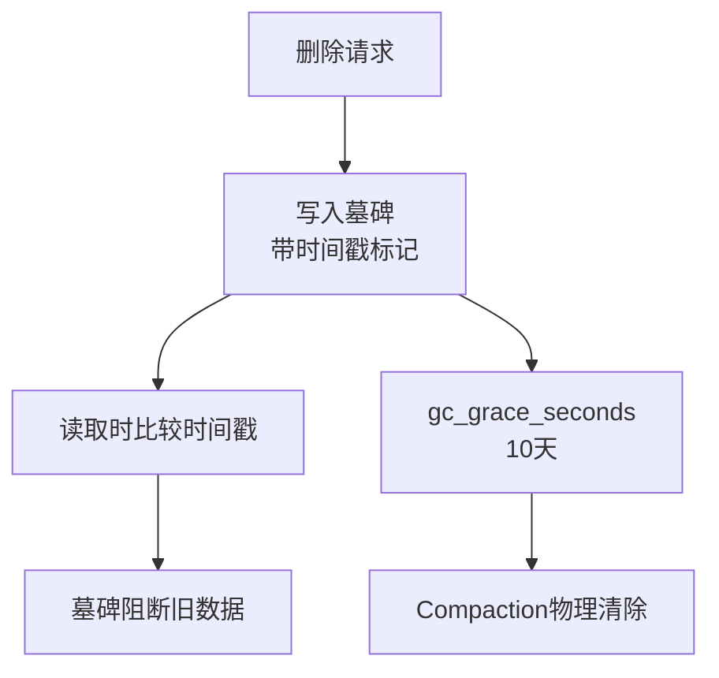

# Cassandra中数据删除的墓碑机制是什么？

Cassandra 采用 LSM-Tree（Log-Structured Merge Tree）存储结构，写入效率极高但修改数据困难。因此，其删除操作不是直接物理删除数据，而是标记删除，这就是**墓碑机制**。

### 1. 核心原理
- **逻辑删除**：当执行删除操作时，Cassandra 并不会立即从磁盘（SSTable）中移除数据，而是写入一条特殊的记录，这条记录被称为**墓碑**。
- **墓碑内容**：墓碑包含了被删除数据的 Key、一个特殊的标记（本地删除标记或范围删除标记）以及删除操作的时间戳。
- **写入路径**：墓碑首先写入 Memtable，然后随 MemTable Flush 到磁盘成为 SSTable 的一部分。

### 2. 读取时的处理
- 当读取数据时，Cassandra 可能会从 Memtable（内存）和多个 SSTable（磁盘）中读取到多条记录（包括旧数据、新数据和墓碑）。
- **冲突解决**：系统会根据时间戳比较这些记录。如果发现存在墓碑，且墓碑的时间戳晚于数据版本的时间戳，系统会判定该数据已被删除，不返回给客户端。
- **数据可见性**：墓碑在读取时会阻断比它旧的数据版本，但在 Compaction 完成前，它不会阻断后续对同一 Key 的新写入（即“复活”操作）。

### 3. 垃圾回收与 GC Grace Seconds
- 墓碑会占用磁盘空间，且长期存在会影响读取性能（因为每次读取都要比较）。
- **GC Grace Seconds**：这是 Cassandra 的一个关键配置参数。墓碑必须保留至少 `gc_grace_seconds` 时间（默认 10 天），以确保在这段时间内，所有宕机的节点都有机会修复并同步到删除标记。
- **Compaction（合并）**：在后台 Compaction 过程中，当墓碑存在时间超过 `gc_grace_seconds`，Cassandra 会将多个 SSTable 合并，物理删除带有墓碑标记的旧数据，并清理墓碑本身，释放空间。

### 4. 为什么需要墓碑？（深入分布式一致性）
- **分布式一致性**：在分布式环境下（如 Multi-DC 复制），删除操作可能只到达部分副本。墓碑作为一种特殊数据，可以通过复制协议传播到其他副本。
- **防止“僵尸复活”**：如果没有墓碑，一个拥有旧数据的副本在恢复或同步时，可能会将已被删除的数据重新覆盖回最新的数据集。墓碑确保所有副本最终都“认为”数据已删除。

### 常见考点
1. **墓碑过多带来的性能问题**：大量的墓碑会导致查询性能下降（Read Path 变慢），如何优化？（调整 Compaction 策略，如 `LeveledCompactionStrategy`，或者手动修复 `repair`）。
2. **Range Tombstones（范围墓碑）**：不仅仅是删除单行，删除一个 Partition 的范围数据时，Range Tombstone 的作用机制。
3. **GC Grace Seconds 设置不当**：如果设置过短，在数据未完全同步前就被清理，会导致已删除数据复活；如果设置过长，磁盘空间占用过大。
4. **TTL 与 Tombstone 的区别**：TTL（Time To Live）过期后也会生成墓碑吗？（是的，TTL 过期后写入数据也会变为墓碑）。

## 技术原理

墓碑机制是 LSM-Tree 存储引擎在分布式环境下的必然产物，其设计贯穿写入、读取、合并三个阶段：

- **LSM-Tree 不可变性约束**：SSTable 一旦落盘就不可修改（追加写 + 不可变文件）。物理删除一条记录意味着重写整个 SSTable，代价极高。墓碑用一个「删除标记」记录覆盖逻辑删除语义，把「删除」转化为「写入」，复用了 LSM 高效的追加写路径。
- **时间戳仲裁机制**：Cassandra 的每条记录都带时间戳（写入时由客户端或服务端生成）。读取时，Memtable + 多个 SSTable 中同一 Key 的所有版本被合并（Read Repair），按时间戳取最新。墓碑本质上是一条「标记为 deleted + 携带删除时间戳」的记录，时间戳比旧数据晚就会在合并时屏蔽旧数据。这就是为什么删除必须带时间戳——它是仲裁依据。
- **副本同步的防复活逻辑**：考虑场景：3 副本 {A, B, C}，删除到达 A、B，C 宕机。若 A、B 直接物理删除，C 恢复后通过 Hinted Handoff 或 Anti-Entropy Repair 同步数据时，C 的旧副本可能被当作「最新」覆盖回 A、B——已删数据「复活」。墓碑作为普通记录参与副本同步，保证 C 最终收到墓碑并标记删除，杜绝复活。`gc_grace_seconds` 必须大于最长的节点宕机时间，否则墓碑被过早清理，复活风险重现。
- **Compaction 的物理回收**：墓碑在超过 `gc_grace_seconds` 后，下次 Compaction 才会真正物理删除旧数据和墓碑本身。Size-tiered 策略下小 SSTable 合并成大文件时触发；Leveled 策略更频繁。这是 LSM 回收磁盘空间的唯一时机。

## 代码示例

```cql
-- Cassandra CQL 删除操作（底层会写入墓碑）
-- 删除整行
DELETE FROM users WHERE user_id = 123;

-- 删除特定列（Cell Tombstone）
DELETE email FROM users WHERE user_id = 123;

-- 设置 TTL（过期自动生成墓碑）
INSERT INTO users (user_id, email) VALUES (123, 'a@b.com) USING TTL 86400;

-- 查看墓碑数量（运维排查）
-- nodetool 提供 SSTable 元信息
-- $ nodetool getsstables users 123
```

```bash
# 检测墓碑过多的 SSTable
nodetool compactionstats
# 关注 "Tombstone Drop" 统计

# 手动触发 Compaction 清理墓碑（慎用，影响性能）
nodetool compact keyspace_name users

# 查看表的 gc_grace_seconds 配置
# ALTER TABLE users WITH gc_grace_seconds = 864000;  -- 默认 10 天
```

## 注意事项

- **墓碑风暴（Tombstone Overload）**：批量删除或 TTL 大量过期会产生海量墓碑，读取时需扫描全部比较，单次查询可能扫描数万条墓碑触发 `tombstone_warn_threshold`（默认 1000）甚至 `tombstone_failure_threshold`（默认 100000）导致查询失败。应对：避免全分区删除、分批删除、调大 warn 阈值仅是缓解。
- **`gc_grace_seconds` 的权衡**：默认 10 天适合常规集群。若存在跨数据中心长延迟同步或节点可能长时间宕机（>10 天），需调大（如 30 天）；相反，单节点、无复制的场景可调小到 1 天以加速空间回收。
- **未执行 Repair 的风险**：如果集群从未运行 `nodetool repair`，副本间墓碑可能不一致，超过 grace period 后某些副本物理删除了旧数据，另一些却保留了——读取时返回不一致结果。生产环境必须定期运行 Repair（建议周期 < `gc_grace_seconds`）。
- **Range Tombstone 的特殊性**：范围删除（如 `DELETE FROM users WHERE partition_key IN (...)`）生成 Range Tombstone，Compaction 时判断更复杂，容易残留。排查墓碑问题时优先确认是否有范围删除操作。




## 记忆要点

- 因为LSM-Tree难物理删除，所以删除本质是写入带有时间戳的特殊标记（墓碑）
- 读取时比较时间戳，墓碑会阻断比它旧的数据返回
- gc_grace_seconds默认10天，过期后会在Compaction时被物理清除
- 核心作用是防止分布式同步时，旧副本将已删数据当成最新数据复活

## 结构化回答


**30 秒电梯演讲：** 撕掉文件的一页太麻烦，不如在文件上盖个“作废”章，等整理档案时再扔掉。

**展开框架：**
1. **写操作** — 删除等同于插入一条Tombstone记录
2. **读操作** — 遇到Tombstone则掩盖旧数据
3. **清理** — 后台Compaction时物理删除数据

**收尾：** 这是我实战中的理解，您想深入哪一段？


## 视频脚本

> 预计时长：3 分钟 | 由浅入深

| 时间 | 画面/字幕 | 口播台词 | 讲解要点 |
|------|----------|----------|----------|
| 0:00 | 标题卡：Cassandra中数据删除的墓碑机… | "Cassandra中数据删除的墓碑机制是什么？一句话——撕掉文件的一页太麻烦，不如在文件上盖个“作废”章，等整理档案时再扔掉。" | 开场钩子 |
| 0:45 | 概念动画/示意图 | "不直接删数据，而是写个“死亡标记”以此覆盖旧数据——撕掉文件的一页太麻烦，不如在文件上盖个“作废”章，等整理档案时再扔掉" | 核心定义 |
| 1:30 | 要点1图解示意 | "因为LSM-Tree难物理删除，所以删除本质是写入带有时间戳的特殊标记（墓碑）。" | 要点1 |
| 2:15 | 读取时比较时间戳示意 | "墓碑会阻断比它旧的数据返回" | 要点2 |
| 3:00 | 总结卡 | "记住这几条，面试不慌。下期讲进阶追问。" | 收尾 |

### 视频流程图


