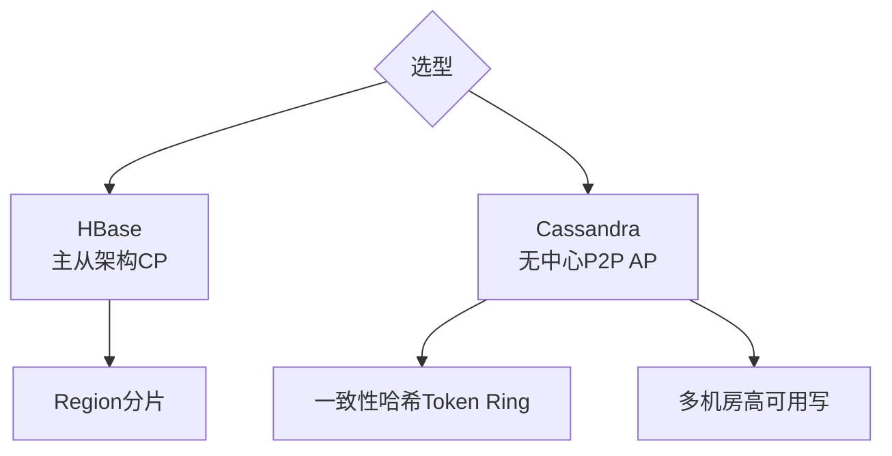

# HBase vs Cassandra？

HBase 和 Cassandra 都是构建在 HDFS 之上的分布式 NoSQL 数据库，但设计理念不同。

### 核心对比

| 特性 | HBase | Cassandra |
| :--- | :--- | :--- |
| **数据模型来源** | Google BigTable | Amazon Dynamo + Google BigTable |
| **架构** | **Master-Slave** (HMaster + RegionServer) | **P2P 去中心化** (无 Master) |
| **一致性模型** | **强一致性** (CP) | **最终一致性** (AP，可调为强一致) |
| **数据分布** | 按 Region 分片，由 Master 分配 | **一致性哈希** (Token Ring) |
| **读写路径** | 读写可能需多次 RPC (Client -> ZK -> Meta -> RS) | 读写定位快，节点本地计算 Token |
| **扩容** | 需 Split Region，重新分配，相对复杂 | 增加节点自动调整 Token 范围，无缝扩容 |
| **单点故障** | HMaster 是单点 (虽支持 HA 但依赖 ZK) | 无单点，任意节点宕机集群仍可用 |
| **写入性能** | 依赖 WAL 和 MemStore，写性能好 | 优秀的写性能，LSM-Tree 结构 |
| **适用场景** | 复杂查询、强一致性需求（如金融）、大文件 | 高可用、海量写入、多机房复制（如物联网、社交） |

### 实战案例

*   **HBase 之痛**：在双十一大促场景下，HBase 曾因 RegionServer 宕机触发大量 Region 迁移，导致 HMaster 在处理元数据变更时阻塞，进而引发全集群写入超时。这体现了 Master 节点在负载极端情况下的瓶颈。
*   **Cassandra 的跨机房优势**：某全球化社交平台利用 Cassandra 的 NetworkTopologyStrategy，实现了写操作同时跨越欧美 3 个机房异步复制，即使整条海底光缆切断，当地机房依然可以正常读写（降级为本地一致性），这是 HBase 难以做到的。

### 关键代码示例（Java API：一致性级别设置）

```java
// Cassandra 写入时设置一致性级别（展示其灵活的调优能力）
SimpleStatement statement = SimpleStatement.builder("INSERT INTO users (id, name) VALUES (?, ?)")
    .addPositionalValues(1, "Alice")
    .setConsistencyLevel(ConsistencyLevel.QUORUM) // 牺牲一点写延迟换取强一致
    .build();

// 对比 HBase：客户端通常强一致性，无法在单次请求级别灵活调节一致性
```

### 常见考点
1. **CAP 理论的选择**：为什么说 HBase 是 CP 而 Cassandra 是 AP？（HBase 牺牲可用性保证强一致；Cassandra 牺牲强一致性保证高可用和写入性能）。
2. **扩容流程对比**：HBase Region Split 虽然自动，但为何频繁 Split 会导致性能抖动？Cassandra 的 VNode 是如何解决热点和手动分配 Token 问题的？
3. **写入路径差异**：HBase 写入必须经过 WAL（Write-Ahead Log）以保证不丢失数据，Cassandra 的 Commit Log 作用类似，但二者在 MemTable 满后的 Flush 策略有何不同？
4. **二级索引支持**：HBase 原生支持二级索引较弱（通常依赖 Phoenix 或 ElasticSearch），而 Cassandra 虽然 SASI 索引有性能限制，但在本地查询上有何优势？

## 技术原理

**架构：HBase 有中心 vs Cassandra 去中心化**
HBase 采用 Master-Slave 架构，HMaster 负责元数据管理和 Region 分配，RegionServer 承载实际数据，依赖 ZooKeeper 做协调。这种中心化设计在大促等极端负载下，HMaster 处理元数据变更时可能成为瓶颈。Cassandra 采用无中心 P2P 架构，所有节点对等，通过 Gossip 协议同步集群状态，任意节点宕机集群仍可用，没有单点。

**一致性：HBase 强一致（CP）vs Cassandra 最终一致（AP）**
HBase 保证强一致性：同一行数据的读写始终落在同一个 RegionServer，通过 WAL 保证不丢数据，适合金融、账户等强一致场景。Cassandra 默认最终一致性，但可通过 ConsistencyLevel（如 QUORUM）调节为强一致，牺牲延迟换取可用性，适合社交、IoT 等高可用写入场景。

**扩容：Cassandra 更灵活自动**
HBase 扩容需要 Split Region 并由 Master 重新分配，过程相对复杂且可能引起性能抖动；频繁 Split 会导致集群不稳定。Cassandra 基于一致性哈希（Token Ring）加 VNode，新增节点自动调整 Token 范围并均衡数据，无需人工干预，扩容过程对业务透明。

## 代码示例

```java
// Cassandra 调节一致性级别（灵活权衡）
SimpleStatement stmt = SimpleStatement.builder(
        "INSERT INTO users (id, name) VALUES (?, ?)")
    .addPositionalValues(1, "Alice")
    .setConsistencyLevel(ConsistencyLevel.QUORUM) // 牺牲延迟换强一致
    .build();
session.execute(stmt);
// HBase 无法在单次请求级别灵活调节，客户端默认强一致
```

```sql
-- Cassandra 多机房复制策略（容灾核心能力）
CREATE KEYSPACE app WITH replication = {
  'class': 'NetworkTopologyStrategy',
  'dc1': 3,   -- 北京机房 3 副本
  'dc2': 2    -- 上海机房 2 副本，整条光缆断开仍可读写
};
```

## 注意事项

- 架构对比：HBase 是主从架构（Master-Slave），而 Cassandra 是无中心 P2P 架构。
- 一致性选型：HBase 追求强一致性（CP），而 Cassandra 追求高可用最终一致性（AP）。
- 数据分布：HBase 依赖 Region 分片，而 Cassandra 基于一致性哈希（Token Ring）。
- 扩容与容灾：Cassandra 增加节点自动均衡且无单点，比 HBase 更适合多机房高可用写入。
- HBase 频繁 Split 会导致性能抖动，需预分裂 Region 并合理设计 RowKey 避免热点。




## 记忆要点

- 架构对比：HBase是主从架构(Master-Slave)，而Cassandra是无中心P2P架构
- 一致性选型：HBase追求强一致性(CP)，而Cassandra追求高可用最终一致性(AP)
- 数据分布：HBase依赖Region分片，而Cassandra基于一致性哈希(Token Ring)
- 扩容与容灾：Cassandra增加节点自动均衡且无单点，比HBase更适合多机房高可用写入

## 结构化回答

**30 秒电梯演讲：** HBase重强一致与查询，Cassandra重高可用与扩展。打个比方，HBase像严格的中央银行，Cassandra像去中心化的P2P网络。

**展开框架：**
1. **架构对比** — HBase是主从架构(Master-Slave)，而Cassandra是无中心P2P架构
2. **一致性选型** — HBase追求强一致性(CP)，而Cassandra追求高可用最终一致性(AP)
3. **数据分布** — HBase依赖Region分片，而Cassandra基于一致性哈希(Token Ring)

**收尾：** 我在项目里踩过坑——HBase 之痛：在双十一大促场景下，HBase 曾因 RegionServer 宕机触发大量 Region 迁移，导致 HMaster 在处理元数据变更时阻塞，进而引发全集群写入超时。您想深入聊哪一段：原理、避坑还是对比选型？

## 视频脚本

> 预计时长：3 分钟 | 由浅入深

| 时间 | 画面/字幕 | 口播台词 | 讲解要点 |
|------|----------|----------|----------|
| 0:00 | 标题卡：HBase vs Cassandra | "HBase vs Cassandra？一句话——HBase像严格的中央银行，Cassandra像去中心化的P2P网络。" | 开场钩子 |
| 0:45 | 概念动画/示意图 | "HBase重强一致与查询，Cassandra重高可用与扩展——HBase像严格的中央银行，Cassandra像去中心化的P2P网络" | 核心定义 |
| 1:30 | 架构对比示意 | "HBase是主从架构(Master-Slave)，而Cassandra是无中心P2P架构" | 要点1 |
| 2:15 | 一致性选型示意 | "HBase追求强一致性(CP)，而Cassandra追求高可用最终一致性(AP)" | 要点2 |
| 3:00 | 总结卡 | "记住这几条，面试不慌。下期讲进阶追问。" | 收尾 |
