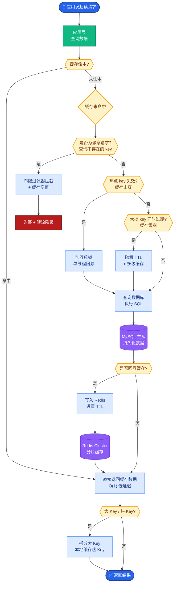
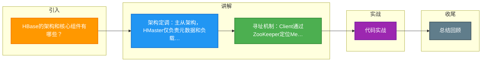

# HBase的架构和核心组件有哪些？

HBase 采用 Master-Slave 架构，核心组件包括 Client、Zookeeper、HMaster、HRegionServer 和 HDFS。

### 核心概念
1. **RowKey**：
   - 行的主键，字典序排序。
   - 查询只能通过 RowKey 进行（Get、Scan），设计极其关键（如利用 Hash 散列防止热点，利用 Salting 等技巧）。
2. **Column Family（列族）**：
   - 物理存储单元，同一个列族的数据存储在一起。
   - 建表时必须定义，建议尽量少（通常 <= 3），避免 IO 放大（因为 Flush 和 Compaction 是按列族进行的）。
3. **Region**：
   - 表的分片。随着数据增大，Table 会按 RowKey 范围横向切分为多个 Region。
   - Region 是分布式存储和负载均衡的最小单元。
4. **TimeStamp**：
   - 用于标识数据的版本。同一 RowKey 的数据按时间戳倒序排列，默认读取最新版本。

### 核心架构组件
1. **Client**：
   - 包含访问 HBase 的接口，并管理 Meta 表的缓存（Region 寻址），减少与 Zookeeper 的交互。
   - Client 与 RegionServer 进行 RPC 通信。
2. **Zookeeper**：
   - **协调中心**：保证 HMaster 高可用（选举）。
   - **元数据入口**：存储 `hbase:meta` 表的位置（以前叫 `.META.`）。
   - **集群监控**：监控 HRegionServer 状态，宕机时通知 HMaster。
3. **HMaster**：
   - **管理节点**（不处理用户读写请求，仅处理元数据操作）：
     - 分配 Region 给 HRegionServer。
     - 负责集群的负载均衡（Region 迁移）。
     - 处理 Schema 变更（建表、修改列族）。
4. **HRegionServer**：
   - **工作节点**：直接处理用户的读写请求。
     - 管理 Region 的 Split 和 Compact。
     - 负责 MemStore 的 Flush 和 WAL 的写入。
5. **HDFS**：
   - **底层存储**：为 HBase 提供高可靠的文件存储服务（HFile 存储在 HDFS）。
   - 提供 WAL（Write-Ahead Log）的持久化，保证数据不丢失。

### 实战案例

*   **Region 热点导致宕机**：某业务将“手机号”作为 RowKey 且未做散列，导致同一号段的流量全部打在同一个 RegionServer 上，引发单机内存溢出（OOM）且集群无法自动均衡。实战中通常使用 MD5(RowKey) 作为前缀来打散数据。
*   **Zookeeper 会话超时**：曾经遇到过由于 HRegionServer GC 时间过长（Full GC > ZK Session Timeout），导致 ZK 判定该节点宕机并触发 Region 迁移。实际上节点还在运行，造成“双主”写入数据冲突。解决方案是调大 `zookeeper.session.timeout` 并优化 GC。

### 关键代码示例（Java：带 Filter 的 Scan）

```java
// 实战场景：只扫描某个 RowKey 前缀范围的数据，并过滤掉值为旧版本的数据
Scan scan = new Scan();
scan.withStartRow(Bytes.toBytes("row_prefix_001"));
scan.withStopRow(Bytes.toBytes("row_prefix_002"));

// 使用过滤器避免网络传输无用数据
Filter filter = new ValueFilter(CompareOperator.NOT_EQUAL, new BinaryComparator(Bytes.toBytes("invalid")));
scan.setFilter(filter);

try (Table table = connection.getTable(TableName.valueOf("my_table"))) {
    ResultScanner scanner = table.getScanner(scan);
    for (Result result : scanner) {
        // 处理结果
    }
}
```

### 架构图与读写流程

```text
   ┌──────────────┐       ┌─────────────────────┐
   │    Client    │──────>│    Zookeeper (ZK)   │
   └──────┬───────┘       └──────▲──────────────┘
          │                      │ (Meta Location)
          │ 1. Get Meta Location  │
          │                      │
          │               ┌──────┴──────────────┐
          │               │     HMaster         │
          │               │  (Assign Regions,   │
          └──────────────>│   Load Balance)     │
                          └─────────────────────┘
                                   │
          3. Read/Write (RPC)      │
          ┌───────────────────────┘
          ▼
   ┌──────────────────────────────────────┐
   │         HRegionServer (Worker)       │
   │  ┌────────────────────────────────┐  │
   │  │  WAL (HLog)                    │  │
   │  └─────────────┬──────────────────┘  │
   │                │ Write               │
   │  ┌─────────────▼──────────────────┐  │
   │  │  MemStore (Write-Ahead Cache) │  │
   │  └─────────────┬──────────────────┘  │
   │                │ Flush               │
   │  ┌─────────────▼──────────────────┐  │
   │  │  HFile (StoreFile on HDFS)    │  │
   │  └────────────────────────────────┘  │
   └──────────────────────────────────────┘
```


## 核心流程图



## 记忆要点

- 架构定调：主从架构，HMaster仅负责元数据和负载均衡，HRegionServer处理实际读写
- 寻址机制：Client通过ZooKeeper定位Meta表，缓存Region位置后直连RegionServer读写
- 核心模型：RowKey字典序排序且易致热点，Column Family是物理存储单元建议少于3个
- 读写组件：数据先写WAL(防丢)再写MemStore，Flush成HFile最终持久化在HDFS

## 结构化回答

**30 秒电梯演讲：** Master管元数据和负载，RegionServer管数据读写，HDFS管存储。打个比方，HMaster是调度员，RegionServer是快递员，HDFS是仓库。

**展开框架：**
1. **架构定调** — 主从架构，HMaster仅负责元数据和负载均衡，HRegionServer处理实际读写
2. **寻址机制** — Client通过ZooKeeper定位Meta表，缓存Region位置后直连RegionServer读写
3. **核心模型** — RowKey字典序排序且易致热点，Column Family是物理存储单元建议少于3个

**收尾：** 我在项目里踩过坑——Region 热点导致宕机：某业务将“手机号”作为 RowKey 且未做散列，导致同一号段的流量全部打在同一个 RegionServer 上，引发单机内存溢出（OOM）且集群无法自动均衡。您想深入聊哪一段：原理、避坑还是对比选型？

## 视频脚本

> 预计时长：3 分钟 | 由浅入深

| 时间 | 画面/字幕 | 口播台词 | 讲解要点 |
|------|----------|----------|----------|
| 0:00 | 标题卡：HBase的架构和核心组件有哪些 | "HBase的架构和核心组件有哪些？一句话——HMaster是调度员，RegionServer是快递员，HDFS是仓库。" | 开场钩子 |
| 0:45 | 概念动画/示意图 | "Master管元数据和负载，RegionServer管数据读写，HDFS管存储——HMaster是调度员，RegionServer是快递员，HDFS是仓库" | 核心定义 |
| 1:30 | 架构定调示意 | "主从架构，HMaster仅负责元数据和负载均衡，HRegionServer处理实际读写" | 要点1 |
| 2:15 | 寻址机制示意 | "Client通过ZooKeeper定位Meta表，缓存Region位置后直连RegionServer读写" | 要点2 |
| 3:00 | 总结卡 | "记住这几条，面试不慌。下期讲进阶追问。" | 收尾 |

### 视频流程图



