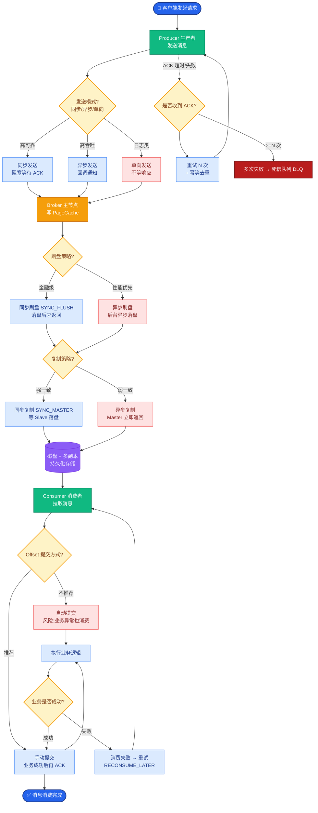

# Kafka中Partition的数据存储格式是怎样的？

Kafka 中 Partition 的数据以日志段的形式存储。每个 Partition 对应一个物理目录，目录下包含多个日志段文件。每个日志段包含两个核心文件：数据文件（.log）和索引文件（.index）。

1. **数据文件**：实际存储消息内容，消息按 offset 顺序追加写入。
2. **索引文件**：稀疏索引，存储 offset 到物理文件位置的映射，通过二分查找快速定位消息。

**数据存储架构图：**
```text
Partition 目录 (topic-partition-0)
├── 00000000000000000000.log  [数据文件：实际消息]
├── 00000000000000000000.index [索引文件：Offset -> Position]
├── 00000000000000000000.timeindex [时间索引：Timestamp -> Offset]
└── leader-epoch-checkpoint   [Leader纪元检查点]
```

**消息体内部结构：**
CRC 校验码、魔数、属性、Key 长度、Key、Value 长度、Value。

### 实战案例

*   **日志清理滞后导致磁盘爆满**：某业务因生产者激增，Kafka 磁盘写入速度远超 `.log` 文件的滚动速度（`log.segment.bytes` 设置过大，导致单个 Segment 达数百 GB）。当达到删除阈值时，Kafka 需删除大文件，导致 IO 飙升阻塞磁盘，造成消费者延迟飙升。实战中建议将 Segment 大小调整为 1GB-2GB 以便快速删除。
*   **索引文件损坏**：曾遇到过非正常关机导致 `.index` 文件尾部的索引项错位，Broker 启动时虽然能通过 `.log` 恢复数据，但读取该 Segment 末尾消息时极其缓慢，因为不得不进行全文件扫描。Kafka 提供了 `kafka-run-class.sh kafka.tools.DumpLogSegments` 工具来检测此类不一致。

### 关键代码示例（Java：查看 Offset 位置）

```java
// 模拟 Kafka 底层如何根据 Offset 查找物理位置（简化版逻辑）
public long findPosition(FileChannel indexChannel, long targetOffset) throws IOException {
    long idxSize = indexChannel.size();
    // 索引项固定 8 字节 (4 bytes relative offset + 4 bytes physical position)
    int slot = (int) (idxSize / 8); 
    
    // 二分查找索引文件
    // ... (binary search logic here)
    
    // 找到小于等于 targetOffset 的最大索引项对应的 physical position
    return physicalPosition; 
}
```

**补充关键细节：**
*   **稀疏索引原理**：为了保证索引文件占用空间小，Kafka 不会为每条消息都建立索引。默认情况下，索引文件每隔约 4KB 数据或写入一定数量消息时才增加一个索引条目。查找时，先通过二分查找找到小于等于目标 Offset 的最大索引项，然后再从对应的物理文件位置开始顺序扫描，直到找到目标消息。
*   **日志段切分**：为了防止单个日志文件过大，Kafka 引入了日志段滚动策略。当 .log 文件大小超过 `log.segment.bytes`（默认 1GB）或时间超过 `log.roll.hours`（默认 168小时）时，会创建一个新的日志段文件，文件名基于当前段起始 Offset 命名。
*   **清理策略**：旧日志段的数据清理依赖于 `log.cleanup.policy` 配置。若为 `delete`，则根据 `log.retention.hours` 或 `log.retention.bytes` 删除旧文件；若为 `compact`，则针对相同 Key 的消息进行压缩，只保留最新版本。

## 常见考点
1.  为什么索引设计成稀疏索引？
2.  如何快速定位到某个 Offset 的消息（查找流程）？
3.  日志段文件的大小限制及如何影响磁盘 I/O？


## 核心流程图



## 记忆要点

- 物理存储：Partition对应目录，由多个日志段组成，核心为.log数据与.index索引文件
- 稀疏索引：.index默认每隔4KB才存一条Offset到Position的映射，故占用空间小
- 查询机制：先二分查找.index定位物理位置，再顺序扫描对应.log文件找到目标消息
- 滚动与清理：.log达1GB或时间阈值会切分新段，旧数据按时间或大小delete/compact清理

## 结构化回答

**30 秒电梯演讲：** 以追加写的日志段文件存储消息，配合稀疏索引加速定位。打个比方，像记日记本一样按顺序写，每页都有页码索引，方便快速翻找。

**展开框架：**
1. **物理存储** — Partition对应目录，由多个日志段组成，核心为.log数据与.index索引文件
2. **稀疏索引** — .index默认每隔4KB才存一条Offset到Position的映射，故占用空间小
3. **查询机制** — 先二分查找.index定位物理位置，再顺序扫描对应.log文件找到目标消息

**收尾：** 我在项目里踩过坑——日志清理滞后导致磁盘爆满：某业务因生产者激增，Kafka 磁盘写入速度远超 `.log` 文件的滚动速度（`log.segment.bytes` 设置过大，导致单个 Segment 达数百 GB）。您想深入聊哪一段：原理、避坑还是对比选型？

## 视频脚本

> 预计时长：3 分钟 | 由浅入深

| 时间 | 画面/字幕 | 口播台词 | 讲解要点 |
|------|----------|----------|----------|
| 0:00 | 标题卡：Kafka中Partition的数据… | "Kafka中Partition的数据存储格式是怎样的？一句话——像记日记本一样按顺序写，每页都有页码索引，方便快速翻找。" | 开场钩子 |
| 0:45 | 概念动画/示意图 | "以追加写的日志段文件存储消息，配合稀疏索引加速定位——像记日记本一样按顺序写，每页都有页码索引，方便快速翻找" | 核心定义 |
| 1:30 | 物理存储示意 | "Partition对应目录，由多个日志段组成，核心为.log数据与.index索引文件" | 要点1 |
| 2:15 | 稀疏索引示意 | ".index默认每隔4KB才存一条Offset到Position的映射，故占用空间小" | 要点2 |
| 3:00 | 总结卡 | "记住这几条，面试不慌。下期讲进阶追问。" | 收尾 |
