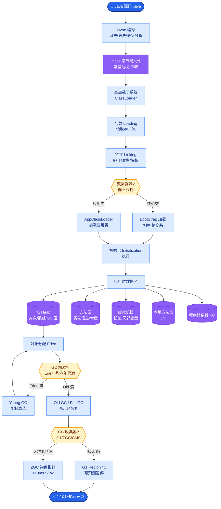

# Logback相比Log4j有哪些优点？

10. 日志

Slf4j
slf4j 的全称是Simple Loging Facade For Java，即它仅仅是一个为Java 程序提供日志输出的统一接
口，并不是一个具体的日志实现方案，就比如JDBC 一样，只是一种规则而已。所以单独的slf4j 是不
能工作的，必须搭配其他具体的日志实现方案，比如apache 的org.apache.log4j.Logger，jdk 自带
的java.util.logging.Logger 等。

Log4j
Log4j 是Apache 的一个开源项目，通过使用Log4j，我们可以控制日志信息输送的目的地是控制台、
文件、GUI 组件，甚至是套接口服务器、NT 的事件记录器、UNIX Syslog 守护进程等；我们也可以控
制每一条日志的输出格式；通过定义每一条日志信息的级别，我们能够更加细致地控制日志的生成过程。
Log4j 由三个重要的组成构成：日志记录器，输出端和日志格式化器。
1.Logger：控制要启用或禁用哪些日志记录语句，并对日志信息进行级别限制
2.Appenders : 指定了日志将打印到控制台还是文件中
3.Layout : 控制日志信息的显示格式
Log4j 中将要输出的Log 信息定义了5 种级别，依次为DEBUG、INFO、WARN、ERROR 和FATAL，
当输出时，只有级别高过配置中规定的 级别的信息才能真正的输出，这样就很方便的来配置不同情况
下要输出的内容，而不需要更改代码。

LogBack
简单地说，Logback 是一个 Java 领域的日志框架。它被认为是 Log4J 的继承人。
Logback 主要由三个模块组成：logback-core，logback-classic。logback-access
logback-core 是其它模块的基础设施，其它模块基于它构建，显然，logback-core 提供了一些关键的
通用机制。
logback-classic 的地位和作用等同于 Log4J，它也被认为是 Log4J 的一个改进版，并且它实现了简单
日志门面 SLF4J；
 logback-access 主要作为一个与 Servlet 容器交互的模块，比如说 tomcat 或者 jetty，提供一些与
HTTP 访问相关的功能。

10.1.3.1.  Logback 优点

同样的代码路径，Logback 执行更快

更充分的测试

原生实现了 SLF4J API（Log4J 还需要有一个中间转换层）

内容更丰富的文档

支持 XML 或者 Groovy 方式配置

配置文件自动热加载

### 实战案例

*   **Log4j 死锁坑**：在老的 Log4j 1.x 版本中，Appender 如果在异步处理中出现异常，可能会导致线程持有锁却无法释放，进而阻塞主业务线程。Logback 的 AsyncAppender 在设计上更加健壮，且丢失数据的策略（Blocking/Discard）配置更明确。
*   **热加载救场**：生产环境遇到接口响应慢但不确定原因时，通过 Logback 的热加载机制，直接修改配置文件将特定包的日志级别从 INFO 改为 DEBUG，无需重启服务即可抓取详细堆栈和参数，极大缩短了排查时间。Log4j 1.x 不支持此功能，通常需要重启服务。

### 关键代码示例（Java：Logback 条件化配置）

```java
// Logback 配置文件中的条件化处理（需引入 janino 依赖）
// 此功能 Log4j 1.x 不支持，Log4j 2 支持
<configuration>
    <if condition='property("ENV").equals("PROD")'>
        <then>
            <root level="INFO">
                <appender-ref ref="FILE" />
            </root>
        </then>
        <else>
            <root level="DEBUG">
                <appender-ref ref="CONSOLE" />
            </root>
        </else>
    </if>
</configuration>
```

### 对比表格：Log4j 1.x vs Logback

| 特性 | Log4j 1.x | Logback |
| :--- | :--- | :--- |
| **性能** | 较慢，尤其在多线程环境下 | 极快，基于前身 Log4j 优化，对象复用减少 GC |
| **API 实现** | 需适配层 | 原生实现 SLF4J，零开销 |
| **配置热加载** | 不支持 | 支持（自动扫描 classpath 变更） |
| **过滤器** | 层级过滤器，功能有限 | TurboFilter，可在日志创建前全局拦截 |
| **配置文件** | 仅 XML/Properties | XML + **Groovy** (脚本化能力更强) |
| **Appender 丰富度** | 基础 | 丰富（如 RollingFileAppender 支持按时间/大小压缩） |

**补充关键细节与架构对比：**

*   **性能优化细节**：
    *   **对象复用**：Logback 在某些高频场景下（如格式化日志时）会复用对象，减少垃圾回收（GC）压力。
    *   **Filter 链**：Logback 提供了更强大的过滤器体系（TurboFilter），可以在日志事件创建之初就决定是否丢弃，比 Log4j 的层级过滤更灵活。

*   **自动热加载原理**：
    Logback 的 `ClassicConfigurationScanner` 会以独立的线程定期检查配置文件的最后修改时间戳。一旦发现变更，它会重新解析配置并重新初始化 Logger 上下文，无需重启应用。这对生产环境问题排查至关重要。

*   **配置灵活性**：
    使用 Groovy 配置可以实现类似脚本化的逻辑，能够动态调整日志级别或根据环境变量切换输出目标，这在 XML 中很难实现。

*   **条件处理**：
    支持条件化配置，例如仅在开发环境输出 DEBUG 日志到控制台，生产环境仅输出 ERROR 到文件。

**架构关系图：**
```text
应用代码 (App)
   │
   ▼
SLF4J (Facade) <───┐
   │                │
   │                ├── slf4j-log4j12 (适配层)
   │                │       └──> Log4j (实现)
   │                │
   │                └── (Logback 无需适配层，直接实现)
   │
   ▼
Logback-Classic (实现)
   │
   ├─ Appender (输出目的地)
   │    ├─ ConsoleAppender
   │    ├─ FileAppender
   │    └─ RollingFileAppender (支持按时间/大小滚动)
```


## 核心流程图



## 记忆要点

- 血缘与性能：Logback是Log4j继承者，原生实现SLF4J且底层优化使得执行速度更快
- 配置热加载：Logback支持配置文件自动热加载，而Log4j 1.x不支持修改级别需重启
- 丰富组件：Logback提供TurboFilter全局拦截与按时间/大小自动压缩的Appender
- 配置更灵活：不仅支持XML，还支持Groovy配置以及基于Janino的条件化处理标签

## 结构化回答

**30 秒电梯演讲：** Logback是Log4j的改进版，性能更高且原生集成SLF4J。打个比方，像是Log4j的升级版跑车，引擎更快（性能），且自带原装配件（SLF4J）。

**展开框架：**
1. **血缘与性能** — Logback是Log4j继承者，原生实现SLF4J且底层优化使得执行速度更快
2. **配置热加载** — Logback支持配置文件自动热加载，而Log4j 1.x不支持修改级别需重启
3. **丰富组件** — Logback提供TurboFilter全局拦截与按时间/大小自动压缩的Appender

**收尾：** 我在项目里踩过坑——Log4j 死锁坑：在老的 Log4j 1.x 版本中，Appender 如果在异步处理中出现异常，可能会导致线程持有锁却无法释放，进而阻塞主业务线程。您想深入聊哪一段：原理、避坑还是对比选型？

## 视频脚本

> 预计时长：3 分钟 | 由浅入深

| 时间 | 画面/字幕 | 口播台词 | 讲解要点 |
|------|----------|----------|----------|
| 0:00 | 标题卡：Logback相比Log4j有哪些优… | "Logback相比Log4j有哪些优点？一句话——像是Log4j的升级版跑车，引擎更快（性能），且自带原装配件（SLF4J）。" | 开场钩子 |
| 0:45 | 概念动画/示意图 | "Logback是Log4j的改进版，性能更高且原生集成SLF4J——像是Log4j的升级版跑车，引擎更快（性能），且自带原装配件（SLF4J）" | 核心定义 |
| 1:30 | 血缘与性能示意 | "Logback是Log4j继承者，原生实现SLF4J且底层优化使得执行速度更快" | 要点1 |
| 2:15 | 配置热加载示意 | "Logback支持配置文件自动热加载，而Log4j 1.x不支持修改级别需重启" | 要点2 |
| 3:00 | 总结卡 | "记住这几条，面试不慌。下期讲进阶追问。" | 收尾 |
