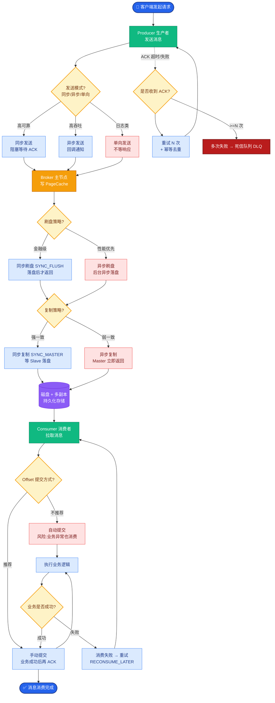

# Netty 实现高性能的关键技术有哪些？

Netty 是高性能 Java 网络框架，关键技术：

**1. IO 模型：**
- 基于主从 Reactor 模式：BossGroup 接收连接，WorkerGroup 处理 IO。
- 底层用 NIO（epoll/kqueue/select），单线程管理多连接（IO 多路复用）。
- 默认不阻塞，异步回调/事件驱动。

**2. 零拷贝（Zero-Copy）：**
- `FileRegion` 用 transferTo 直接内核态传输文件，避免用户态拷贝。
- `CompositeByteBuf` 合并多个 ByteBuf 而不拷贝数据（逻辑合并）。
- `Unpooled.wrappedBuffer` 共享底层数组。

**3. 内存管理：**
- **ByteBuf 池化：** PooledByteBufAllocator 复用 ByteBuf，减少 GC。
- **直接内存：** 用堆外内存（DirectByteBuf），减少 JNI 拷贝。
- 引用计数管理生命周期。

**4. 串行化无锁设计：**
- 每个 Channel 绑定一个 EventLoop（单线程），该 Channel 的所有 IO 都在同一线程处理，无需加锁。
- 避免多线程竞争和上下文切换。

**5. 高效并发：**
- 无锁串行化 + 任务队列。
- 用 FastThreadLocal 替代 ThreadLocal（优化哈希查找）。

**6. 其他：** 丰富的解码器/编码器、心跳保活、粘包拆包处理。

**主从 Reactor 线程模型架构图：**
```text
            [Client Group]
                 │  Connect
                 ▼
        ┌───────────────────┐
        │   BossGroup (N)   │  (负责注册 Accept 事件)
        │  (EventLoopGroup) │
        └─────────┬─────────┘
                  │ 初始化 Channel
                  ▼
        ┌───────────────────┐
        │  WorkerGroup (M)  │  (负责 Read/Write 事件)
        │  (EventLoopGroup) │
        └─────────┬─────────┘
                  │
       ┌──────────┴──────────┐
       ▼                     ▼
 [EventLoop 1]         [EventLoop 2]
  (Selector)            (Selector)
       │                     │
   ┌───┴───┐             ┌───┴───┐
   │Queue  │             │Queue  │
   │Tasks  │             │Tasks  │
   └───┬───┘             └───┬───┘
       │                     │
  [Channel A]           [Channel B]
  (Pipeline)            (Pipeline)
  (Handler)             (Handler)
```

**补充关键细节：**

*   **TCP 参数优化**：Netty 默认开启了 TCP 的相关参数，如 `TCP_NODELAY`（禁用 Nagle 算法，低延迟）、`SO_KEEPALIVE`（保活）、`SO_REUSEADDR`（端口重用）。
*   **ByteBuf 设计**：与 JDK ByteBuffer 相比，Netty 的 ByteBuf 采用了读写指针分离的设计，无需调用 `flip()` 方法切换读写模式，且支持动态扩容。
*   **引用计数原理**：类似于 C++ 的智能指针。ByteBuf 初始引用计数为 1，每次 `retain()` +1，`release()` -1。当计数为 0 时，底层内存被回收或放回池中。这对于避免内存泄露非常关键，尤其是使用了 `CompositeByteBuf` 切片操作时。
*   **EventLoop 任务队列机制**：如果非当前 Reactor 线程尝试直接写入 Channel，Netty 会将 Write 封装成任务投递到 EventLoop 的任务队列（MpscQueue），保证线程安全。

---

### 1. 实战案例：高并发文件传输的 OOM 问题排查
在某即时通讯项目中，需支持大文件传输（如 500MB 视频文件）。初期使用堆内内存 `HeapByteBuf`，在并发传输时频繁发生 Old GC 卡顿，甚至导致 Full GC。后改为使用 `FileRegion` 进行零拷贝传输（`transferTo`），并结合 `PooledDirectByteBuf` 替换堆内 Buffer，彻底解决了 GC 停顿问题，TP99 延迟从 200ms 降至 20ms。

### 2. 代码示例：零拷贝文件传输与 CompositeByteBuf
**Java：使用 FileRegion 发送文件**
```java
// 在 ChannelHandler 中
RandomAccessFile raf = new RandomAccessFile(file, "r");
FileRegion region = new DefaultFileRegion(raf.getChannel(), 0, file.length());

// 直接写出，数据由内核直接传输到网卡，无需拷贝到用户态
ChannelFuture sendFuture = ctx.writeAndFlush(region);
sendFuture.addListener(new ChannelFutureListener() {
    @Override
    public void operationComplete(ChannelFuture future) {
        raf.close(); // 记得关闭文件句柄
    }
});
```

**Java：使用 CompositeByteBuf 合并协议头与数据**
```java
// 合并 Header 和 Body 而不进行内存拷贝
CompositeByteBuf compositeBuf = Unpooled.wrappedBuffer(headerBuf, bodyBuf);
ctx.writeAndFlush(compositeBuf);
// 注意：引用计数会自动增加，release 时需注意计数管理
```

### 3. 对比表格：JDK NIO vs Netty
| 特性 | JDK NIO | Netty |
| :--- | :--- | :--- |
| **API 易用性** | 复杂，需手动管理 Selector、ByteBuffer flip() | 高，封装完善，链式调用，自动处理读写指针 |
| **线程模型** | 需自己实现 Reactor，容易写错多线程竞争 | 内置主从 Reactor 模型，Channel 线程绑定无锁化 |
| **零拷贝** | 仅支持 FileChannel.transferTo | 丰富：CompositeByteBuf, FileRegion, WrappedBuffer |
| **内存管理** | 仅堆内存，GC 压力大 | 支持 Pool（池化）、Direct（堆外），自主内存管理 |
| **粘包/拆包** | 手动处理，逻辑繁琐 | 内置 LineBasedFrameDecoder, LengthFieldPre 等解码器 |


## 核心流程图



## 记忆要点

- 线程模型：采用主从Reactor模式，Boss接收连接，Worker负责IO读写且单线程无锁串行化
- 零拷贝技术：运用FileRegion实现内核态文件传输，CompositeByteBuf实现逻辑合并避免内存拷贝
- 内存管理：采用池化+直接内存的ByteBuf减少GC和JNI开销，依赖引用计数释放生命周期
- 底层优化：使用IO多路复用，采用读写指针分离免flip翻转，且FastThreadLocal提升并发效率

## 结构化回答

**30 秒电梯演讲：** 基于IO多路复用、零拷贝和内存池化技术实现高并发低延迟。打个比方，像快递总站，单号员（线程）快速分拣，直接传送不搬运（零拷贝），复用纸箱（池化）。

**展开框架：**
1. **线程模型** — 采用主从Reactor模式，Boss接收连接，Worker负责IO读写且单线程无锁串行化
2. **零拷贝技术** — 运用FileRegion实现内核态文件传输，CompositeByteBuf实现逻辑合并避免内存拷贝
3. **内存管理** — 采用池化+直接内存的ByteBuf减少GC和JNI开销，依赖引用计数释放生命周期

**收尾：** 我在项目里踩过坑——实战案例：高并发文件传输的 OOM 问题排查。您想深入聊哪一段：原理、避坑还是对比选型？

## 视频脚本

> 预计时长：3 分钟 | 由浅入深

| 时间 | 画面/字幕 | 口播台词 | 讲解要点 |
|------|----------|----------|----------|
| 0:00 | 标题卡：Netty 实现高性能的关键技术有哪… | "Netty 实现高性能的关键技术有哪些？一句话——像快递总站，单号员（线程）快速分拣，直接传送不搬运（零拷贝），复用纸箱（池化）。" | 开场钩子 |
| 0:45 | 概念动画/示意图 | "基于IO多路复用、零拷贝和内存池化技术实现高并发低延迟——像快递总站，单号员（线程）快速分拣，直接传送不搬运（零拷贝），复用纸箱（池化）" | 核心定义 |
| 1:30 | 线程模型示意 | "采用主从Reactor模式，Boss接收连接，Worker负责IO读写且单线程无锁串行化" | 要点1 |
| 2:15 | 零拷贝技术示意 | "运用FileRegion实现内核态文件传输，CompositeByteBuf实现逻辑合并避免内存拷贝" | 要点2 |
| 3:00 | 总结卡 | "记住这几条，面试不慌。下期讲进阶追问。" | 收尾 |
