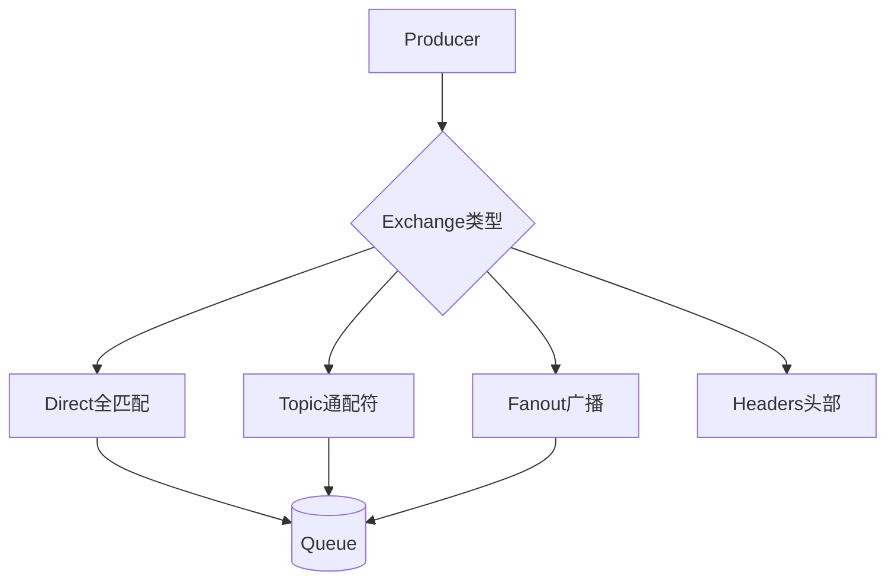

# RabbitMQ的整体架构和核心组件有哪些？

RabbitMQ 是一个由 Erlang 语言开发的 AMQP 的开源实现。AMQP ：Advanced Message Queue，高级消息队列协议。它是应用层协议的一个开放标准，为面向消息的中间件设计。RabbitMQ 最初起源于金融系统，用于在分布式系统中存储转发消息，在易用性、扩展性、高可用性等方面表现不俗。

**核心组件详解：**

*   **Message**：消息，由消息头和消息体组成。消息头包含 routing-key、priority 等属性。
*   **Publisher**：消息的生产者，向交换器发布消息的客户端应用程序。
*   **Exchange（交换机）**：接收生产者发送的消息并将这些消息路由给服务器中的队列。类型包括：
    *   **Direct**：完全匹配 Routing Key。
    *   **Topic**：通配符匹配 Routing Key（`*` 匹配一个词，`#` 匹配零个或多个词）。
    *   **Fanout**：广播模式，忽略 Routing Key，将消息分发到所有绑定的队列。
    *   **Headers**：不常用，根据消息头中的属性匹配。
*   **Queue（队列）**：消息容器，存储消息直到被消费者消费。具有持久化、排他性等属性。
*   **Binding Key（绑定键）**：Exchange 与 Queue 之间的关联规则，告诉 Exchange 如何将特定路由键的消息分发到队列。
*   **Virtual Host（虚拟主机）**：用于逻辑隔离，不同的 VHost 之间交换机和队列是不可见的，类似于数据库的 Schema。
*   **Broker**：RabbitMQ 服务节点实例。
*   **Connection**：TCP 连接。
*   **Channel**：信道，建立在 TCP 连接之上的虚拟连接，减少 TCP 建立开销，复用连接。

**Exchange 类型对比：**

| 类型 | 路由规则 | 适用场景 | 复杂度 |
| :--- | :--- | :--- | :--- |
| Direct | 完全匹配 Routing Key | 点对点任务分配、特定日志分级 | 低 |
| Fanout | 广播到所有绑定队列 | 广播通知、群聊消息同步 | 低 |
| Topic | 模式匹配 (*, #) | 多级分类消息、多租户数据分发 | 高 |
| Headers | 键值对匹配 | 复杂路由规则的高级场景 | 极高 |

**实战案例：**
在电商大促场景中，曾遇到订单服务因队列堆积导致内存溢出（OOM），**根本原因**是未配置 `TTL`（过期时间）和死信队列（DLQ），大量异常订单积压在内存队列中无法释放。修复后，通过配置 `x-message-ttl` 并将过期消息转发到死信队列进行人工干预，成功保护了主链路稳定性。

**代码示例：**
```java
// Java (Spring AMQP): 声明死信队列与TTL，防止消息无限堆积
@Bean
public Queue orderQueue() {
    Map<String, Object> args = new HashMap<>();
    args.put("x-message-ttl", 60000); // 消息60秒未消费自动过期
    args.put("x-dead-letter-exchange", "dlx.exchange"); // 指定死信交换机
    return QueueBuilder.durable("order.queue").withArguments(args).build();
}
```




## 记忆要点

- 核心链路：生产者将消息发给Exchange，依据路由规则Binding Key投递到对应队列Queue
- 四大交换机：Direct全匹配、Topic通配符匹配、Fanout广播忽略Key、Headers按头部匹配
- 信道复用：Channel是建立在TCP连接之上的虚拟连接，旨在减少频繁建连的网络开销
- 防积压方案：实战中常配置TTL过期时间与死信队列(DLQ)，避免异常消息堆积导致OOM

## 结构化回答

**30 秒电梯演讲：** 基于Exchange和Binding路由规则，将消息从Producer投递到Queue。打个比方，像邮局分拣系统，信件（消息）通过分拣机（交换机）按地址（路由键）投递到邮箱（队列）。

**展开框架：**
1. **核心链路** — 生产者将消息发给Exchange，依据路由规则Binding Key投递到对应队列Queue
2. **四大交换机** — Direct全匹配、Topic通配符匹配、Fanout广播忽略Key、Headers按头部匹配
3. **信道复用** — Channel是建立在TCP连接之上的虚拟连接，旨在减少频繁建连的网络开销

**收尾：** 我在项目里踩过坑——在电商大促场景中，曾遇到订单服务因队列堆积导致内存溢出（OOM），根本原因是未配置 `TTL`（过期时间）和死信队列（DLQ），大量异常订单积压在内存队列中无法释放。您想深入聊哪一段：原理、避坑还是对比选型？

## 视频脚本

> 预计时长：3 分钟 | 由浅入深

| 时间 | 画面/字幕 | 口播台词 | 讲解要点 |
|------|----------|----------|----------|
| 0:00 | 标题卡：RabbitMQ的整体架构和核心组件… | "RabbitMQ的整体架构和核心组件有哪些？一句话——像邮局分拣系统，信件（消息）通过分拣机（交换机）按地址（路由键）投递到邮箱（队列）。" | 开场钩子 |
| 0:45 | 概念动画/示意图 | "基于Exchange和Binding路由规则，将消息从Producer投递到Queue——像邮局分拣系统，信件（消息）通过分拣机（交换机）按地址（路由键）投递到邮箱（队列）" | 核心定义 |
| 1:30 | 核心链路示意 | "生产者将消息发给Exchange，依据路由规则Binding Key投递到对应队列Queue" | 要点1 |
| 2:15 | 四大交换机示意 | "Direct全匹配、Topic通配符匹配、Fanout广播忽略Key、Headers按头部匹配" | 要点2 |
| 3:00 | 总结卡 | "记住这几条，面试不慌。下期讲进阶追问。" | 收尾 |
