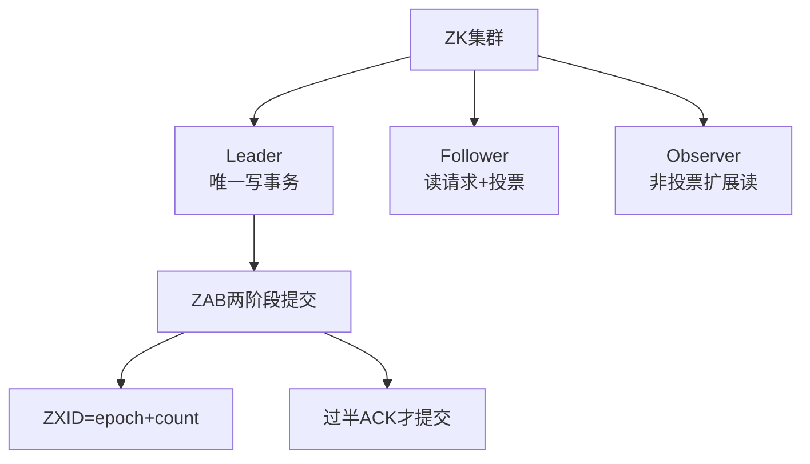

# ZooKeeper集群中有哪些角色？各自的作用？

ZooKeeper 集群是一个基于主从复制的高可用集群，旨在解决分布式协调问题。集群服务器主要承担以下三种角色：

### 1. Leader（领导者）
- **唯一性**：集群同一时间只有一个实际工作的 Leader。
- **职责**：负责写请求处理、状态协调、事务请求调度。

### 2. Follower（跟随者）
- **职责**：处理读请求、转发写请求给 Leader、参与写请求投票和 Leader 选举投票。

### 3. Observer（观察者）
- **职责**：处理读请求，转发写请求，但**不参与投票**。常用于跨数据中心扩展读能力。

**ZAB 协议核心原理：**
ZAB 协议通过 Zxid（事务ID）保证一致性。Zxid 高 32 位为 epoch（纪元），低 32 位为 count（计数器）。协议分为恢复模式（选举与同步）和广播模式（正常写请求处理）。在广播模式下，Leader 收到超过半数 ACK 时才提交事务。

**角色对比表格：**

| 特性 | Leader | Follower | Observer |
| :--- | :--- | :--- | :--- |
| **写请求** | 处理并广播 | 转发给 Leader | 转发给 Leader |
| **读请求** | 处理 | 处理 | 处理 |
| **投票权** | 提案发起者 | **有** (选举+写确认) | **无** |
| **作用** | 核心协调 | 参与一致性保障 | 扩展读性能，不影响集群选主速度 |

**实战案例：**
在日志服务监控中，发现某 Follower 节点的 `peerState` 频繁在 `FOLLOWING` 和 `LOOKING` 之间切换，导致客户端请求超时。**排查发现**是该节点磁盘 I/O 繁忙，导致事务日志同步滞后，被集群判定为“失联”从而触发重新选举。优化方案是将日志写入和 ZK 数据目录分离到不同物理磁盘。

**代码示例：**
```java
// Java (Apache Curator): 使用临时节点实现 Leader 选举
LeaderSelectorListener listener = new LeaderSelectorListener() {
    @Override
    public void takeLeadership(CuratorFramework client) throws Exception {
        // 获得领导权，执行主任务
        System.out.println("Elected as Leader");
        Thread.sleep(Long.MAX_VALUE); // 保持连接
    }
};
LeaderSelector selector = new LeaderSelector(client, "/master-election", listener);
selector.autoRequeue(); 
selector.start();
```

## 技术原理

ZooKeeper 的角色设计本质是**把"写一致性"和"读扩展性"解耦**——写必须集中到 Leader 保证顺序一致，读可以分散到任意节点提升吞吐。Observer 的引入是为了在不影响写性能的前提下横向扩展读能力。

- **Leader 唯一性的根因——ZAB 协议的顺序一致性要求**：ZAB（ZooKeeper Atomic Broadcast）本质是 Paxos 的简化版，要求所有写操作按全局顺序应用。如果有多个 Leader 同时接受写请求，事务顺序无法保证。所以 Leader 是"写入口的唯一瓶颈"，这也是 ZK 不适合高频写的原因（典型上限几万 TPS）。
- **Follower 的双重职责**：（1）处理读请求——直接读本地内存数据（ZK 数据全在内存），延迟低且分担 Leader 压力；（2）参与写投票——Leader 发起提案后，过半 Follower ACK 才提交（Quorum 机制）。Follower 数量决定集群可用性（N 个节点容忍 N/2-1 个故障），但也决定写延迟（每次写要等过半 ACK）。
- **Observer 的设计巧妙之处**：跨机房部署时，如果加 Follower，每次写都要等远程机房的 ACK，延迟高（跨地域几十毫秒）。Observer 不投票，只异步接收 Leader 的提案广播并更新本地数据，跨机房延迟不影响写性能。客户端读 Observer 拿到的是"稍微旧一点"的数据（最终一致），但读吞吐可以无限扩展。
- **ZXID 的双重含义——epoch + counter**：ZXID 是 64 位 long，高 32 位是 epoch（选举周期，每次选主 +1），低 32 位是事务计数器。这个设计保证：（1）新 Leader 选出后 epoch 自增，旧 Leader 的提案自动失效（避免脑裂）；（2）同一 epoch 内事务严格递增，Follower 据此判断是否遗漏事务。ZXID 是 ZAB 一致性的核心标识。
- **过半 ACK（Quorum）的数学基础**：N 个节点的 Quorum 是 N/2+1。这是 Paxos/Raft 的共识——任意两个多数派必有交集，保证已提交的事务不会被覆盖。3 节点容忍 1 个故障，5 节点容忍 2 个故障，**奇数节点更高效**（偶数节点不增加容错能力但增加 Quorum 大小）。

## 代码示例

```java
// 1. Leader 选举：基于临时节点（Curator 框架）
import org.apache.curator.framework.CuratorFramework;
import org.apache.curator.framework.recipes.leader.LeaderSelector;
import org.apache.curator.framework.recipes.leader.LeaderSelectorListener;

public class LeaderElectionExample {
    public void startElection(CuratorFramework client) {
        LeaderSelectorListener listener = new LeaderSelectorListener() {
            @Override
            public void takeLeadership(CuratorFramework client) throws Exception {
                // 获得领导权，执行主任务（如定时调度）
                System.out.println("I am Leader, doing master work");
                try {
                    Thread.sleep(Long.MAX_VALUE);   // 持有领导权直到会话断开
                } finally {
                    // takeLeadership 返回即放弃领导权
                    System.out.println("Releasing leadership");
                }
            }

            @Override
            public void stateChanged(CuratorFramework client, ConnectionState newState) {
                if (newState == ConnectionState.LOST) {
                    // 会话丢失，必须放弃领导权
                }
            }
        };

        LeaderSelector selector = new LeaderSelector(client, "/master-election", listener);
        selector.autoRequeue();   // 失去领导权后自动重新排队参与下一轮选举
        selector.start();
    }
}
```

```java
// 2. Observer 配置：在 zoo.cfg 启用 Observer 角色
/*
# zoo.cfg
server.1=node1:2888:3888        # Follower（participant）
server.2=node2:2888:3888
server.3=node3:2888:3888
server.4=node4:2888:3888:observer   # Observer（非投票成员，跨机房读扩展）
peerType=observer                    # 本节点角色声明
*/

// 连接 Observer 节点的客户端（读请求自动路由到 Observer）
CuratorFramework client = CuratorFrameworkFactory.builder()
    .connectString("node4:2181")   // 直接连 Observer
    .build();
client.start();
// 读：直接从 Observer 本地数据返回（最终一致）
byte[] data = client.getData().forPath("/config/db_url");
```

```java
// 3. 写请求流程：客户端连任意节点，写转发给 Leader
public void writeExample(CuratorFramework client) throws Exception {
    // 客户端可以连 Follower，但写请求会被转发给 Leader
    // Leader 发起提案 → 过半 Follower ACK → 提交 → 返回客户端
    client.create()
          .creatingParentsIfNeeded()
          .forPath("/services/payment/instance-1", "10.0.0.1:8080".getBytes());
    // 这个写操作要等过半 ACK，所以 ZK 写延迟取决于最慢的 Follower
}
```

```bash
# 4. 运维命令：查看节点角色和状态
echo "stat" | nc node1 2181
# Zookeeper version: 3.7.0
# Mode: follower          # 节点角色（leader/follower/observer）

echo "mntr" | nc node1 2181 | grep -E "zk_server_state|zk_packets"
# zk_server_state follower
# zk_packets_received 1234567
# zk_packets_sent 1234500

# 查看 ZXID 和 epoch（确认事务进度）
echo "conf" | nc node1 2181 | grep -E "initLimit|syncLimit"
```

## 对比选型

| 特性 | Leader | Follower | Observer |
| :--- | :--- | :--- | :--- |
| **读请求** | 处理 | 处理 | 处理 |
| **写请求** | 唯一处理者 | 转发给 Leader | 转发给 Leader |
| **投票权（选举）** | 是（提案发起者） | 是 | 否 |
| **投票权（事务）** | 发起提案 | ACK 确认 | 不参与 |
| **影响 Quorum** | 是 | 是 | 否（不影响写延迟） |
| **跨机房部署** | 主机房 | 主机房 | 任意机房（最终一致） |
| **故障容忍** | 宕机触发选举 | 影响可用性 | 不影响可用性 |
| **典型数量** | 1 | 2-4（奇数） | 任意（按读需求） |

## 常见坑

- **Observer 的数据延迟**：Observer 异步接收提案，数据比 Leader 滞后几十毫秒。强一致读必须连 Leader 或用 `sync()` 操作，Observer 只适合最终一致读。
- **Follower 磁盘 IO 瓶颈导致频繁选主**：Follower 事务日志同步滞后会被判定失联，触发选举。事务日志（`dataDir`）和快照（`dataLogDir`）要分到不同磁盘，避免相互影响。
- **脑裂（Split-Brain）的防御**：网络分区时两个子网都觉得自己有 Leader。ZAB 的过半 Quorum 保证少数派分区无法选出新 Leader（不满足 Quorum），避免双写。但部署时不要让 Quorum 节点都在同一机房。
- **写性能受限于 Leader 单点**：所有写都过 Leader，Leader 网络或 CPU 成为瓶颈。ZK 不适合高频写（>10万 TPS），那种场景用 etcd（Raft + 更优实现）或专门 KV 存储。
- **会话超时配置不当**：`sessionTimeout` 太短（如 2s）网络抖动就触发临时节点删除和重选；太长（如 60s）真宕机后客户端要等很久。典型 10-30s。
- **不要用 ZK 做大数据存储**：ZK 设计目标是协调服务（配置、选举、锁），单 znode 默认 1MB 上限。存大量业务数据会撑爆内存（全内存存储），用专门的数据库。
- **Observer 的网络带宽消耗**：Observer 要接收 Leader 的所有提案广播，大量写场景下 Observer 的入带宽可能成为瓶颈，部署时预留足够带宽。




## 核心知识点图


## 记忆要点

- Leader角色：集群唯一的写事务处理者，负责发起提案并协调集群状态更新
- Follower角色：处理客户端读请求，转发写请求给Leader，并参与Leader选举和事务提案投票
- Observer角色：非投票成员仅处理读请求，用于跨机房无差别扩展读性能且不影响选主效率
- ZAB与一致性：通过ZXID(高32位epoch+低32位count)保证事务顺序，过半ACK才提交

## 结构化回答

**30 秒电梯演讲：** Leader处理写请求，Follower投票同步，Observer扩展读能力。打个比方，像公司架构，老板做决策，员工投票确认，实习生只干活不投票以扩充人力。

**展开框架：**
1. **Leader角色** — 集群唯一的写事务处理者，负责发起提案并协调集群状态更新
2. **Follower角色** — 处理客户端读请求，转发写请求给Leader，并参与Leader选举和事务提案投票
3. **Observer角色** — 非投票成员仅处理读请求，用于跨机房无差别扩展读性能且不影响选主效率

**收尾：** 我在项目里踩过坑——在日志服务监控中，发现某 Follower 节点的 `peerState` 频繁在 `FOLLOWING` 和 `LOOKING` 之间切换，导致客户端请求超时。您想深入聊哪一段：原理、避坑还是对比选型？

## 视频脚本

> 预计时长：3 分钟 | 由浅入深

| 时间 | 画面/字幕 | 口播台词 | 讲解要点 |
|------|----------|----------|----------|
| 0:00 | 标题卡：ZooKeeper集群中有哪些角色？… | "ZooKeeper集群中有哪些角色？各自的作用？一句话——像公司架构，老板做决策，员工投票确认，实习生只干活不投票以扩充人力。" | 开场钩子 |
| 0:45 | 概念动画/示意图 | "Leader处理写请求，Follower投票同步，Observer扩展读能力——像公司架构，老板做决策，员工投票确认，实习生只干活不投票以扩充人力" | 核心定义 |
| 1:30 | Leader角色示意 | "集群唯一的写事务处理者，负责发起提案并协调集群状态更新" | 要点1 |
| 2:15 | Follower角色示意 | "处理客户端读请求，转发写请求给Leader，并参与Leader选举和事务提案投票" | 要点2 |
| 3:00 | 总结卡 | "记住这几条，面试不慌。下期讲进阶追问。" | 收尾 |
