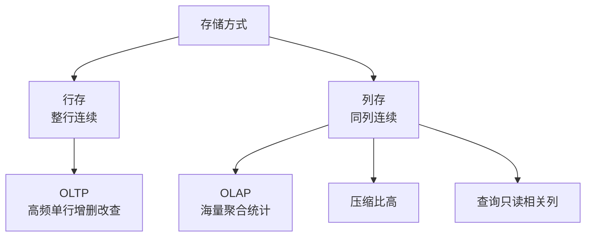
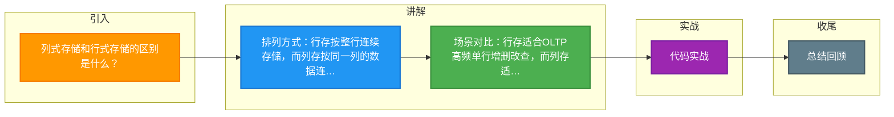

# 列式存储和行式存储的区别是什么？

列式存储和行式存储的主要区别在于数据在磁盘上的物理排列方式、压缩效率及适用场景（OLTP vs OLAP）。

### 1. 行式存储
- **存储方式**：一行记录的所有字段在磁盘上是连续存储的。
- **适用场景**：**OLTP（联机事务处理）**。适合高并发地增删改查单条记录。
- **缺点**：针对分析型查询，必须读取整行数据，大量无效 IO。

### 2. 列式存储
- **存储方式**：同一列的数据在磁盘上是连续存储的。
- **适用场景**：**OLAP（联机分析处理）**。适合海量数据的聚合分析、报表统计。
- **优点**：**高压缩比**（同列数据类型相同，重复度高，适合 RLE、Delta Encoding 压缩）。查询时只读需要的列。
- **缺点**：**写入开销大**（插入一行需操作多个文件），不适合高频单行事务。

**架构对比图：**
```text
行式存储布局：
Row1: [ID, Name, Age] -> Row2: [ID, Name, Age]
查询 Name(只读中间列)：需要读取 Row1 全部 + Row2 全部 (浪费)

列式存储布局：
ID: [1, 2] -> Name: [Alice, Bob] -> Age: [25, 30]
查询 Name：只读取 Name 块 (高效)
```

**行式存储 vs 列式存储：**

| 特性 | 行式存储 | 列式存储 |
| :--- | :--- | :--- |
| **适用场景** | OLTP (交易系统) | OLAP (数仓/报表) |
| **读取操作** | 适合整行读取 (`SELECT *`) | 适合单列/多列聚合 (`SUM(age)`) |
| **写入操作** | 追加效率高，一次写一行 | 随机写多，一次写多列文件，效率低 |
| **压缩效率** | 较低 (不同类型数据混存) | 极高 (同类数据易压缩) |
| **典型产品** | MySQL, PostgreSQL, Oracle | ClickHouse, HBase, Vertica |

**实战案例：**
在构建实时数仓时，将 1 亿条用户行为日志从 MySQL (行式) 同步到 ClickHouse (列式) 后，存储空间从 50GB 降至 8GB。执行一个“计算各平台平均停留时长”的 SQL，在 MySQL 需耗时 120 秒且导致 CPU 飙升，在 ClickHouse 仅需 0.5 秒，且只需读取 `duration` 这一列数据。

**代码示例：**
```sql
-- ClickHouse (列式) 建表示例：利用 MergeTree 引擎和 TTL 优化
CREATE TABLE user_events (
    user_id UInt32,
    event_time DateTime,
    duration UInt32,
    platform String
) ENGINE = MergeTree()
PARTITION BY toYYYYMM(event_time)
ORDER BY (user_id, event_time) -- 支持高效索引查找
TTL event_time + INTERVAL 3 MONTH; -- 3个月前数据自动删除
```




## 记忆要点

- 排列方式：行存按整行连续存储，而列存按同一列的数据连续存储
- 场景对比：行存适合OLTP高频单行增删改查，而列存适合OLAP海量数据聚合统计
- 压缩效率：因为列存同类数据聚集，所以压缩比极高，且查询只需读取相关列大幅减少IO
- 写入开销：因为列存按列打散，所以单行插入需修改多个文件，随机写入效率远低于行存

## 结构化回答

**30 秒电梯演讲：** 行存按行连续写入适合事务，列存按列聚合适合分析。打个比方，行存像填表，一行行记流水账；列存像分类账，把所有金额单独放一页算总账。

**展开框架：**
1. **排列方式** — 行存按整行连续存储，而列存按同一列的数据连续存储
2. **场景对比** — 行存适合OLTP高频单行增删改查，而列存适合OLAP海量数据聚合统计
3. **压缩效率** — 因为列存同类数据聚集，所以压缩比极高，且查询只需读取相关列大幅减少IO

**收尾：** 我在项目里踩过坑——在构建实时数仓时，将 1 亿条用户行为日志从 MySQL (行式) 同步到 ClickHouse (列式) 后，存储空间从 50GB 降至 8GB。您想深入聊哪一段：原理、避坑还是对比选型？

## 视频脚本

> 预计时长：3 分钟 | 由浅入深

| 时间 | 画面/字幕 | 口播台词 | 讲解要点 |
|------|----------|----------|----------|
| 0:00 | 标题卡：列式存储和行式存储的区别是什么 | "列式存储和行式存储的区别是什么？一句话——行存像填表，一行行记流水账；列存像分类账，把所有金额单独放一页算总账。" | 开场钩子 |
| 0:45 | 概念动画/示意图 | "行存按行连续写入适合事务，列存按列聚合适合分析——行存像填表，一行行记流水账；列存像分类账，把所有金额单独放一页算总账" | 核心定义 |
| 1:30 | 排列方式示意 | "行存按整行连续存储，而列存按同一列的数据连续存储" | 要点1 |
| 2:15 | 场景对比示意 | "行存适合OLTP高频单行增删改查，而列存适合OLAP海量数据聚合统计" | 要点2 |
| 3:00 | 总结卡 | "记住这几条，面试不慌。下期讲进阶追问。" | 收尾 |

### 视频流程图



