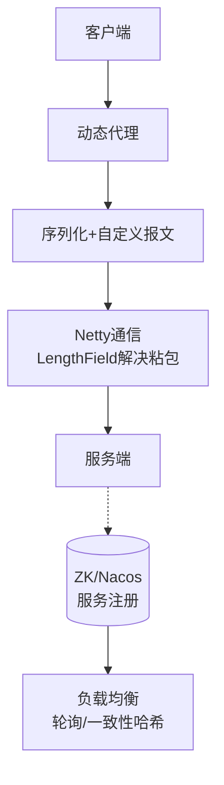

# 如何基于 Netty 实现一个 RPC 框架？

基于 Netty 实现 RPC 框架的核心在于解决网络通信、序列化、服务注册与动态代理问题。

### 1. 服务端实现
- **启动流程**：配置 `ServerBootstrap`，处理 I/O。
- **编解码器**：解决 TCP 粘包/拆包，常用 `LengthFieldPrepender` + `LengthFieldBasedFrameDecoder`。
- **业务处理**：利用 Java 反射机制 (`method.invoke()`) 调用本地服务。

### 2. 客户端实现
- **动态代理**：拦截接口方法调用，屏蔽网络细节。
- **并发模型**：维护 `ConcurrentHashMap<Long, RpcFuture>` 实现“异步发送、同步等待”的调用体验。

### 3. 序列化与协议设计
- **序列化选择**：Protobuf (跨语言) 或 Kryo (高性能 Java)。
- **报文结构**：`[Magic Number | Length | RequestId | Body]`。

### 4. 服务注册与发现
- **注册中心**：使用 ZooKeeper 或 Nacos。服务端注册 IP:Port，客户端订阅并监听变化。

### 5. 负载均衡策略
- 随机、轮询、一致性哈希等策略选择服务节点。

**实战案例：**
在生产环境 RPC 调用中，曾出现服务端重启导致客户端大量请求报“超时”的问题。**原因**是客户端未实现“连接预热”和“优雅断连”。服务端重启瞬间，客户端旧连接未及时关闭，发出了半包报文。优化后引入了 IdleStateHandler 心跳检测，并在捕获 IOException 时主动剔除无效节点，实现了秒级故障转移。

**代码示例：**
```java
// Java: Netty 服务端启动关键代码
ServerBootstrap b = new ServerBootstrap();
b.group(bossGroup, workerGroup)
 .channel(NioServerSocketChannel.class)
 .childHandler(new ChannelInitializer<SocketChannel>() {
     @Override
     protected void initChannel(SocketChannel ch) {
         ChannelPipeline p = ch.pipeline();
         // 解决粘包拆包：4字节长度字段
         p.addLast(new LengthFieldBasedFrameDecoder(65536, 0, 4, 0, 4));
         p.addLast(new LengthFieldPrepender(4));
         p.addLast(new KryoDecoder()); // 自定义解码
         p.addLast(new KryoEncoder()); // 自定义编码
         p.addLast(new RpcServerHandler()); // 业务处理
     }
 });
```



## 记忆要点

- 网络与代理：基于Netty通信，客户端利用动态代理屏蔽网络细节，实现像本地一样调用远程方法
- 通信协议：自定义报文结构(魔数+长度+ID)，配合LengthField解决TCP粘包拆包问题
- 异步转同步：利用Map维护RequestId与Future映射，实现请求线程的阻塞等待与响应回调
- 服务治理：集成ZK/Nacos实现服务注册发现，并结合轮询或一致性哈希做客户端负载均衡

## 结构化回答

**30 秒电梯演讲：** 利用Netty网络通信、动态代理和序列化实现远程透明调用。打个比方，像打电话，你拨号（动态代理），信号塔传输，对方接听，你感觉不到中间复杂的线路。

**展开框架：**
1. **网络与代理** — 基于Netty通信，客户端利用动态代理屏蔽网络细节，实现像本地一样调用远程方法
2. **通信协议** — 自定义报文结构(魔数+长度+ID)，配合LengthField解决TCP粘包拆包问题
3. **异步转同步** — 利用Map维护RequestId与Future映射，实现请求线程的阻塞等待与响应回调

**收尾：** 我在项目里踩过坑——在生产环境 RPC 调用中，曾出现服务端重启导致客户端大量请求报“超时”的问题。您想深入聊哪一段：原理、避坑还是对比选型？

## 视频脚本

> 预计时长：3 分钟 | 由浅入深

| 时间 | 画面/字幕 | 口播台词 | 讲解要点 |
|------|----------|----------|----------|
| 0:00 | 标题卡：如何基于 Netty 实现一个 RP… | "如何基于 Netty 实现一个 RPC 框架？一句话——像打电话，你拨号（动态代理），信号塔传输，对方接听，你感觉不到中间复杂的线路。" | 开场钩子 |
| 0:45 | 概念动画/示意图 | "利用Netty网络通信、动态代理和序列化实现远程透明调用——像打电话，你拨号（动态代理），信号塔传输，对方接听，你感觉不到中间复杂的线路" | 核心定义 |
| 1:30 | 网络与代理示意 | "基于Netty通信，客户端利用动态代理屏蔽网络细节，实现像本地一样调用远程方法" | 要点1 |
| 2:15 | 通信协议示意 | "自定义报文结构(魔数+长度+ID)，配合LengthField解决TCP粘包拆包问题" | 要点2 |
| 3:00 | 总结卡 | "记住这几条，面试不慌。下期讲进阶追问。" | 收尾 |
