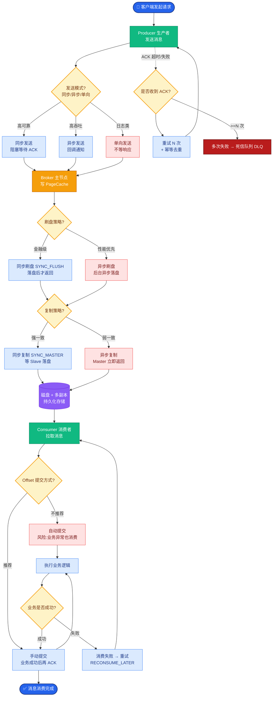

# Kafka如何保证消息不丢失？

Kafka 保证消息不丢失需要从 Producer（生产者）、Broker（服务端）和 Consumer（消费者）三个环节共同配合，缺一不可。

### 1. 生产者端
- **acks 参数（确认机制）**：
    - `acks=0`：生产者发送后不等待确认，可能丢数据，吞吐最高。
    - `acks=1`：Leader 写入成功即确认，如果 Leader 挂了且 Follower 未同步，则丢数据。
    - `acks=all` (或 -1)：Leader 等待所有 ISR (In-Sync Replicas) 副本都写入成功后才确认。这是保证不丢的核心。
- **retries（重试）**：设置 `retries > 0`，当网络异常时自动重试。
- **幂等性**：设置 `enable.idempotence=true`。开启后，Producer 会分配 PID（Producer ID）和序列号。即使重试，Broker 也会自动去重，防止消息重复。
- **带有回调通知**：不要使用 `producer.send(msg)`，而要使用 `producer.send(msg, callback)`，确保在收到异常回调时进行业务逻辑处理（如记录日志或重试）。

### 2. Broker 端
- **副本因子**：`replication.factor >= 3`。保证有多份副本存在。
- **最小同步副本数**：`min.insync.replicas > 1`（通常设为 2）。配合 `acks=all` 使用。如果 ISR 中存活副本数少于该值，拒绝写入，保证数据至少写在两台机器上。
- **禁止非脏选举**：`unclean.leader.election.enable=false`。禁止非 ISR 节点的副本成为 Leader。如果设为 true，可能会导致旧 Leader（未包含所有数据）当选，从而丢失数据。
- **日志刷盘**：虽然 Kafka 依赖多副本和 Page Cache，但为了防断电极端情况，可调整 `log.flush.interval.messages` 或 `log.flush.interval.ms`（通常不建议调整，会影响性能，因为副本机制已足够）。

### 3. 消费者端
- **关闭自动提交**：`enable.auto.commit=false`。
    - 默认自动提交是定期提交的，如果消息被拉取下来但还没处理完消费者挂了，Offset 已提交，导致消息丢失。
- **手动提交**：业务逻辑执行成功后，手动调用 `commitSync()` 或 `commitAsync()` 提交 Offset。
- **Offset 管理**：确保消费逻辑和提交逻辑是原子性的（如果处理过程很长，最好保证处理成功再提交）。

### 消息流向与丢失点分析

```text
Producer           Broker (Leader)            Broker (Follower)          Consumer
   │                    │                           │                      │
   ├── Send Msg ──────>│                           │                      │
   │                    │                           │                      │
   │       acks=all?    │                           │                      │
   │<──── Ack ──────────│ (Wait for ISR)            │                      │
   │                    │                           │                      │
   │                    │── Replicate ─────────────>│                      │
   │                    │<── Ack ───────────────────│                      │
   │                    │                           │                     
```

### 4. 实战案例
**踩坑经验**：某线上业务曾因 Broker 机房网络抖动，导致 Follower 被 ISR 剔除。此时 `min.insync.replicas=1` 且 `acks=all`，实际上退化为了 `acks=1`，随后 Leader 宕机导致数据丢失。**修复**：将 `min.insync.replicas` 调整为 2，确保至少两份同步才算成功，并开启 `producer.send` 的异常回调将失败消息落库兜底。

### 5. 代码示例
**Java Producer 配置关键代码**：
```java
Properties props = new Properties();
props.put("acks", "all");
props.put("retries", 3); 
props.put("enable.idempotence", true); // 开启幂等防重
props.put("max.in.flight.requests.per.connection", 5); // 允许5个并发请求
producer.send(new ProducerRecord<>(topic, key, value), (metadata, exception) -> {
    if (exception != null) {
        // 实战关键：必须处理异常，记录日志或发送到备用存储（如Redis/DB）
        log.error("Send failed", exception);
    }
});
```


## 核心流程图



## 记忆要点

- 防丢三步走：生产者端、Broker端、消费者端三管齐下缺一不可。
- 生产端因为要防丢，所以必须配置acks=all且开启retries与幂等性。
- 服务端因为要防宕机，所以副本数要≥3且min.insync.replicas必须>1。
- 消费端因为要防处理失败，所以关闭自动提交(auto.commit=false)改用手动提交。
- 核心避坑：禁用unclean.leader.election，防止未同步副本当选导致数据丢失。

## 结构化回答

**30 秒电梯演讲：** 通过多副本同步、生产者确认和消费者手动提交三重机制保障。打个比方，寄挂号信，寄出确认对方签收（生产者ACK），邮局多处备份（Broker副本），收件人签了名才算（消费者提交）。

**展开框架：**
1. **防丢三步走** — 生产者端、Broker端、消费者端三管齐下缺一不可。
2. **生产端因为要防丢** — 所以必须配置acks=all且开启retries与幂等性。
3. **服务端因为要防宕机** — 所以副本数要≥3且min.insync.replicas必须>1。

**收尾：** 我在项目里踩过坑——Properties props = new Properties();。您想深入聊哪一段：原理、避坑还是对比选型？

## 视频脚本

> 预计时长：3 分钟 | 由浅入深

| 时间 | 画面/字幕 | 口播台词 | 讲解要点 |
|------|----------|----------|----------|
| 0:00 | 标题卡：Kafka如何保证消息不丢失 | "Kafka如何保证消息不丢失？一句话——寄挂号信，寄出确认对方签收（生产者ACK），邮局多处备份（Broker副本），收件人签了名才算（消费者提交）。" | 开场钩子 |
| 0:45 | 概念动画/示意图 | "通过多副本同步、生产者确认和消费者手动提交三重机制保障——寄挂号信，寄出确认对方签收（生产者ACK），邮局多处备份（Broker副本），收件人签了名才算（消费者提交）" | 核心定义 |
| 1:30 | 防丢三步走示意 | "生产者端、Broker端、消费者端三管齐下缺一不可。" | 要点1 |
| 2:15 | 生产端因为要防丢示意 | "所以必须配置acks=all且开启retries与幂等性。" | 要点2 |
| 3:00 | 总结卡 | "记住这几条，面试不慌。下期讲进阶追问。" | 收尾 |
