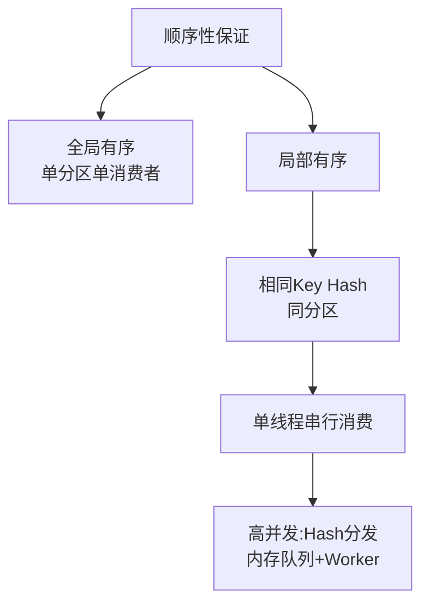

# Kafka如何保证消息的顺序性？

Kafka保证顺序性的粒度是Partition（分区），同一个Partition内的消息是有序的。

### 1. 全局有序方案
*   **单Partition**：Topic只设置1个Partition，所有消息有序。但失去了并行能力，吞吐量低。

### 2. 业务有序（推荐）
*   **原理**：将需要保证顺序的消息发到同一个Partition。Kafka利用 Hash 算法对 Key 进行计算（`murmurhash2`），相同 Key 的消息会被路由到相同的 Partition。
*   **实现**：例如同一订单的状态变更，使用 orderId 作为 key。

```java
// 发送时指定key，相同orderId的消息会进入同一分区
producer.send(new ProducerRecord<>("orders", orderId, message));
```

### 3. 关键难点与解决方案：消费端有序
即使消息在 Partition 有序，如果消费端处理失败或多线程处理，顺序也会乱。

**数据流与架构图**：
```text
Producer (Key=A)                    Broker (Partition 1)               Consumer Group
+----------+  Hash(A) -> Part 1  +----------------+  Fetch  +-------------------+
| Msg 1(A) | -----------------> | [Msg 1(A)]     | ------> | Consumer (Thread) |
| Msg 2(A) | -----------------> | [Msg 2(A)]     | ------> | (单线程/内存队列) |
| Msg 3(A) | -----------------> | [Msg 3(A)]     | ------> |                   |
+----------+                     +----------------+         +-------------------+
                                     (有序存储)                  (顺序处理)
```

*   **消费端保证**：
    1.  **单线程消费**：一个 Partition 只能被消费者组中的一个消费者消费（避免多消费者乱序）。
    2.  **单线程处理**：消费者内部对于该 Partition 的消息，必须在一个线程中串行处理（不能提交到多线程池）。如果为了提高吞吐量，可在消费端维护多个内存队列，根据 HashKey 将消息分发到不同队列，每个队列对应唯一Worker线程。

### 4. 失败重试的顺序影响
如果消息 2 处理失败，需要重试，会阻塞消息 3 的处理，直到消息 2 成功。在高并发场景下需要评估阻塞风险。

### 5. 实战案例
**场景**：在电商订单状态流转中，必须保证 `创建 -> 支付 -> 发货` 的顺序。**踩坑**：如果直接将消息丢到消费者端的无界线程池处理，支付请求可能被延迟，导致发货消息先于支付消息处理。**解决**：消费者端使用 Hash 取模将同一 OrderID 的消息分发到固定内存队列，由唯一 Worker 线程串行消费。

### 6. 代码示例
**消费者端内存队列保证顺序（伪代码）**：
```java
// 内存队列：key为业务ID，value为对应的阻塞队列
Map<String, BlockingQueue<Event>> queues = new ConcurrentHashMap<>();
// Worker 线程池：每个队列绑定一个线程
ExecutorService workers = Executors.newFixedThreadPool(10);

public void onMessage(Event msg) {
    queues.computeIfAbsent(msg.getOrderId(), k -> {
        BlockingQueue<Event> q = new LinkedBlockingQueue<>();
        workers.submit(() -> processSerially(q)); // 绑定线程处理
        return q;
    }).put(msg); // 保证同一ID的消息进入同一队列
}
```




## 核心知识点图


## 记忆要点

- 全局有序方案：单分区单消费者，但吞吐极低；业务推荐局部有序。
- 局部有序原理：因为相同Key经Hash路由必定进入同一分区，所以能保证业务级顺序。
- 消费端难点：因为多线程并发会打乱顺序，所以单分区只能被一个单线程串行消费。
- 高并发架构：消费端将同一业务ID的消息通过Hash分发到对应的内存队列，各自绑定唯一Worker线程。

## 结构化回答

**30 秒电梯演讲：** 分区内有序，全局有序需单分区或定向路由。打个比方，单车道排队有序，多车道并行无序，指定车道保序。

**展开框架：**
1. **全局有序方案** — 单分区单消费者，但吞吐极低；业务推荐局部有序。
2. **局部有序原理** — 因为相同Key经Hash路由必定进入同一分区，所以能保证业务级顺序。
3. **消费端难点** — 因为多线程并发会打乱顺序，所以单分区只能被一个单线程串行消费。

**收尾：** 我在项目里踩过坑——// 内存队列：key为业务ID，value为对应的阻塞队列。您想深入聊哪一段：原理、避坑还是对比选型？

## 视频脚本

> 预计时长：2 分钟 | 由浅入深

| 时间 | 画面/字幕 | 口播台词 | 讲解要点 |
|------|----------|----------|----------|
| 0:00 | 标题卡：Kafka如何保证消息的顺序性 | "Kafka如何保证消息的顺序性？一句话——单车道排队有序，多车道并行无序，指定车道保序。" | 开场钩子 |
| 0:40 | 概念动画/示意图 | "分区内有序，全局有序需单分区或定向路由——单车道排队有序，多车道并行无序，指定车道保序" | 核心定义 |
| 1:20 | 全局有序方案示意 | "单分区单消费者，但吞吐极低；业务推荐局部有序。" | 要点1 |
| 2:00 | 总结卡 | "记住这几条，面试不慌。下期讲进阶追问。" | 收尾 |
