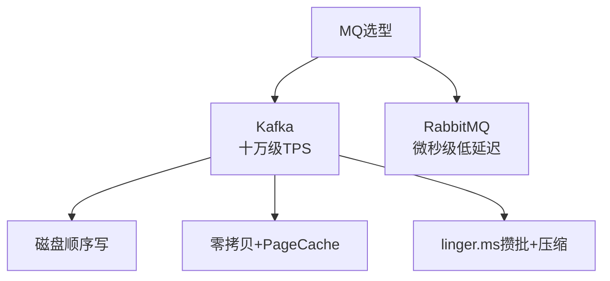
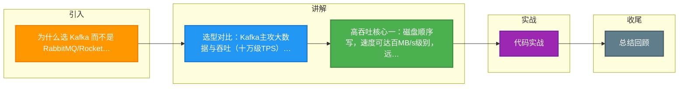

# 为什么选 Kafka 而不是 RabbitMQ/RocketMQ？Kafka 高吞吐的本质原因是什么？

### 一、选型对比

| 特性 | Kafka | RabbitMQ | RocketMQ |
| :--- | :--- | :--- | :--- |
| **定位** | 大数据、日志聚合、流处理 | 传统业务消息、异步解耦 | 电商、金融、高并发业务 |
| **TPS** | 单机十万级（极高） | 单机万级 | 单机十万级 |
| **时效性** | ms级（批处理有延迟） | us级（微秒） | ms级 |
| **消息可靠性** | 可能丢失（配置可落盘） | 高（不丢） | 高（支持同步刷盘） |
| **特性** | 顺序写、持久化 | 路由灵活、Exchange 丰富 | 事务消息、延时消息 |

### 二、Kafka 高吞吐的本质原因（核心）

#### 1. 顺序写磁盘
磁盘的顺序写速度可达 **600MB/s**，而随机写只有 **100KB/s**。Kafka 强制将消息追加到 Log 文件末尾，极大利用了磁盘带宽。

#### 2. 零拷贝
*   **传统 I/O**：磁盘 -> 内核 Buffer -> 用户 Buffer -> Socket Buffer -> 网卡（4 次拷贝，4 次上下文切换）。
*   **Kafka**：利用 Linux `sendfile` 系统调用。数据直接从 **PageCache -> 网卡**（2 次拷贝：DMA 到网卡，CPU 仅拷贝描述符），大幅减少 CPU 和内存开销。

#### 3. PageCache (页缓存)
Kafka 并不强制每条消息 `fsync` 到物理磁盘。
*   **写**：Producer 写入 OS 的 PageCache 后即返回成功，由 OS 后台线程异步刷盘。
*   **读**：如果消息刚写入不久，还在 PageCache 中，Consumer 直接从内存读，**磁盘 I/O 为 0**。这被称为“读磁盘即是读内存”。

#### 4. 批量发送与压缩
*   **Producer 端**：配置 `linger.ms` 和 `batch.size`，攒一批消息打包发送，减少网络请求 RTT 次数。
*   **压缩**：支持 GZIP、Snappy、LZ4、Zstd。多个消息压缩为一个包发送，Broker 端不解压直接存储，Consumer 解压。减少网络传输带宽和磁盘占用。

#### 5. 磁盘文件的高效利用
*   Kafka 使用稀疏索引，不保存每条消息的物理位置，而是按间隔存储偏移量，极大减小索引文件内存占用。

### 三、为什么不选 RabbitMQ？
RabbitMQ 基于 AMQP 协议，协议本身开销较大。为了保证消息可靠性，RabbitMQ 在收到消息后通常需要写入磁盘并确认，且其路由机制需要维护复杂的交换机和绑定关系，CPU 开销大，不适合海量日志场景。

### 四、常见考点
1.  **Kafka 会丢数据吗？什么情况下？**
    -   会。如果 Producer `acks=1`（只要 Leader 收到即成功）或 `acks=0`，Leader 挂了且 Follower 没同步，数据就会丢。
    -   解决：`acks=all`（ISR 列表同步完成），`min.insync.replicas > 1`，且 `unclean.leader.election.enable=false`。
2.  **既然 Kafka 性能这么高，为什么不把数据库也做成像 Kafka 一样？**
    -   适用场景不同。Kafka 是**追加写**日志，不支持修改和删除（逻辑删除），适合流式数据；数据库需要支持大量的随机读写、事务、复杂查询，无法完全套用 Kafka 的顺序写模型。
3.  **如何利用 PageCache 提升性能？**
    -   Kafka 读写都依赖 PageCache。建议给 Broker 留足够的内存作为文件系统缓存（不要把所有 JVM 堆内存设满，留一半给 OS），让 OS 管理缓存，效率比 Java 自己做缓存更高。

### 五、实战案例
**场景**：某日志采集系统从 Flume 迁移到 Kafka，Flume 使用 `fsync` 导致吞吐量受限于磁盘 IOPS（约 5000/s）。切换到 Kafka 后，利用 `linger.ms=5` 和 `batch.size=32KB` 进行攒批，配合 Zstd 压缩，单机吞吐量提升至 15w/s，且磁盘占用减少 60%。

### 六、代码示例
**Java Producer 高性能配置**：
```java
Properties props = new Properties();
// 实战关键：启用压缩和攒批，最大化吞吐
props.put("compression.type", "zstd"); // 启用 Zstd 压缩
props.put("linger.ms", "10");          // 等待10ms攒批
props.put("batch.size", "32768");      // 32KB批次大小
props.put("buffer.memory", "67108864");// 64MB缓冲区
props.put("acks", "all");
```




## 记忆要点

- 选型对比：Kafka主攻大数据与吞吐(十万级TPS)，RabbitMQ胜在路由灵活与低延迟(us级)。
- 高吞吐核心一：磁盘顺序写，速度可达百MB/s级别，远超随机写。
- 高吞吐核心二：零拷贝sendfile结合OS PageCache，数据直接从内存直达网卡。
- 高吞吐核心三：Producer端配置linger.ms与batch.size进行攒批与压缩。
- 口诀：顺写页缓零拷贝，攒批压缩快快快。

## 结构化回答

**30 秒电梯演讲：** 顺序写、零拷贝、页缓存、批量压缩造就高吞吐。打个比方，像流水线装卸货，只许往后加，批量搬，不反复搬运。

**展开框架：**
1. **选型对比** — Kafka主攻大数据与吞吐(十万级TPS)，RabbitMQ胜在路由灵活与低延迟(us级)。
2. **高吞吐核心一** — 磁盘顺序写，速度可达百MB/s级别，远超随机写。
3. **高吞吐核心二** — 零拷贝sendfile结合OS PageCache，数据直接从内存直达网卡。

**收尾：** 我在项目里踩过坑——Properties props = new Properties();。您想深入聊哪一段：原理、避坑还是对比选型？

## 视频脚本

> 预计时长：3 分钟 | 由浅入深

| 时间 | 画面/字幕 | 口播台词 | 讲解要点 |
|------|----------|----------|----------|
| 0:00 | 标题卡：为什么选 Kafka 而不是 Rab… | "为什么选 Kafka 而不是 RabbitMQ/RocketMQ？Kafka 高吞吐的本质原因是什么？一句话——像流水线装卸货，只许往后加，批量搬，不反复搬运。" | 开场钩子 |
| 0:45 | 概念动画/示意图 | "顺序写、零拷贝、页缓存、批量压缩造就高吞吐——像流水线装卸货，只许往后加，批量搬，不反复搬运" | 核心定义 |
| 1:30 | 选型对比示意 | "Kafka主攻大数据与吞吐(十万级TPS)，RabbitMQ胜在路由灵活与低延迟(us级)。" | 要点1 |
| 2:15 | 高吞吐核心一示意 | "磁盘顺序写，速度可达百MB/s级别，远超随机写。" | 要点2 |
| 3:00 | 总结卡 | "记住这几条，面试不慌。下期讲进阶追问。" | 收尾 |

### 视频流程图



