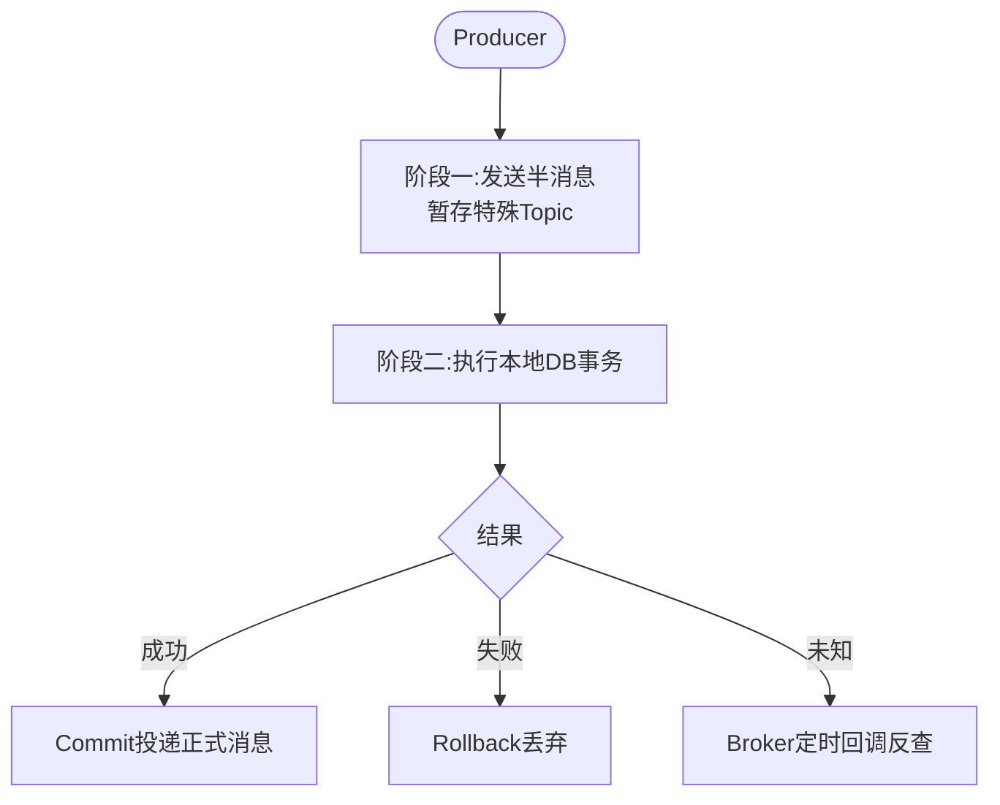

# RocketMQ 事务消息的原理是什么？它如何保证本地事务和消息发送的原子性？

### RocketMQ 事务消息原理
**核心矛盾**：本地事务（如扣款）与消息发送是两个独立的动作，无法通过普通事务保证原子性（无法同时回滚或提交）。

**解决方案**：采用**两阶段提交 + 本地事务表（思想）** 的变种。

### 流程架构图
```text
Producer                         Broker (Half Topic)                 Consumer
   |                                  |                                  |
   |--- 1. 发送半消息 ---------------->|                                  |
   |   (暂存，不可见)                  |                                  |
   |<-- 2. 发送成功 -------------------|                                  |
   |                                  |                                  |
   |--- 3. 执行本地事务 --------------->|                                  |
   |   (如：扣款)                      |                                  |
   |                                  |                                  |
   |--- 4. 提交/Rollback ------------->|                                  |
   |   (Commit: 转为正式消息)          |                                  |
   |   (Rollback: 删除半消息)          |                                  |
   |                                  |--> 5. 消息可见 ----------------->|
   |                                  |                                  |
   |--- [异常情况] 反查机制 ----------->|                                  |
   |<-- 6. 回调 checkLocalTransaction -| (定时任务扫描超时半消息)           |
   |--- 7. 再次提交状态 -------------->|                                  |
```

### 详细步骤解析

#### 第一阶段：发送半消息
1.  Producer 发送一条半消息到 Broker。
2.  Broker 收到后，写入 `RMQ_SYS_TRANS_HALF_TOPIC`（系统内部 Topic），对下游消费者**不可见**。
3.  **注意**：此时 Broker 并不存储真正的业务 Topic 数据，只是打个桩，证明 Producer 有意向发送事务。

#### 第二阶段：执行本地事务
Producer 收到半消息发送成功的响应后，在本地执行业务逻辑（如 SQL 更新）。

#### 第三阶段：提交/回滚
1.  **成功**：发送 Commit 请求给 Broker。Broker 将半消息从 `Half Topic` 移动到**真正的业务 Topic**，消费者可见。
2.  **失败**：发送 Rollback 请求给 Broker。Broker 丢弃半消息，消费者永远不会看到。
3.  **未知**：如果 Producer 挂了，没发 Commit/Rollback怎么办？进入回查机制。

#### 第四阶段：事务回查
1.  Broker 定时任务扫描 `Half Topic` 中超过一定时间（默认 1 分钟）未处理的消息。
2.  Broker 主动回调 Producer 的 `checkLocalTransaction` 接口。
3.  Producer 查询本地事务状态（如查 DB），返回 Commit、Rollback 或继续等待。

### 实战深化

#### 1. 实战案例（踩坑经验）
**场景**：某电商大促期间，由于服务 A 挂掉，Broker 回查服务 A 的 `checkLocalTransaction` 接口超时。由于未正确处理“未知”状态，Broker 默认采取“继续回查”策略，导致回查队列堆积，进而阻塞了该 Topic 的正常消息写入。
**教训**：`checkLocalTransaction` 接口必须保证高性能（如只查 DB 不调第三方），且必须明确返回 Commit/Rollback，避免无休止的 Unknown 导致死循环。

#### 2. 代码示例（Java 实现事务监听器）
```java
public class TransactionListenerImpl implements TransactionListener {
    // 本地事务执行
    @Override
    public LocalTransactionState executeLocalTransaction(Message msg, Object arg) {
        try {
            // 执行业务逻辑（如扣款DB操作）
            boolean success = businessService.doBusiness();
            return success ? LocalTransactionState.COMMIT_MESSAGE : LocalTransactionState.ROLLBACK_MESSAGE;
        } catch (Exception e) {
            return LocalTransactionState.ROLLBACK_MESSAGE;
        }
    }

    // Broker 回查逻辑
    @Override
    public LocalTransactionState checkLocalTransaction(MessageExt msg) {
        // 核心点：通过查询本地事务表判断状态，而不是重新执行业务逻辑
        int status = transactionLogService.queryStatus(msg.getTransactionId());
        if (status == 1) return LocalTransactionState.COMMIT_MESSAGE;
        if (status == 2) return LocalTransactionState.ROLLBACK_MESSAGE;
        return LocalTransactionState.UNKNOWN; // 继续回查
    }
}
```

#### 3. 对比表格：普通消息 vs 事务消息
| 特性 | 普通消息 | 事务消息 |
| :--- | :--- | :--- |
| **发送流程** | 发送 -> 等待 ACK -> 结束 | 发送半消息 -> 执行本地事务 -> 提交/回滚 -> (回查兜底) |
| **一致性保证** | 最终一致性（可能丢） | 强一致性（本地事务与消息同生共死） |
| **吞吐量** | 高 | 低（涉及两次网络交互和回查开销） |
| **适用场景** | 通知、日志、普通业务 | 跨系统数据一致性（如支付->积分、下单->库存） |




## 记忆要点

- 核心方案：基于两阶段提交思想，通过半消息机制解决本地事务与网络发送的原子性问题。
- 阶段一：发送半消息暂存至特殊Topic，此时对下游消费者不可见。
- 阶段二：执行本地DB事务，成功则Commit投递正式消息，失败则Rollback丢弃。
- 兜底机制：若状态未知，Broker定时任务会主动回调Producer接口反查本地事务结果。
- 实战避坑：事务回查接口必须高性能且严禁无休止返回Unknown，以免引发回查堆积阻塞。

## 结构化回答

**30 秒电梯演讲：** 半消息预投递+本地事务+回查机制实现最终一致。打个比方，先占座（半消息），办完事（本地事务）确认入座，若丢票服务员核查。

**展开框架：**
1. **核心方案** — 基于两阶段提交思想，通过半消息机制解决本地事务与网络发送的原子性问题。
2. **阶段一** — 发送半消息暂存至特殊Topic，此时对下游消费者不可见。
3. **阶段二** — 执行本地DB事务，成功则Commit投递正式消息，失败则Rollback丢弃。

**收尾：** 这三点都能配合实战聊。您想深入聊原理、对比还是避坑？

## 视频脚本

> 预计时长：3 分钟 | 由浅入深

| 时间 | 画面/字幕 | 口播台词 | 讲解要点 |
|------|----------|----------|----------|
| 0:00 | 标题卡：RocketMQ 事务消息的原理是什… | "RocketMQ 事务消息的原理是什么？它如何保证本地事务和消息发送的原子性？一句话——先占座（半消息），办完事（本地事务）确认入座，若丢票服务员核查。" | 开场钩子 |
| 0:45 | 概念动画/示意图 | "半消息预投递+本地事务+回查机制实现最终一致——先占座（半消息），办完事（本地事务）确认入座，若丢票服务员核查" | 核心定义 |
| 1:30 | 核心方案示意 | "基于两阶段提交思想，通过半消息机制解决本地事务与网络发送的原子性问题。" | 要点1 |
| 2:15 | 阶段一示意 | "发送半消息暂存至特殊Topic，此时对下游消费者不可见。" | 要点2 |
| 3:00 | 总结卡 | "记住这几条，面试不慌。下期讲进阶追问。" | 收尾 |
