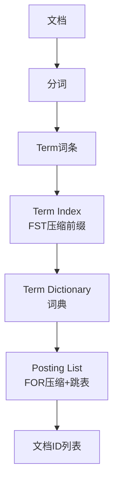

# 为什么选 Elasticsearch 做搜索而不是 MySQL 的 LIKE？ES 倒排索引的原理是什么？

【为什么不用 MySQL LIKE？】
- LIKE '%keyword%' 无法走索引，导致全表扫描，数据量达到百万级时查询响应时间急剧增加，甚至导致数据库 CPU 飙升。
- MySQL 全文索引（FULLTEXT）对中文支持较弱（通常需配合 ngram 分词器），且分词灵活性、自定义权重、同义词处理等能力远不如 ES。
- MySQL 不具备相关性打分机制（如 TF-IDF/BM25），难以根据内容相关性对结果进行精准排序。

【ES 为什么快？——倒排索引】
- **正向索引**（MySQL B+树）：ID → 文档内容。查询包含某个词的文档时，必须逐条扫描文档内容，效率极低。
- **倒排索引**（ES）：词项 → 文档 ID 列表。查询时直接定位到词项，获取包含该词的所有文档 ID，效率极高。

【倒排索引核心结构与原理】

```text
+-------------------+       +-----------------------------+       +-----------------------+
|  Term Index       | --->  |  Term Dictionary            | --->  |  Posting List         |
| (词典索引, 内存)   |       | (词典, 磁盘/内存)             |       | (倒排表, 磁盘)         |
+-------------------+       +-----------------------------+       +-----------------------+
| *har*             |       | ...
| *app*             |       | apple   -> [Doc1, Doc3, Doc5] 
| *ora*             |       | ...     
| (FST压缩前缀)     |       | orange  -> [Doc2, Doc4]
+-------------------+       +-----------------------------+       +-----------------------+
```

1. **Term Index（词典索引）**：
   - 采用 **FST（Finite State Transducer）** 结构，仅存储词项的前缀，极度压缩内存占用。
   - 作用：类似于 MySQL B+ 树的非叶子节点，用于快速在磁盘中定位 Term Dictionary 的 Block。
   - 查找复杂度：O(len(term))，极快。

2. **Term Dictionary（词典）**：
   - 存储所有分词后的去重词项，按字典序排序。
   - 通过 Term Index 定位后，加载到内存进行精确查找。

3. **Posting List（倒排表）**：
   - 存储包含该词项的文档 ID 集合。
   - **压缩**：使用 **Frame of Reference (FOR)** 或 **Roaring Bitmaps** 压缩存储，大幅减少磁盘 IO 和内存占用。
   - **交集运算**：利用 **Skip List（跳表）** 或 **Bitset** 位图运算，极速实现 AND/OR 逻辑（如查找 "Java AND 工程师"）。

【ES 搜索流程】
用户查询 → Analyzer（分词器）拆词 → Term Index 查找 → Term Dictionary 精确定位 → 读取多个 Posting List → 求交集/并集 → TF-IDF/BM25 算法打分 → 排序 → 返回 TopK 结果。

【ES vs MySQL 选型】
- **精确查询**（如 id=1、精确手机号）：MySQL B+ 树更快，且维护成本低。
- **全文检索**（如搜索商品描述）、**多维度筛选**（如 品牌+价格区间+标签）、**复杂聚合分析**（如按日期统计销量）：ES 完胜。
- **架构建议**：MySQL 做主数据存储（源头），通过 Canal/MQ 同步数据到 ES，ES 负责复杂查询。

### 实战深化

#### 1. 实战案例（踩坑经验）
**场景**：在用户搜索场景中，搜索“小米手机”时，期望匹配出品牌为“小米”的商品。但由于 IK 分词器配置问题，将“小米”拆分为“小”和“米”，导致搜索结果包含大量干扰数据（如“大米”、“小凳子”）。
**教训**：ES 的分词器配置至关重要，上线前必须通过 ` _analyze` API 验证分词效果，对特定品牌词需维护**自定义词库**（热更新），避免因分词精度问题导致搜索体验崩塌。

#### 2. 代码示例（Java RestHighLevelClient 查询）
```java
// 构建搜索请求，使用 BoolQuery 组合多条件
SearchRequest searchRequest = new SearchRequest("products");
SearchSourceBuilder sourceBuilder = new SearchSourceBuilder();

// 1. must: 全文检索 (match query)
sourceBuilder.query(QueryBuilders.matchQuery("productName", "小米手机"));

// 2. filter: 精确过滤 (term query) - 不参与算分，利用缓存加速
sourceBuilder.postFilter(QueryBuilders.termQuery("status", 1));

// 3. aggregation: 聚合统计 (按品牌分组)
TermsAggregationBuilder aggregation = AggregationBuilders.terms("by_brand").field("brandId");
sourceBuilder.aggregation(aggregation);

searchRequest.source(sourceBuilder);
SearchResponse response = client.search(searchRequest, RequestOptions.DEFAULT);
```

#### 3. 对比表格：MySQL B+树 vs ES 倒排索引
| 维度 | MySQL (InnoDB B+树) | Elasticsearch (倒排索引) |
| :--- | :--- | :--- |
| **数据结构** | B+树（叶子节点存储数据行） | FST + Posting List (Skip List/Roaring Bitmaps) |
| **查找逻辑** | ID 找数据（O(log N)） | 关键词找 ID 集合（O(1) + 位图交集） |
| **擅长场景** | 精确匹配（=, >, <）、事务操作 | 全文搜索、模糊匹配、复杂聚合、多维筛选 |
| **写性能** | 优秀（支持行锁/事务） | 较低（需更新倒排表、Segment 合并开销大） |
| **排序** | 依赖索引顺序，固定方式 | 依赖算分（TF-IDF/BM25），支持相关性排序 |




## 核心知识点图


## 记忆要点

- 对比MySQL：因为LIKE%无法走索引会触发全表扫描，且不支持分词和打分，所以用ES。
- 倒排索引本质：正向是ID找内容，倒排则是分词后的词条(Term)反向映射到文档ID列表。
- 三层结构：Term Index(FST压缩前缀找词快) -> Term Dictionary(词典) -> Posting List(倒排表)。
- 因为Posting List采用FOR压缩和跳表技术，所以多条件求交集运算极速且省内存。
- 口诀：词典索引定位置，倒排跳表求交集，BM25算打分。

## 结构化回答

**30 秒电梯演讲：** 通过倒排索引实现从词到文档的快速映射。打个比方，书末关键词索引页，直接标出页码，不用翻全书。

**展开框架：**
1. **对比MySQL** — 因为LIKE%无法走索引会触发全表扫描，且不支持分词和打分，所以用ES。
2. **倒排索引本质** — 正向是ID找内容，倒排则是分词后的词条(Term)反向映射到文档ID列表。
3. **三层结构** — Term Index(FST压缩前缀找词快) -> Term Dictionary(词典) -> Posting List(倒排表)。

**收尾：** 这三点都能配合实战聊。您想深入聊原理、对比还是避坑？

## 视频脚本

> 预计时长：3 分钟 | 由浅入深

| 时间 | 画面/字幕 | 口播台词 | 讲解要点 |
|------|----------|----------|----------|
| 0:00 | 标题卡：为什么选 Elasticsearch… | "为什么选 Elasticsearch 做搜索而不是 MySQL 的 LIKE？ES 倒排索引的原理是什么？一句话——书末关键词索引页，直接标出页码，不用翻全书。" | 开场钩子 |
| 0:45 | 概念动画/示意图 | "通过倒排索引实现从词到文档的快速映射——书末关键词索引页，直接标出页码，不用翻全书" | 核心定义 |
| 1:30 | 对比M示意 | "因为LIKE%无法走索引会触发全表扫描，且不支持分词和打分，所以用ES。" | 要点1 |
| 2:15 | 倒排索引本质示意 | "正向是ID找内容，倒排则是分词后的词条(Term)反向映射到文档ID列表。" | 要点2 |
| 3:00 | 总结卡 | "记住这几条，面试不慌。下期讲进阶追问。" | 收尾 |
