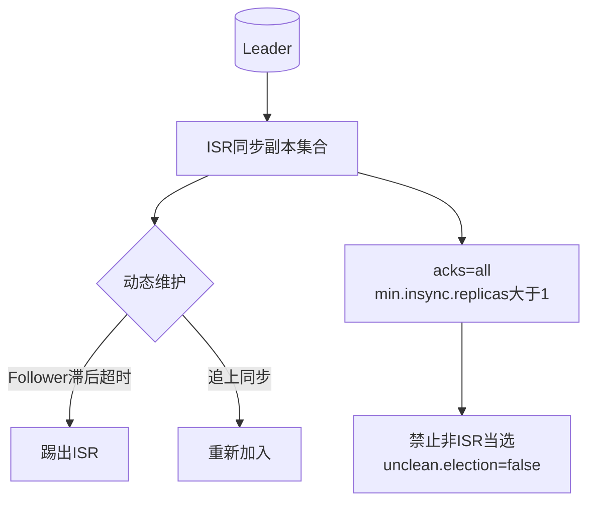
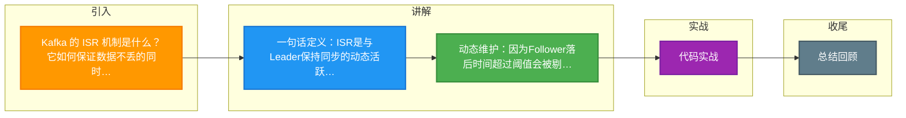

# Kafka 的 ISR 机制是什么？它如何保证数据不丢的同时兼顾性能？

【ISR（In-Sync Replicas）机制】
- ISR 是与 Leader 保持同步的副本集合。Kafka 每个 Partition 有 1 个 Leader 和若干 Follower。
- ISR 是动态维护的列表，存放在 ZooKeeper（或 KRaft 元数据日志）中，由 Leader 负责更新。

【ISR 动态维护机制】
- Follower 持续从 Leader 拉取数据（Fetch 请求）。
- **剔除条件**：如果 Follower 在 `replica.lag.time.max.ms`（默认 30s，旧版基于消息数量）时间内未完全跟上 Leader 的 LEO（Log End Offset），则被踢出 ISR。
- **加入条件**：落后 Follower 追上 Leader 的 LEO 后，重新加入 ISR。

【数据不丢的配置保证】
1. **生产者 acks 机制**：
   - `acks=0`：生产者不等待确认（可能丢数据，最快）。
   - `acks=1`：Leader 写入成功即确认（Leader 挂了可能丢数据）。
   - `acks=all` (或 `-1`)：Leader 等待 ISR 中所有副本写入成功才确认（最安全）。
2. **min.insync.replicas（最小同步副本数）**：
   - 当 ISR 中存活副本数少于该值（如 2）时，拒绝生产者写入。防止 ISR 只有 Leader 1 人时，`acks=all` 退化为 `acks=1` 导致的数据丢失风险。
3. **Unclean Leader Election**：
   - `unclean.leader.election.enable=false`（默认）：禁止非 ISR 副本当选 Leader，宁可服务不可用也不丢数据。
   - 设为 `true` 时，允许数据落后的 Follower 当选 Leader，保证高可用但可能丢失数据。

【Leader 选举与故障恢复】
- Leader 宕机时，Controller 会从 ISR 中挑选一个作为新 Leader（通常选 AR 中且在 ISR 里的副本，优先从 ISR 选）。
- 这保证了新 Leader 拥有所有已提交的数据（HW 之前的数据）。

【HW 与 LEO 的概念】
- **LEO (Log End Offset)**：每个副本自己的日志末端位移（下一条待写入消息的 Offset）。
- **HW (High Watermark)**：高水位，ISR 中所有副本都已同步的 Offset。消费者只能拉取到 HW 之前的消息。

```text
+-------+  Leader   +-------+
| LEO=10| --------> | LEO=10|  Follower A (ISR)
|  HW=8 | <-------- |  HW=8 |
+-------+           +-------+
      |
      | (同步滞后)
      v
+-------+  Follower B (被踢出 ISR)
| LEO=5 |
|  HW=5 |
+-------+
```

【性能与可靠性的平衡】
- **相比同步全副本**：ISR 机制只等待「跟得上」的副本，慢节点被剔除，不会拖慢整体写吞吐。
- **相比异步复制**：ISR 机制配合 `acks=all` 和 `min.insync.replicas`，在保证数据持久化到多数节点的前提下提供了高性能。

### 实战深化

#### 1. 实战案例（踩坑经验）
**场景**：某日志集群因网络抖动，某 Follower 频繁在 ISR 中进出，导致 HW 更新停滞，消费者读取不到最新数据（数据可见性延迟）。且 Follower 追赶 Leader 时产生巨大的网络流量，打满带宽，导致整个 Broker 集群吞吐量骤降。
**教训**：生产环境严禁将 `replica.lag.time.max.ms` 设置得过小（如默认的 30s 可能过于敏感），建议根据业务延迟容忍度适当调大，避免因短暂网络抖动引发 ISR“颠簸”效应。

#### 2. 代码示例（生产者高可靠配置）
```java
Properties props = new Properties();
// 1. 开启幂等性（防止单分区单会话重复）
props.put(ProducerConfig.ENABLE_IDEMPOTENCE_CONFIG, "true");

// 2. 关键可靠性配置：等待 ISR 所有副本确认
props.put(ProducerConfig.ACKS_CONFIG, "all");

// 3. 最小同步副本数：配合 acks=all，防止 ISR 仅剩 Leader
// 建议在 Broker 端全局配置，生产者也可作为兜底检查
props.put(ProducerConfig.MIN_INSYNC_REPLICAS_CONFIG, "2");

// 4. 重试机制
props.put(ProducerConfig.RETRIES_CONFIG, Integer.MAX_VALUE);
// 开启幂等性后，无需配置重试间隔，内部会自动处理
```

#### 3. 对比表格：Kafka ISR 机制 vs 传统 MySQL 主从复制
| 特性 | Kafka ISR | MySQL 传统异步复制 (Async Replication) |
| :--- | :--- | :--- |
| **同步策略** | 动态 ISR 列表，Leader 等待 ISR 集合提交 | Binlog 异步发送给 Slave，不等待 Slave 确认 |
| **数据一致性** | 最终一致性（基于 HW 截断），可配置强一致 (`acks=all`) | 弱一致性，主库宕机可能丢失已提交事务 |
| **故障切换** | Controller 从 ISR 选新 Leader，数据零丢失 | 切换需人工介入或工具（如 MHA），可能丢数据 |
| **性能影响** | 慢节点被踢出 ISR，不影响主写入吞吐 | Slave 延迟不影响主库写入，但切换风险高 |
| **适用场景** | 高吞吐、可容忍轻微延迟的消息流 | 强事务强一致性的交易型业务（需配合 Semi-Sync） |




## 记忆要点

- 一句话定义：ISR是与Leader保持同步的动态活跃副本集合，慢节点会被随时踢出。
- 动态维护：因为Follower落后时间超过阈值会被剔除，所以避免了慢节点拖累整体写性能。
- 数据不丢铁律：acks=all 配合 min.insync.replicas>1，保证写入多个节点才算成功。
- 选举原则：禁止非ISR副本当选Leader(unclean.election=false)，宁可熔断不可丢数据。
- 消费界限：消费者只能拉取到HW(高水位)之前的消息，确保了不会读到未同步的脏数据。

## 结构化回答

**30 秒电梯演讲：** 动态维护同步副本集，权衡数据可靠性与写入性能。打个比方，班长（Leader）只管跟得上的同学（ISR），掉队的暂时不管。

**展开框架：**
1. **一句话定义** — ISR是与Leader保持同步的动态活跃副本集合，慢节点会被随时踢出。
2. **动态维护** — 因为Follower落后时间超过阈值会被剔除，所以避免了慢节点拖累整体写性能。
3. **数据不丢铁律** — acks=all 配合 min.insync.replicas>1，保证写入多个节点才算成功。

**收尾：** 这三点都能配合实战聊。您想深入聊原理、对比还是避坑？

## 视频脚本

> 预计时长：2 分钟 | 由浅入深

| 时间 | 画面/字幕 | 口播台词 | 讲解要点 |
|------|----------|----------|----------|
| 0:00 | 标题卡：Kafka 的 ISR 机制是什么？… | "Kafka 的 ISR 机制是什么？它如何保证数据不丢的同时兼顾性能？一句话——班长（Leader）只管跟得上的同学（ISR），掉队的暂时不管。" | 开场钩子 |
| 0:40 | 概念动画/示意图 | "动态维护同步副本集，权衡数据可靠性与写入性能——班长（Leader）只管跟得上的同学（ISR），掉队的暂时不管" | 核心定义 |
| 1:20 | 一句话定义示意 | "ISR是与Leader保持同步的动态活跃副本集合，慢节点会被随时踢出。" | 要点1 |
| 2:00 | 总结卡 | "记住这几条，面试不慌。下期讲进阶追问。" | 收尾 |

### 视频流程图



