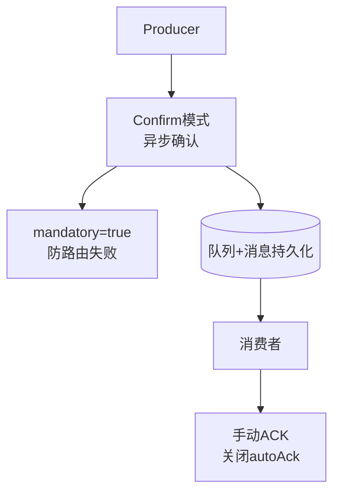

# 什么场景选 RabbitMQ 而不是 Kafka？RabbitMQ 的可靠投递机制是怎样的？

【RabbitMQ 适合的场景（相比 Kafka）】
1. **复杂的路由需求**：
   - RabbitMQ 提供 Direct（直连）、Topic（通配符）、Fanout（广播）、Headers 四种交换机，能轻松实现复杂的消息分发逻辑（如按日志级别分发到不同队列，或多租户路由）。Kafka 只能基于 Topic 和 Partition 路由，路由能力较弱。
2. **极高的可靠性要求（金融/订单）**：
   - RabbitMQ 支持强一致性的消息确认（事务或 Confirm 机制），能保证每条消息的投递状态。Kafka 侧重高吞吐，采用异步批量提交，存在极少数数据丢失或不一致的可能性。
3. **低延迟实时性**：
   - RabbitMQ 延迟在微秒级，适合实时性要求极高的在线业务（如支付回调、即时通知）。Kafka 为吞吐量设计，通常有毫秒级的批量延迟。
4. **消息 TTL 和死信处理**：
   - 原生支持消息/队列 TTL（过期时间）和死信队列（DLX），适合实现「延时订单」等业务。

【RabbitMQ 可靠投递完整链路】
```text
[生产者] --(1) Confirm--> [Exchange] --(2) Return --> [RoutingKey Fail]
      |                       |
      +--(Transaction)--------+--(3) Binding--> [Queue] --(4) Persist--> Disk
                                                          |
                                                     [消费者] --(5) Manual Ack
```
1. **生产端保障**：
   - **Publisher Confirm**：开启 `channel.confirmSelect()`，消息到达 Broker 后触发 `handleAck`（成功）或 `handleNack`（失败）。这是异步高性能的方式。
   - **Publisher Return**：开启 `mandatory=true`，消息无法路由到队列时，Broker 回传 `returnCallback`，生产者可记录日志或重试。
   - **事务机制**：`channel.txSelect()`, `txCommit()`, `txRollback()`。性能极差，一般不推荐，仅在极端一致性场景使用。

2. **Broker 端保障**：
   - **Exchange 持久化**：声明时 `durable=true`，防止重启丢失交换机配置。
   - **Queue 持久化**：声明时 `durable=true`。
   - **消息持久化**：发送时设置 `deliveryMode=2`。消息会写入磁盘。注意：持久化会降低吞吐，需权衡。

3. **消费端保障**：
   - **手动 ACK**：关闭自动 ack (`autoAck=false`)，业务逻辑处理成功后调用 `channel.basicAck(deliveryTag, false)`。
   - **拒绝重试**：处理失败调用 `basicNack` 或 `basicReject`，并设置 `requeue=true`（重新入队）或 `false`（丢弃或进入死信队列）。

【死信队列（DLX）机制】
当消息出现以下情况时，若配置了 `x-dead-letter-exchange`，消息会被路由到死信交换机（DLX），进而进入死信队列：
1. 消息被消费端 `basicNack/basicReject` 且 `requeue=false`。
2. 消息过期（TTL 到期）。
3. 队列长度超限（`x-max-length`）。

### 实战深化

#### 1. 实战案例（踩坑经验）
**场景**：某支付系统消费端开启 `autoAck=true`，在业务逻辑执行（如插入数据库）时发生异常。由于 RabbitMQ 认为消息已被消费，直接将其删除，导致资金流记录丢失，造成严重账务事故。
**教训**：涉及资金、订单等核心业务，**务必关闭自动 ACK**，改为业务逻辑成功后手动 ACK；对于处理失败的消息，根据错误类型选择是否 `requeue` 或转入死信队列进行人工干预。

#### 2. 代码示例（Spring Boot 实现可靠生产者）
```java
// 配置文件开启 Confirm 和 Return
// spring.rabbitmq.publisher-confirm-type=correlated
// spring.rabbitmq.publisher-returns=true

@RestController
public class OrderController {
    @Autowired
    private RabbitTemplate rabbitTemplate;

    @PostConstruct
    public void init() {
        // 设置消息只要被 Broker 接收就会触发回调
        rabbitTemplate.setConfirmCallback((correlationData, ack, cause) -> {
            if (!ack) {
                // 记录日志或落库重试，防止消息丢在发送途中
                log.error("消息发送失败: {}", cause);
            }
        });
        // 设置消息无法路由到队列时的回调
        rabbitTemplate.setReturnsCallback(returned -> {
            log.error("消息路由失败: {}", returned.getMessage());
        });
    }

    public void sendOrderMsg(Order order) {
        // 构建消息，设置 deliveryMode=2 (持久化)
        Message msg = MessageBuilder.withBody(JSON.toJSONString(order).getBytes())
                .setDeliveryMode(MessageDeliveryMode.PERSISTENT)
                .build();
        rabbitTemplate.convertAndSend("order.exchange", "order.key", msg);
    }
}
```

#### 3. 对比表格：RabbitMQ vs Kafka 选型决策
| 维度 | RabbitMQ | Kafka |
| :--- | :--- | :--- |
| **设计目标** | 企业级消息队列（可靠路由） | 分布式流处理平台（高吞吐日志） |
| **吞吐量** | 万级/秒（受磁盘 IO 延迟影响） | 十万/级甚至百万/秒（顺序写、零拷贝） |
| **延迟** | 微秒级（极低） | 毫秒级（批量处理会有延迟） |
| **消息可靠性** | 极高（ACK、事务、Confirm机制完备） | 较高（配置复杂，依赖 ISR 和 Offset 管理） |
| **路由能力** | 强（Exchange + RoutingKey 灵活绑定） | 弱（仅支持 Partition 路由） |
| **功能特性** | 原生支持死信队列、延迟插件（需安装） | 依赖时间轮或外部流计算实现延迟 |
| **典型应用** | 订单、支付、即时通讯 | 日志收集、用户行为分析、流式计算 |




## 记忆要点

- 选型场景：因为RabbitMQ具备丰富的Exchange路由和微秒级低延迟，所以适合复杂在线业务。
- 可靠链路三步走：生产者确认机制(Confirm) + Broker端队列与消息持久化 + 消费者手动ACK。
- 生产端确认：开启Confirm模式异步保障投递成功；开启mandatory=true防止路由失败丢消息。
- 消费端保障：务必关闭autoAck改用手动签收，防止业务处理异常导致消息永久丢失。
- 死信队列(DLX)触发：消息被拒、消息过期(TTL)或队列超长时，自动转发至死信交换机做兜底。

## 结构化回答

**30 秒电梯演讲：** 复杂路由强于Kafka，通过Confirm+Ack+持久化保可靠。打个比方，特快专递（RabbitMQ）签字确认、物流追踪，比平邮（Kafka）更保险。

**展开框架：**
1. **选型场景** — 因为RabbitMQ具备丰富的Exchange路由和微秒级低延迟，所以适合复杂在线业务。
2. **可靠链路三步走** — 生产者确认机制(Confirm) + Broker端队列与消息持久化 + 消费者手动ACK。
3. **生产端确认** — 开启Confirm模式异步保障投递成功；开启mandatory=true防止路由失败丢消息。

**收尾：** 这三点都能配合实战聊。您想深入聊原理、对比还是避坑？

## 视频脚本

> 预计时长：3 分钟 | 由浅入深

| 时间 | 画面/字幕 | 口播台词 | 讲解要点 |
|------|----------|----------|----------|
| 0:00 | 标题卡：什么场景选 RabbitMQ 而不是… | "什么场景选 RabbitMQ 而不是 Kafka？RabbitMQ 的可靠投递机制是怎样的？一句话——特快专递（RabbitMQ）签字确认、物流追踪，比平邮（Kafka）更保险。" | 开场钩子 |
| 0:45 | 概念动画/示意图 | "复杂路由强于Kafka，通过Confirm+Ack+持久化保可靠——特快专递（RabbitMQ）签字确认、物流追踪，比平邮（Kafka）更保险" | 核心定义 |
| 1:30 | 选型场景示意 | "因为RabbitMQ具备丰富的Exchange路由和微秒级低延迟，所以适合复杂在线业务。" | 要点1 |
| 2:15 | 可靠链路三步走示意 | "生产者确认机制(Confirm) + Broker端队列与消息持久化 + 消费者手动ACK。" | 要点2 |
| 3:00 | 总结卡 | "记住这几条，面试不慌。下期讲进阶追问。" | 收尾 |
