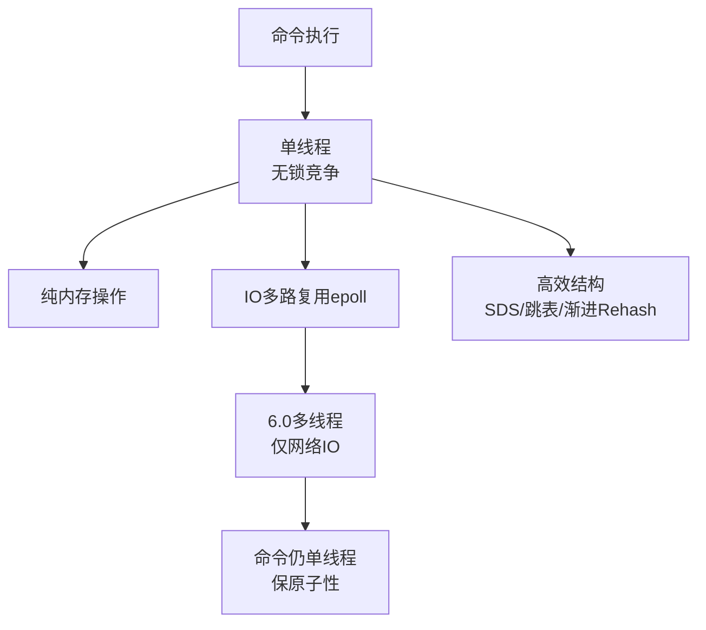

# 为什么选 Redis 做缓存而不是 Memcached？Redis 单线程为什么还能这么快？

### 【Redis vs Memcached 选型】
- **Redis**：支持 String, Hash, List, Set, ZSet, Stream 等多种数据结构；支持 RDB/AOF 持久化；支持主从复制、哨兵、Cluster 集群；支持 Lua 脚本、事务、Pub/Sub。适合做缓存、分布式锁、排行榜、计数器、消息队列等。
- **Memcached**：仅支持简单的 KV 操作；多线程；无持久化；不支持集群（需客户端或代理分片）。
- **结论**：现代项目几乎首选 Redis，除非有极端简单的纯 KV 缓存需求且已有 Memcached 运维经验。

**对比表格**：

| 特性 | Redis | Memcached |
| :--- | :--- | :--- |
| **数据结构** | 丰富（List, Hash, ZSet 等） | 仅支持 Key-Value |
| **线程模型** | 单线程命令执行 + 6.0 多线程 IO | 多线程（IO 读写均并行） |
| **持久化** | 支持 RDB 和 AOF，重启数据不丢失 | 不支持，重启数据丢失 |
| **集群方案** | 原生支持 Cluster/Sentinel | 无原生支持，依赖客户端分片 |
| **内存效率** | 数据结构丰富，略占内存 | 纯 KV 存储，内存利用率极高 |

**实战案例**：
在做电商首页推荐时，我们将用户的浏览历史存储在 Redis 的 `ZSet` 中以便进行实时相关性排序，这是 Memcached 无法做到的；而在早期的图片服务元数据缓存中，我们曾仅用 Memcached 缓存 URL 映射，因其纯 KV 模型在处理极高频并发读取时内存利用率更高，但在需要服务重启保持会话的场景下被迫迁移到了 Redis。

---

### 【Redis 单线程模型详解】
Redis 6.0 之前的核心网络请求处理与命令执行是单线程的。Redis 6.0 引入了多线程处理网络 IO 读写，但命令执行依然是单线程。

**为什么单线程反而快？**
1. **纯内存操作**：Redis 所有数据都在内存中，CPU 不是瓶颈，内存读写速度极快（纳秒级），主要的耗时通常在网络 IO。
2. **避免了多线程开销**：
   - 无需创建/销毁线程的开销。
   - 无需多线程上下文切换。
   - 无需锁竞争（数据结构操作天然线程安全），避免死锁和性能损耗。
3. **IO 多路复用**：
   - 使用 `epoll`（Linux）机制，单线程可以高效管理成千上万个并发连接。
   - 「多路」指多个网络连接，「复用」指复用同一个线程。
   - 流程：Redis 事件循环不断监听 Socket，当发生「可读/可写」事件时，将其放入事件队列，单线程顺序处理。

**高效底层数据结构**：
- **SDS (Simple Dynamic String)**：O(1) 获取长度，二进制安全，避免频繁内存重分配（空间预分配）。
- **ZipList / ListPack**：紧凑存储，节省内存，用于元素较少的 List/Hash/ZSet。
- **Skiplist (跳表)**：ZSet 的底层实现之一，查找 O(logN)，范围查找效率高。
- **HashTable**：Dict 的底层，使用渐进式 Rehash 避免一次性阻塞。

**Redis 6.0 多线程 IO**：
- **目的**：为了提高网络数据包的解析和封包速度，突破单线程在网络带宽饱和时的性能瓶颈。
- **原理**：
  - 主线程负责读取 Socket 数据放入输入队列。
  - IO 线程负责解析请求。
  - 主线程执行命令。
  - IO 线程负责封包结果。
  - 主线程发送 Socket 数据。
- **注意**：命令执行依然是串行的，保证了原子性，不需要 Lua 也能保证部分事务逻辑的安全。

**代码示例（IO 多路复用伪代码）**：
```c
// 简化版 Redis 事件循环核心逻辑 (C语言风格)
void aeMain(aeEventLoop *eventLoop) {
    while (!eventLoop->stop) {
        // 1. 调用 epoll_wait 等待事件发生，阻塞直到有网络事件或超时
        numevents = aeApiPoll(eventLoop, tvp);
        
        // 2. 处理读事件（来自客户端的请求）
        for (j = 0; j < numevents; j++) {
            fe = &eventLoop->events[eventLoop->fired[j].fd];
            if (fe->mask & AE_READABLE) {
                // 读取 socket 数据并解析命令
                readQueryFromClient(eventLoop->fired[j].fd); 
            }
        }
        
        // 3. 单线程执行命令、处理逻辑、写回响应
        processCommand(); 
    }
}
```

**实战案例**：
在监控系统中曾发现 Redis CPU 飙升至 100%，排查发现是业务方在热点 Key 上执行了 `HGETALL`，该 Key 包含数万个字段，导致单线程阻塞长达数秒，最终通过改为 `HMGET` 按需获取字段解决。这深刻体现了单线程模型下严禁执行耗时命令的重要性。

### 【常见考点】
1. **Redis 为什么是单线程的？**
   - 历史原因：维护简单，基于内存瓶颈不在 CPU。
   - 核心优势：无锁并发模型开发难度低，CPU 缓存命中率极高。
2. **单线程的 Redis 如何利用多核 CPU？**
   - 单实例无法利用多核。
   - 解决方案：在一台机器上部署多个 Redis 实例，组成集群或分片，由上层负责分片路由。
3. **什么是 Redis 阻塞？**
   - 除网络慢之外，主要是 **Big Key** 操作（如 `hgetall` 一个百万字段的 Hash）、大量 Key 集中过期、`fork` 子进程生成 RDB 导致阻塞、使用 `keys *` 或 `flushall`。




## 记忆要点

- Redis胜在数据结构丰富、支持持久化与集群，而Memcached仅纯KV且无持久化。
- 单线程快因为纯内存操作且无锁竞争，核心是利用epoll实现IO多路复用。
- 6.0引入多线程仅处理网络IO读写，命令执行依然单线程以保原子性。
- 底层数据结构极其高效：SDS、跳表、渐进式Rehash均避免阻塞。
- 单线程切忌执行如HGETALL大Key等耗时命令，易导致CPU满载。

## 结构化回答

**30 秒电梯演讲：** 内存操作+IO多路复用+无锁设计，6.0引入多线程IO。打个比方，无需换赛道（无锁），纯脑力计算（内存），反应极快。

**展开框架：**
1. **Redis胜在数据结构丰富、支持持久化与集群** — 而Memcached仅纯KV且无持久化。
2. **单线程快因为纯内存操作且无锁竞争** — 核心是利用epoll实现IO多路复用。
3. **0引入多线程仅处理网络IO读写** — 命令执行依然单线程以保原子性。

**收尾：** 我在项目里踩过坑——在做电商首页推荐时，我们将用户的浏览历史存储在 Redis 的 `ZSet` 中以便进行实时相关性排序，这是 Memcached 无法做到的；而在早期的图片服务元数据缓存中，我们曾仅用 Memcached 缓存 URL 映射，因其纯 KV 模型在处理极高频并发读取时内存利用率更高，但在需要服务重启保持会话的场景下被迫迁移到了 Redis。您想深入聊哪一段：原理、避坑还是对比选型？

## 视频脚本

> 预计时长：3 分钟 | 由浅入深

| 时间 | 画面/字幕 | 口播台词 | 讲解要点 |
|------|----------|----------|----------|
| 0:00 | 标题卡：为什么选 Redis 做缓存而不是 … | "为什么选 Redis 做缓存而不是 Memcached？Redis 单线程为什么还能这么快？一句话——无需换赛道（无锁），纯脑力计算（内存），反应极快。" | 开场钩子 |
| 0:45 | 概念动画/示意图 | "内存操作+IO多路复用+无锁设计，6.0引入多线程IO——无需换赛道（无锁），纯脑力计算（内存），反应极快" | 核心定义 |
| 1:30 | 要点1图解示意 | "而Memcached仅纯KV且无持久化。" | 要点1 |
| 2:15 | 要点2图解示意 | "核心是利用epoll实现IO多路复用。" | 要点2 |
| 3:00 | 总结卡 | "记住这几条，面试不慌。下期讲进阶追问。" | 收尾 |
