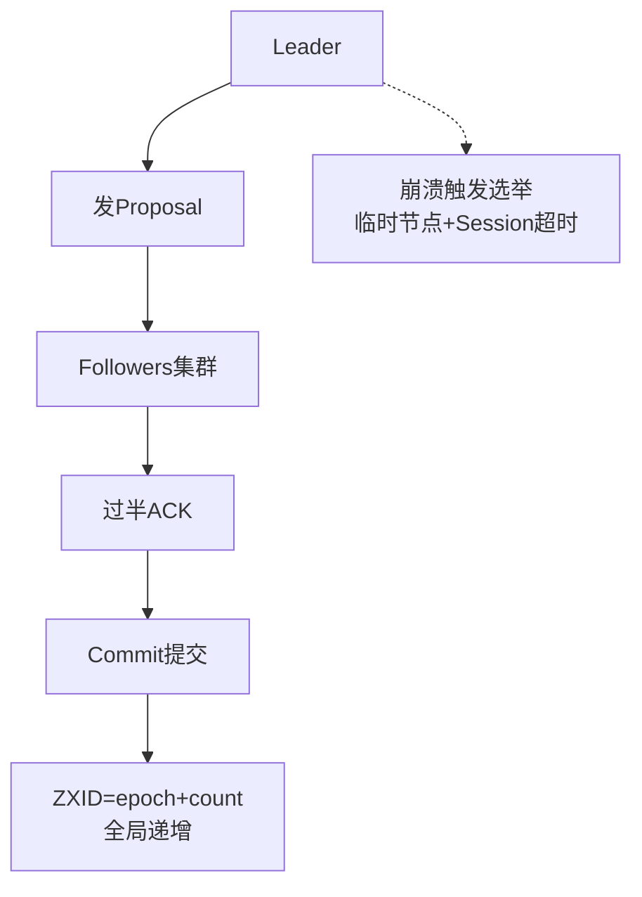

# 为什么分布式协调选 ZooKeeper 而不是直接用数据库？ZAB 协议解决什么核心问题？

【为什么选 ZooKeeper 而不是数据库？】
- **性能与延迟**：ZK 全内存存储数据（树形节点），读性能极高，适合高频的配置读取和状态查询。数据库基于磁盘，高并发下 IO 压力大，延迟高。
- **监听机制**：ZK 提供 **Watcher 事件监听**，客户端可以监听节点变化，一旦变更立即推送，实现推送模型。数据库只能靠轮询，延迟高且浪费资源。
- **强一致性与顺序性**：ZAB 协议保证所有客户端看到的数据视图严格一致，且所有写操作全局有序。数据库在不同主从模式下可能出现主从延迟或读写分离导致的不一致。
- **CP 特性**：在 CAP 理论中，ZK 牺牲可用性保证一致性和分区容错性，适合作为元数据存储和协调中心（如 HBase Master 选举、Kafka Offset 存储）。数据库通常偏向 AP 或 CA。

【ZAB 协议核心原理】
ZAB（ZooKeeper Atomic Broadcast）是为 ZK 设计的原子广播协议，用于在集群间同步事务请求，保证数据一致性。

**ZAB 两阶段模式**：
1. **恢复模式（选举）**：集群启动或 Leader 崩溃时进入，目的是选出一个新的 Leader 并让数据同步。
2. **广播模式（正常写入）**：Leader 接收写请求，并广播给 Follower。

【ZAB 写入流程（原子广播）】
```text
+--------+                              +--------+
| Client|                              | Client|
+---+----+                              +---+----+
    |                                     |
    v                                     v
+--------+   (1) Proposal (zxid=100)   +--------+
| Leader| ----------------------------> |Follower|
|  (L)  | <---------------------------- |   (F)  |
+--------+   (2) ACK                   +--------+
    |
    | (3) 收到过半 ACK (Quorum)
    v
+--------+   (4) Commit (zxid=100)    +--------+
| Leader| ----------------------------> |Follower|
|  (L)  |                              |   (F)  |
+--------+                              +--------+
    |
    v
+--------+   (5) Response to Client
| Leader|
+--------+
```
- **zxid (64位)**：高 32 位是 epoch（纪元，每选一次 Leader +1），低 32 位是 counter（计数器）。它保证了事务的全局唯一且递增的顺序。
- **Quorum（过半机制）**：只要收到超过半数节点的 ACK，Leader 就认为提交成功。这比 2PC（两阶段提交）只需所有节点响应要更快，且容忍部分节点故障。

【ZAB 的一致性保证】
- **崩溃恢复**：当旧 Leader 挂了，新 Leader 选举出来后，会确保包含所有 ZXID 大于新 Leader lastProcessedZXid 的提案都被提交（数据同步），确保不丢数据。
- **顺序性**：所有 Follower 按 Leader 发送的 Proposal 顺序应用事务。

**实战案例**
在分布式任务调度中，曾尝试用 MySQL 行锁做 Leader 选举，结果数据库主从切换导致出现“双主”同时执行任务，引发数据重复。改用 ZK 临时节点后，Session 超时节点即刻删除，成功解决了网络抖动带来的分裂脑问题。

**代码示例**
```java
// Java: 使用 Curator 实现分布式锁（利用 ZAB 强一致性）
InterProcessMutex lock = new InterProcessMutex(client, "/my_lock");
try {
    // 阻塞获取锁，本质是创建临时顺序节点并检查序号
    if (lock.acquire(10, TimeUnit.SECONDS)) {
        doBusiness(); // 业务逻辑
    }
} finally {
    lock.release(); // 删除节点，触发 Watcher 通知竞争者
}
```

**对比表格**
| 特性 | ZooKeeper | 关系型数据库 (MySQL) |
| :--- | :--- | :--- |
| **数据存储** | 全内存 (树形结构)，适合元数据 | 磁盘 (表结构)，适合业务数据 |
| **一致性模型** | CP (强一致性，线性一致写入) | AP/CA (主从复制可能有延迟) |
| **变更通知** | Watcher 机制 (实时推送) | 轮询 (延时高，资源消耗大) |
| **读写性能** | 读极高，写受限于同步协议 | 读写均衡，高并发需分库分表 |
| **适用场景** | 配置中心、服务发现、分布式锁 | 事务处理、复杂查询、报表统计 |

【常见考点】
1. **ZooKeeper 的 Watcher 机制是一次性的吗？**
   - 是的。Watcher 触发一次后就会失效。如果需要持续监听，必须在收到事件后再次注册 Watcher。
2. **ZooKeeper 集群部署为什么要是奇数台？**
   - 为了利用过半机制。例如 3 台允许挂 1 台，4 台也允许挂 1 台，但 4 台通信成本更高。因此 2N+1 台性价比最高。
3. **ZAB 和 Paxos 的区别？**
   - ZAB 是为 ZK 特化的，主要解决「主备模式下的日志广播与恢复」，强调事务的严格顺序。Paxos 是通用的分布式一致性算法。



## 记忆要点

- 选ZK因为它是全内存的CP系统，具备Watcher监听机制，而DB多为轮询且存磁盘。
- ZAB协议核心解决主备数据同步与Leader崩溃时的选举一致性。
- ZAB写入采用两阶段：Leader先发Proposal，收到过半ACK才提交Commit。
- ZXID由epoch和counter组成，保证了事务的全局唯一与严格递增。
- ZK选举依赖临时节点与Session超时机制，天然防脑裂。

## 结构化回答


**30 秒电梯演讲：** 大家选个队长，所有人听队长按同一口令行动。

**展开框架：**
1. **ZAB** — ZAB协议包含选举与广播两个阶段
2. **Zxid** — 通过Zxid保证事务顺序
3. **过半节点提交** — 过半节点提交机制保证一致

**收尾：** ZAB 和 Raft 协议有什么区别？各自的核心设计是什么？


## 视频脚本

> 预计时长：3 分钟 | 由浅入深

| 时间 | 画面/字幕 | 口播台词 | 讲解要点 |
|------|----------|----------|----------|
| 0:00 | 标题卡：为什么分布式协调选 ZooKeepe… | "为什么分布式协调选 ZooKeeper 而不是直接用数据库？ZAB 协议解决什么核心问题？一句话——大家选个队长，所有人听队长按同一口令行动。" | 开场钩子 |
| 0:45 | 概念动画/示意图 | "ZAB协议保证分布式节点数据的一致性与顺序性——大家选个队长，所有人听队长按同一口令行动" | 核心定义 |
| 1:30 | 要点1图解示意 | "具备Watcher监听机制，而DB多为轮询且存磁盘。" | 要点1 |
| 2:15 | 要点2图解示意 | "ZAB协议核心解决主备数据同步与Leader崩溃" | 要点2 |
| 3:00 | 总结卡 | "记住这几条，面试不慌。下期讲进阶追问。" | 收尾 |
