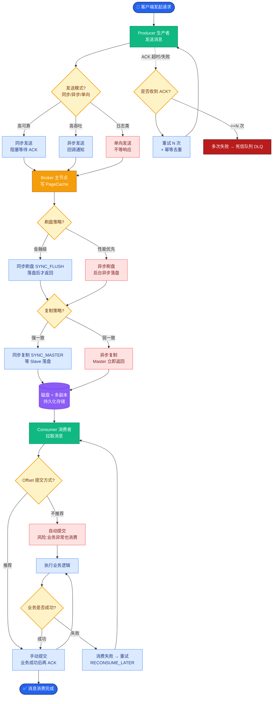
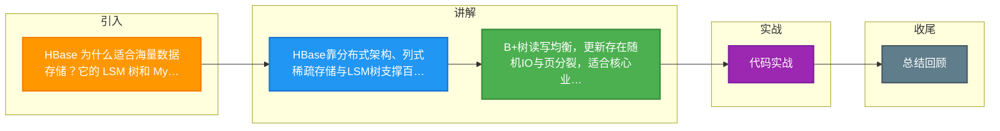

# HBase 为什么适合海量数据存储？它的 LSM 树和 MySQL 的 B+树有什么本质区别？

【HBase 适用场景】
- 百亿级数据、写多读少、按 RowKey 查询（不支持复杂 SQL）。
- 典型：订单归档、日志存储、用户画像、时序数据。

【为什么 HBase 能存百亿级？】
1. **分布式存储**：数据按 RowKey 范围分到多个 RegionServer，横向扩展。
2. **列式存储**：稀疏数据省空间（null 列不存储）。
3. **LSM 树**：写性能极高（顺序写），适合写多场景。

【LSM 树 vs B+树（核心区别）】

**B+树（MySQL InnoDB）：**
- **写**：随机写（更新要找到位置改数据），需更新索引树，有页分裂。
- **读**：快（B+树高度低，3 层千万级）。
- **原理**：数据存储在叶子节点，非叶子节点仅存索引。更新数据可能导致页面分裂或合并，产生大量随机 I/O。
- **适合**：读多写少、需要事务。

**LSM 树（Log-Structured Merge-Tree，HBase/HBase/LevelDB）：**
- **写**：所有写先追加到内存 MemStore（内存有序，基于 SkipList），满后刷成 HFile（磁盘顺序写）。不更新原数据，而是追加新版本，写入极快。
- **读**：需查 MemStore + 多个 HFile（可能要合并），读放大。用布隆过滤器优化。
- **Compaction**：后台合并多个 HFile，清理过期版本（TTL）或被标记删除的数据，降低读放大。分为 Minor（小文件合并）和 Major（全量合并）。
- **适合**：写多读少、海量数据。

【LSM 树写流程架构图】
```text
Client Request
      │
      ▼
 ┌─────────────┐
 │  Write WAL  │ (顺序写，HLog，容灾)
 └──────┬──────┘
        │
        ▼
 ┌─────────────┐
 │  MemStore   │ (内存，SkipList 结构，有序)
 │  (Mutable)  │
 └──────┬──────┘
        │ (满 128MB / RegionServer 内存满)
        ▼
 ┌─────────────┐     Flush      ┌──────────────┐
 │  MemStore   │ ──────────────> │    HFile     │ (磁盘，有序)
 │ (Immutable) │                │ (Immutable)  │
 └─────────────┘                └──────┬───────┘
                                       │
                                       ▼ (Compaction)
                               ┌───────────────┐
                               │ Merged HFile  │
                               └───────────────┘
```

【HBase 读流程架构图】
```text
Client Read Request (RowKey)
      │
      ▼
┌─────────────┐
│ BlockCache  │ (读缓存，LRU)
└──────┬──────┘
       │ Miss
       ▼
┌─────────────┐
│  MemStore   │ (最新写入数据)
└──────┬──────┘
       │
       ▼
┌───────────────────────────────┐
│       Disk Store (HFiles)      │
│  ┌───────────┐ ┌───────────┐  │
│  │ BloomFilter│ │ Data Block│  │ (按时间倒序查，从新到旧)
│  └─────┬─────┘ └───────────┘  │
└────────┼────────────────────────┘
         │
         ▼
    [Merge Results] (多版本合并，取最新)
```

**实战案例**
某监控系统每日写入 20 亿条日志，最初使用 MySQL 分库分表，随着数据量增加，插入因磁盘随机 IO 瓶颈导致延迟飙升。迁移至 HBase 后，利用 LSM 树的顺序写特性，写入吞吐量提升了 10 倍，但查询时需严格指定 RowKey 范围，否则 Full Scan 会非常慢。

**代码示例**
```java
// Java: HBase 批量写入，利用 LSM 优势
Connection connection = ConnectionFactory.createConnection(config);
Table table = connection.getTable(TableName.valueOf("events"));

// 使用 Buffer Mutation 减少 RPC 次数，刷盘即 HFile 生成
BufferedMutator mutator = connection.getBufferedMutator(TableName.valueOf("events"));
for (LogEvent event : events) {
    Put put = new Put(Bytes.toBytes(event.getId()));
    put.addColumn(Bytes.toBytes("cf"), Bytes.toBytes("data"), Bytes.toBytes(event.getContent()));
    mutator.mutate(put);
}
mutator.flush(); // 最终触发 Flush 生成 HFile
```

**对比表格**
| 维度 | B+树 (MySQL InnoDB) | LSM 树 (HBase) |
| :--- | :--- | :--- |
| **读写模型** | 读强写弱（随机写） | 写强读弱（顺序写 + 读放大） |
| **更新机制** | 原地更新 | 追加更新，后台 Compaction 合并 |
| **IO 模式** | 随机 IO (Read/Write) | 顺序 IO (Write)，随机 IO (Read/Compaction) |
| **适用场景** | 事务密集型、强一致性分析 | 海量写入、日志存储、时序数据 |
| **空间利用率** | 相对较低（页分裂碎片） | 较高（紧凑存储，需定期合并） |

【常见考点】
1. **RowKey 设计原则**：为什么长度要短且散列？为了避免热点，利用哈希使负载均匀，且减少 MemStore 和 BlockCache 的内存占用。


## 核心流程图



## 记忆要点

- HBase靠分布式架构、列式稀疏存储与LSM树支撑百亿级海量写入。
- B+树读写均衡，更新存在随机IO与页分裂，适合核心业务与读多写少。
- LSM树采用顺序写与追加机制，无原地更新，写性能极高。
- LSM树读放大需查MemStore与多HFile，常通过布隆过滤器优化。
- 后台Compaction合并历史版本文件，清理过期数据，从而降低读放大。

## 结构化回答


**30 秒电梯演讲：** LSM像写日记（顺序记），B+树像查字典（随时翻）。

**展开框架：**
1. **LSM** — LSM写内存后刷盘，B+树直接改磁盘随机写
2. **LSM** — LSM读需合并多层文件，存在读放大
3. **HBase** — HBase靠分布式RegionServer横向扩展

**收尾：** LSM 树的 Compaction 机制是什么？Major/Minor Compaction 有什么区别？


## 视频脚本

> 预计时长：4 分钟 | 由浅入深

| 时间 | 画面/字幕 | 口播台词 | 讲解要点 |
|------|----------|----------|----------|
| 0:00 | 标题卡：HBase 为什么适合海量数据存储？… | "HBase 为什么适合海量数据存储？它的 LSM 树和 MySQL 的 B+树有什么本质区别？一句话——LSM像写日记（顺序记），B+树像查字典（随时翻）。" | 开场钩子 |
| 0:48 | 概念动画/示意图 | "LSM树牺牲读性能换取极致的写入能力——LSM像写日记（顺序记），B+树像查字典（随时翻）" | 核心定义 |
| 1:36 | 要点1图解示意 | "HBase靠分布式架构、列式稀疏存储与LSM树支" | 要点1 |
| 2:24 | B+树读写均衡示意 | "更新存在随机IO与页分裂，适合核心业务与读多写少。" | 要点2 |
| 3:12 | 要点3图解示意 | "无原地更新，写性能极高。" | 要点3 |
| 4:00 | 总结卡 | "记住这几条，面试不慌。下期讲进阶追问。" | 收尾 |

### 视频流程图



