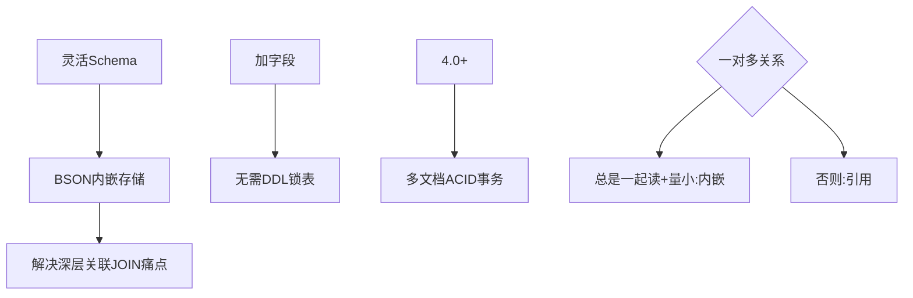

# 什么场景选 MongoDB 而不是 MySQL？MongoDB 的文档模型解决了什么问题？

【MongoDB 适合的场景】
- 数据结构不固定/频繁变化（schema-less）。
- 嵌套/关联数据多（文档内嵌 vs MySQL 多表 JOIN）。
- 写多读少、海量数据（分片）。
- 典型：内容管理（文章+评论嵌套）、物联网时序数据、用户画像、日志分析。

【MySQL 不适合的场景】
- Schema 频繁变化（加字段要 DDL，大表锁）。
- 深层嵌套关系（多次 JOIN 性能差）。

【文档模型的核心优势】
- **JSON/BSON 文档**：一条记录是完整的 JSON，天然支持嵌套。
  - 用户文档：{ name, age, address: { city, zip }, orders: [...] }
  - MySQL 需要 user + address + order 三张表 JOIN。
- **Schema 灵活**：不同文档可有不同字段，加字段无需 DDL（Schema Validation 可选，非强制）。
- **读取高效**：一次查询拿到完整文档，无需 JOIN（应用层 Join 替代数据库层 Join）。

【MongoDB 的索引与 MySQL 类似】
- 基于 B+树，支持单字段索引、复合索引、全文索引、地理索引（2dsphere）。
- 查询用 JSON 语法：db.users.find({ age: { $gt: 18 } })。
- **复合索引最左前缀原则**与 MySQL 一致。

【事务支持】
- MongoDB 4.0+ 支持多文档 ACID 事务（副本集）。
- 4.2+ 支持分片集群事务。
- 但事务性能不如 MySQL，且对 Oplog 压力大，核心交易系统仍推荐 MySQL。

【存储引擎 WiredTiger】
- 默认引擎，支持文档级别的锁，支持 Checkpoint 快照。
- 压缩：支持 Snappy 压缩，节省磁盘空间。

**实战案例**
在开发 CMS 系统时，文章属性（标题、作者）与扩展属性（SEO字段、自定义标签）差异巨大且常变。使用 MySQL 需频繁执行 DDL 锁表，影响业务；切换至 MongoDB 后，利用文档模型实现了“Schema-less”，新属性直接写入即可，开发效率提升 50% 且无锁表风险。

**代码示例**
```javascript
// Javascript: MongoDB 内嵌数组查询与更新（无 JOIN）
db.products.updateOne(
  { _id: 100 }, 
  { $push: { comments: { user: "alice", text: "Great!", date: new Date() } } }
);
// 查询评论包含特定关键词的产品（利用索引）
db.products.find({ 
  "comments.text": { $regex: "fast" } 
}, { "comments.$": 1 }); // 仅返回匹配的评论元素
```

**对比表格**
| 特性 | MySQL (关系型) | MongoDB (文档型) |
| :--- | :--- | :--- |
| **数据模型** | 结构化 Table，需预定义 Schema | 灵活 Document，无强制 Schema |
| **关联处理** | JOIN 操作 (多表关联) | 内嵌 或 引用 (​$lookup) |
| **扩展性** | 垂直扩展为主，水平分库分表复杂 | 原生支持水平分片 | 
| **事务支持** | 成熟稳定，ACID 强支持 | 4.0+ 支持，分片集群事务性能较弱 |
| **适用场景** | 核心交易、复杂分析、强一致性 | 内容管理、日志、快速迭代业务 |

【常见考点】
1. **内嵌 vs 引用设计**：“一对多”关系何时内嵌？子文档数量小（<100）、不频繁变动、总是一起读取时内嵌（如用户评论）；反之用引用（类似 MySQL 外键）。
2. **MongoDB 事务的性能瓶颈**：事务执行期间会占用大量内存，且由于需要协调多个分片/节点，Latency 较高，不宜用于长事务。
3. **_id 字段机制**：默认为主键，包含时间戳、机器标识、进程ID和计数器，不仅是索引，还能部分反映插入顺序。




## 记忆要点

- 选MongoDB因为其Schema灵活，加字段无需DDL锁表，适合快速迭代业务。
- 文档模型采用BSON内嵌存储，解决了深层关联需多次JOIN的性能痛点。
- 4.0+版本开始支持多文档及分片集群ACID事务，但核心交易仍推荐MySQL。
- 默认使用WiredTiger引擎，支持文档级锁与Snappy压缩。
- 一对多关系设计原则：总是一起读取且数量小用内嵌，否则用引用。

## 结构化回答

**30 秒电梯演讲：** 文档模型通过嵌套和弱Schema解决复杂数据存储。打个比方，MongoDB是个文件夹（文件里套文件夹），MySQL是Excel表。

**展开框架：**
1. **选MongoDB因为其Schema灵活** — 加字段无需DDL锁表，适合快速迭代业务。
2. **文档模型采用BSON内嵌存储** — 解决了深层关联需多次JOIN的性能痛点。
3. **0+版本开始支持多文档及分片集群ACID事务** — 但核心交易仍推荐MySQL。

**收尾：** 我在项目里踩过坑——在开发 CMS 系统时，文章属性（标题、作者）与扩展属性（SEO字段、自定义标签）差异巨大且常变。您想深入聊哪一段：原理、避坑还是对比选型？

## 视频脚本

> 预计时长：2 分钟 | 由浅入深

| 时间 | 画面/字幕 | 口播台词 | 讲解要点 |
|------|----------|----------|----------|
| 0:00 | 标题卡：什么场景选 MongoDB 而不是 … | "什么场景选 MongoDB 而不是 MySQL？MongoDB 的文档模型解决了什么问题？一句话——MongoDB是个文件夹（文件里套文件夹），MySQL是Excel表。" | 开场钩子 |
| 0:40 | 概念动画/示意图 | "文档模型通过嵌套和弱Schema解决复杂数据存储——MongoDB是个文件夹（文件里套文件夹），MySQL是Excel表" | 核心定义 |
| 1:20 | 要点1图解示意 | "加字段无需DDL锁表，适合快速迭代业务。" | 要点1 |
| 2:00 | 总结卡 | "记住这几条，面试不慌。下期讲进阶追问。" | 收尾 |
