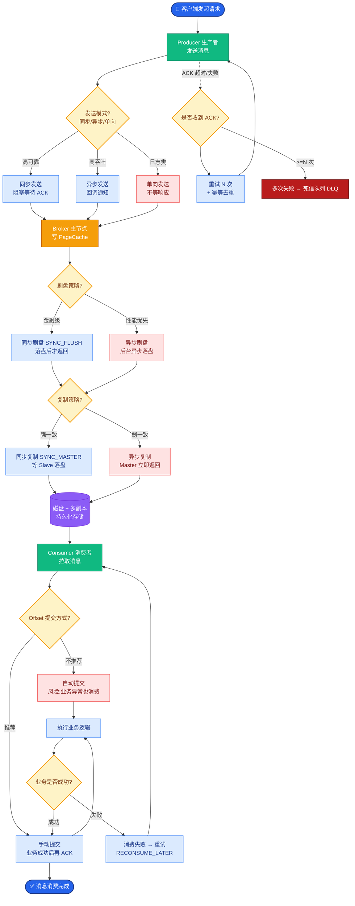
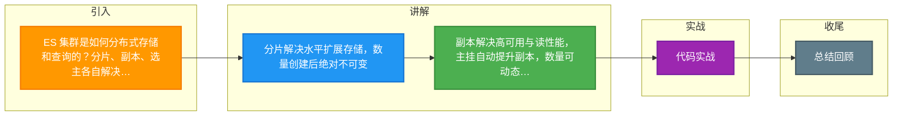

# ES 集群是如何分布式存储和查询的？分片、副本、选主各自解决什么问题？

【ES 分布式架构】
- 一个 ES 索引被分为多个**分片**，分布在不同节点。
- 每个分片有**副本**，一主一备，保证高可用。
- 集群通过**选主**管理元数据。

【分片与副本架构图】
```text
           ┌───────────────┐
           │  Node 1       │
           │ ┌───────────┐ │
           │ │P0 (Primary)│ │
           │ └───────────┘ │
           │ ┌───────────┐ │
           │ │R1 (Replica)│ │
           │ └───────────┘ │
           └───────────────┘
                      │
           ┌──────────┴──────────┐
           │                     │
           ▼                     ▼
    ┌───────────────┐     ┌───────────────┐
    │  Node 2       │     │  Node 3       │
    │ ┌───────────┐ │     │ ┌───────────┐ │
    │ │R0 (Replica)│ │     │ │P1 (Primary)│ │
    │ └───────────┘ │     │ └───────────┘ │
    │               │     │ ┌───────────┐ │
    │               │     │ │R1 (Replica)│ │
    └───────────────┘     │ └───────────┘ │
                          └───────────────┘
```

【分片】
- 数据按 `hash(routing) % numberOfPrimaryShards` 路由到分片。默认 routing=_id。
- 分片数在索引创建时固定，后续不可变（过多会导致小文件问题，过少无法扩展）。
- 单个分片本质是一个 **Lucene 索引**，受限于文件句柄数（最大 20亿 docs）。

【副本】
- 每个主分片可有多个副本（number_of_replicas）。
- 作用：① 高可用（主分片挂了副本顶上）；② 读负载均衡（读请求可走副本）。
- 副本数可动态调整。

【写入流程】
1. 客户端发写请求到任意节点（Coordinating Node，协调节点）。
2. Coordinating Node 根据 hash 计算目标主分片，转发。
3. 主分片写入 → 同步到所有副本（In-sync Replicas）→ 全部确认后返回成功。

【查询流程】
1. Coordinating Node 收到查询，广播到所有分片。
2. 每个分片本地查询，返回 TOP N 结果（DocID + Score）。
3. Coordinating Node 汇总所有分片结果，按 Score 全局排序取 TOP N。
4. 深度分页问题：`from=10000, size=10` 意味着每个分片都要查 10010 条，网络传输和排序开销巨大。

【选主】
- Master 节点管理集群元数据（创建/删除索引、分片分配策略），不处理数据请求（轻量级）。
- 7.x+ 使用 **Bully 算法**（修改版）选主，节点 ID 小者优先，需 Quorum 认可。

**实战案例**
某电商大促期间，ES 集群出现索引“红色”状态（主分片丢失）。查看日志发现是 Master 节点磁盘写满，导致无法提交集群状态。扩容磁盘并重启该节点后，集群自动重新选举 Master 并恢复分片，但恢复过程耗费数小时（需复制的数 TB 数据）。教训是 Master 节点需预留充足资源且监控磁盘水位。

**代码示例**
```java
// Java: 使用 RestClient 进行滚动查询，避免深度分页性能问题
SearchRequest searchRequest = new SearchRequest("logs");
SearchSourceBuilder sourceBuilder = new SearchSourceBuilder()
    .query(QueryBuilders.matchAllQuery())
    .size(1000); // 每批大小
searchRequest.source(sourceBuilder);
searchRequest.scroll(TimeValue.timeValueMinutes(1L)); 
// 初始查询...
// 循环获取 scrollId 继续拉取，而非 from + size 翻页
```

**对比表格**
| 组件 | 分片 | 副本 | 选主 |
| :--- | :--- | :--- | :--- |
| **核心作用** | 实现数据水平切分与分布式存储 | 保证数据冗余与高可用，提升读吞吐 | 集群状态管理，决策分片分配 |
| **特性** | 数量创建后不可变，决定写入并行度 | 数量可动态调整，可增加读 QPS | Master 节点负载极轻，需独立资源 |
| **故障影响** | 分片丢失导致数据缺失/不可写 | 副本丢失降低冗余度，主丢失选副本 | Master 挂了无法创建/删除索引 |
| **配置建议** | 单分片 10-50GB，根据数据量预设 | 生产环境至少设为 1，防止单点 | 专用 Master 节点 (3-5台奇数) |

【常见考点】
1. **脑裂问题**：旧版可能因网络分区出现两个 Master。解决：`discovery.zen.minimum_master_nodes = (master_eligible_nodes / 2) + 1`。7.x+ 默认自动配置，避免脑裂。
2. **段合并**：Lucene 写入是不可变的，频繁更新会产生大量 Segment，导致文件句柄耗尽、查询慢。ES 后台会进行 Merge，期间消耗资源。
3. **倒排索引原理**：如何实现快速全文检索？通过 Term Dictionary -> Term Index (FST) -> Posting List (DocId 列表，压缩为 Frame of Reference)。


## 核心流程图



## 记忆要点

- 分片解决水平扩展存储，数量创建后绝对不可变。
- 副本解决高可用与读性能，主挂自动提升副本，数量可动态调整。
- 选主负责集群元数据管理，7.x采用Bully算法且需Quorum机制认可。
- 查询走协调节点广播：各分片取局部Top N，协调节点全局排序合并。
- 深度分页开销极大，必须用Scroll滚动查询替代from+size机制。

## 结构化回答

**30 秒电梯演讲：** 通过分片分担压力，通过副本保证可用，通过选主管理集群。打个比方，分片是把书拆页，副本是复印件，选主是选组长。

**展开框架：**
1. **分片解决水平扩展存储** — 数量创建后绝对不可变。
2. **副本解决高可用与读性能** — 主挂自动提升副本，数量可动态调整。
3. **选主负责集群元数据管理** — 7.x采用Bully算法且需Quorum机制认可。

**收尾：** 我在项目里踩过坑——某电商大促期间，ES 集群出现索引“红色”状态（主分片丢失）。您想深入聊哪一段：原理、避坑还是对比选型？

## 视频脚本

> 预计时长：3 分钟 | 由浅入深

| 时间 | 画面/字幕 | 口播台词 | 讲解要点 |
|------|----------|----------|----------|
| 0:00 | 标题卡：ES 集群是如何分布式存储和查询的？… | "ES 集群是如何分布式存储和查询的？分片、副本、选主各自解决什么问题？一句话——分片是把书拆页，副本是复印件，选主是选组长。" | 开场钩子 |
| 0:45 | 概念动画/示意图 | "通过分片分担压力，通过副本保证可用，通过选主管理集群——分片是把书拆页，副本是复印件，选主是选组长" | 核心定义 |
| 1:30 | 分片解决水平扩展存储示意 | "数量创建后绝对不可变。" | 要点1 |
| 2:15 | 副本解决高可用与读性能示意 | "主挂自动提升副本，数量可动态调整。" | 要点2 |
| 3:00 | 总结卡 | "记住这几条，面试不慌。下期讲进阶追问。" | 收尾 |

### 视频流程图



